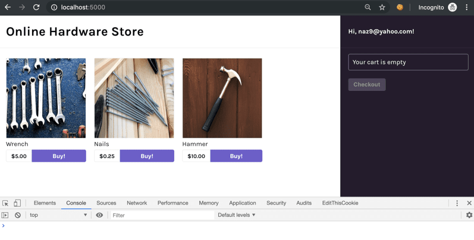
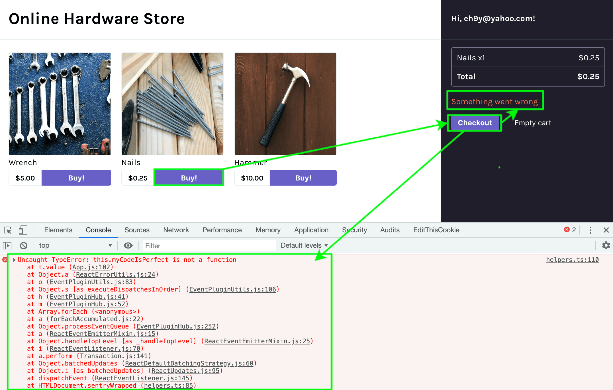
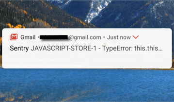
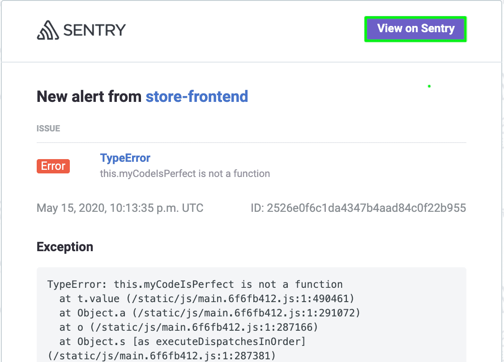
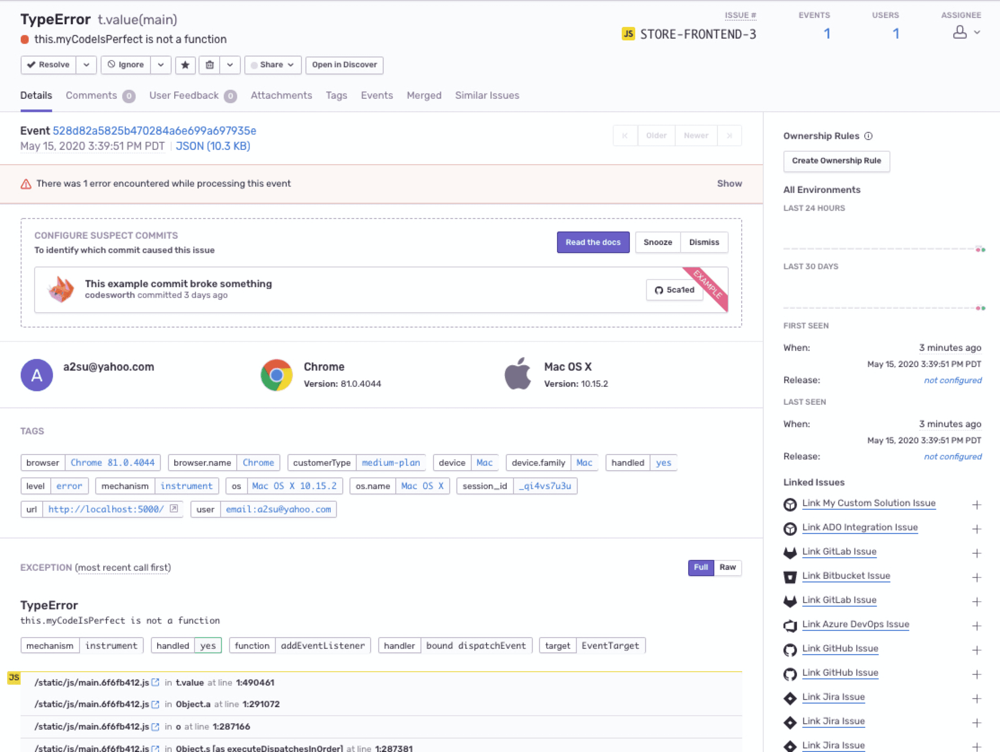
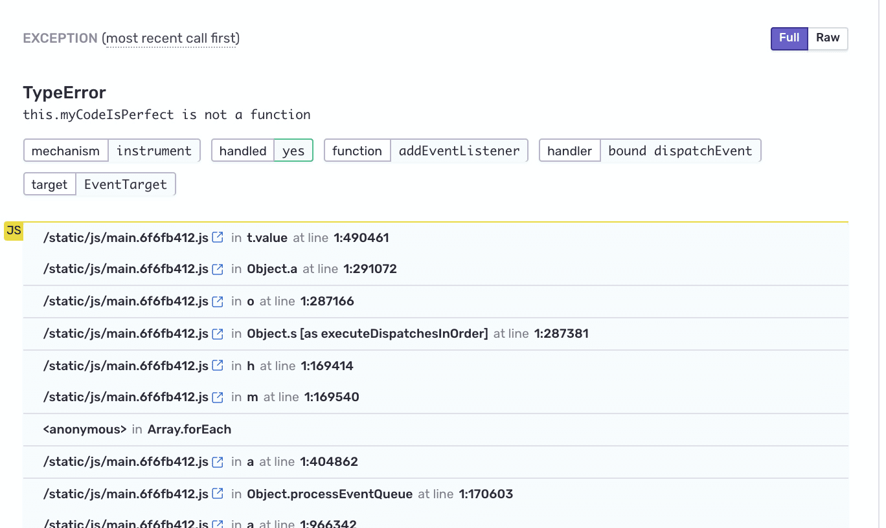

Now that the Demo App is up and running on your local environment integrated with the Sentry SDK, you're ready to generate the first error.

<Note>

If you're not using the provided React demo code, follow [the Verification step](/platforms/javascript/) to introduce an error to your source code and continue with [Step 2](#step-2-handle-the-error)

</Note>

## Step 1: Capture your first event

1. Launch the demo app by opening the [localhost link](http://localhost:5000) in your browser

2. Open the browser's **Console** to verify that an error has occurred

   

3. Click on any of the **Buy!** buttons to add products to your shopping cart

4. Click on the **Checkout** button on the left panel to generate an error

   

   Notice that:

   - An error message **Something went wrong** displays in the app
   - The error appears in the browser console
   - An alert sent to your email address configured on Sentry notifying you about an error that occurred in your app

     

## Step 2: Handle the error

1. Go to your email inbox and open the email notification from Sentry

   

2. Click on `View on Sentry` to view the full details and context of this error in your Sentry account

   
   **Note:** Sentry aggregates similar errors (events) into one Issue

3. Scroll down to the `Exception` stack trace

   

   - Notice that the stack trace is **minified**. JavaScript is typically minified to reduce to the size of the source code.
   - Sentry can un-minify the code back to its readable form and display source (code) context lines in each stack frame, which is covered in the next section.

## Next

[Enable Readable Stack Traces in your Errors](/guides/integrate-frontend/upload-source-maps/)
