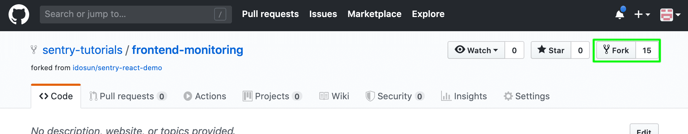
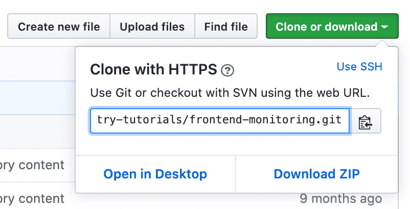
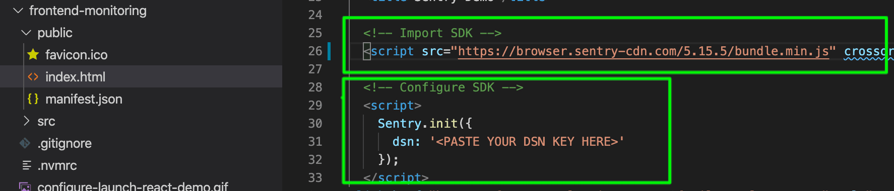
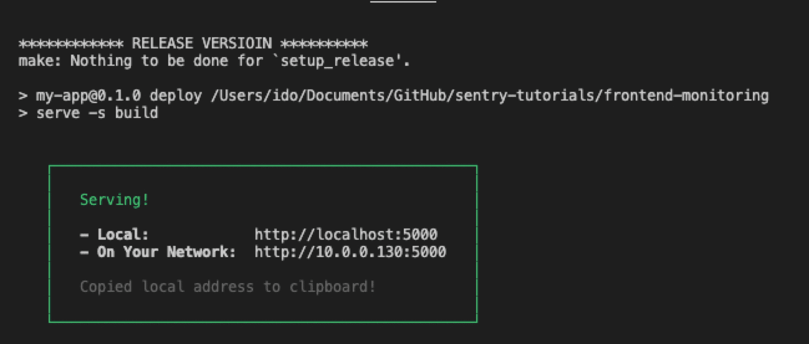

In this tutorial, you import the React demo code into your local development environment, add the Sentry SDK, and initialize it.

<Note>

If you're using your own source code you can skip this section and instead

</Note>

- Follow the instructions on [Getting Started](/platforms/) for your platform. Notice that you can select the desired platform.
- Continue with the [Next section](/guides/integrate-frontend/generate-first-error/).

## Prerequisites

The demo app source code requires a **NodeJS** development environment to install and run the application. Make sure that you have the following in place:

- [Node and NPM](https://nodejs.org/en/)
- [NVM](https://github.com/nvm-sh/nvm)

## Step 1: Get the code

1. Open the `frontend-monitoring` sample [code repository](https://github.com/sentry-tutorials/frontend-monitoring) on GitHub

2. Click on `Fork` and select the target GitHub account you wish this repository to be forked in to

   

3. Once the fork is complete, click on `Clone or download`, and copy the repository HTTPS URL

   

4. Clone the forked repository to your local environment

   ```bash
   > git clone <repository HTTPS url>
   ```

5. Now that the sample code is available locally open the `frontend-monitoring` project in your preferred code editor

## Step 2: Install the SDK

Sentry captures data by using a platform-specific SDK within your application runtime. To use the SDK, import and configure it in your source code. The demo project uses React and Browser JS. The quickest way to get started is by using the CDN hosted version of the JavaScript browser SDK, however, you can NPM install the [browser SDK](/platforms/javascript/install/npm/) as well.

1. Open the `index.html` file (located under _./frontend-monitoring/public/_)

   

   > Notice that we import and initialize the SDK as early as possible in our code. When initializing the SDK, we provide the desired configuration. The only mandatory configuration option is the **DSN** key, however, the SDK supports multiple other configuration options. For more information see [Configuration](/platforms/javascript/configuration/).

2. In the Sentry SDK configuration, enter the `DSN` key value you copied from the project created in the previous section.

   ```javascript
   Sentry.init({
     dsn: "<PASTE YOUR DSN KEY HERE>",
   });
   ```

## Step 3: Install & run the demo app

To build and run the Demo application on your localhost:

1. Open a shell terminal and change directory to the `frontend-monitoring` project folder

2. Use the `.nvmrc` file to set the Node version compatible with this project. Run:

   ```bash
   > nvm use
   ```

3. Install project dependencies by running:

   ```bash
   > npm install
   ```

4. Build, deploy, and run the project on your localhost by running:

   ```bash
   > npm run deploy
   ```

   

   > Once the deploy finishes successfully, you'll see the confirmation in your terminal.

## Next

[Capture your First Error](/guides/integrate-frontend/generate-first-error/)
