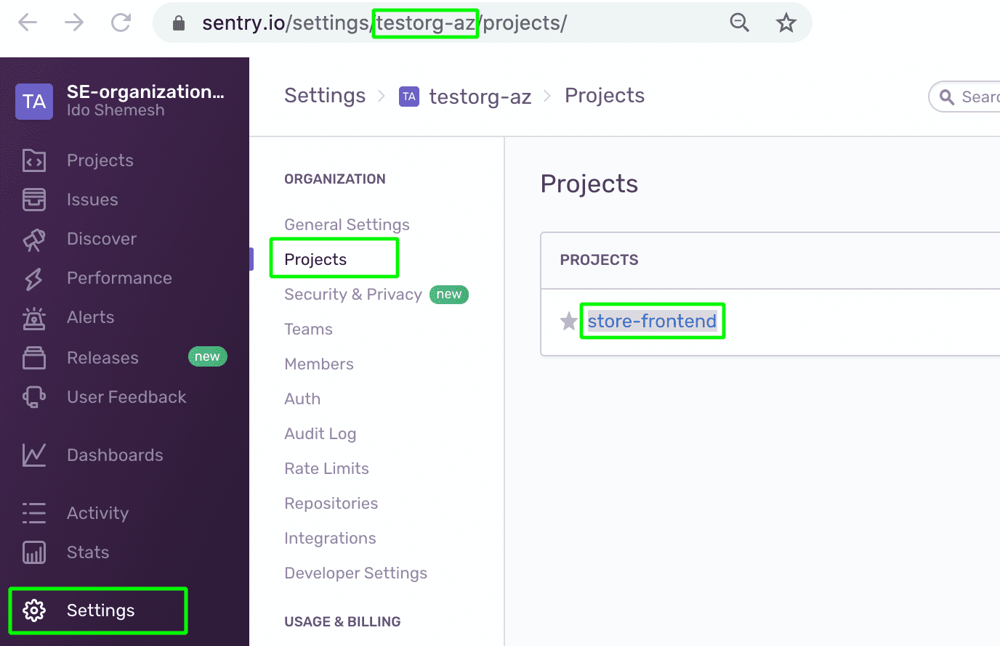
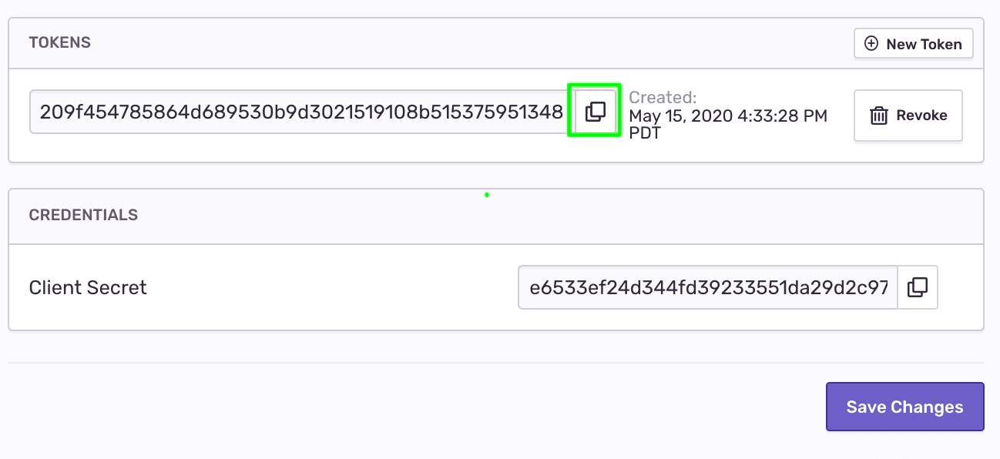

A `release version` is a dynamic identifier that changes whenever you ship a new version of your code. When you give Sentry information about your releases, you unlock several features, including source mapping of minified JavaScript stack traces upon ingestion. For more information, see [Releases](/product/releases/).
In this section, we will:

1. Utilize the `Sentry CLI` **during the build process** to update your Sentry account by:

   - Creating a new release version
   - Uploading the project's latest source maps (and associate them with the new release version)

2. Add the release version to the Sentry SDK configuration --- this will associate any error captured by the SDK in our app to this specific release. Sentry will use the release's uploaded source maps to unminify the error's stack trace.

<Note>

As part of the **CI/CD workflow** for this app demo, we're using a `Makefile` to handle the `sentry-cli` related tasks through `make` targets. If you're using a different code base, you can still apply the settings and commands described below to your specific setup or run them directly in a command-line shell as part of your build process. For more information, see [Command Line Interface](/product/cli/).

</Note>

## Step 1: Prepare the build environment

We use the `Makefile` in the `frontend-monitoring` project to handle Sentry related tasks utilizing the `sentry-cli`. The CLI is already available through the project dependencies (see `package.json`) and requires several parameters to be available to run.

1. Open the `Makefile`

2. Uncomment the commented environment variables `SENTRY_AUTH_TOKEN` , `SENTRY_ORG`, and `SENTRY_PROJECT` (remove the leading **#**)

   

3. To find the SENTRY_ORG and SENTRY_PROJECT values

   - Open your Sentry account and click `Settings > Projects`
   - Your Organization ID is part of the browser URL (for example, https://sentry.io/settings/**SENTRY_ORG**/projects/)
   - The SENTRY_PROJECT value is the name that appears in the project tile

     

   - Copy the values and paste them in the Makefile

4. To create a `SENTRY_AUTH_TOKEN`

   - Click on the `Developer Settings` menu option name from the left side panel to create a new integration and org-level auth token
   - Click on `New Internal Integration`

     

   - Enter a `Name`
   - Under `Permissions` set `Release:Admin` and `Organization:Read & Write`

     

   - Click on `Save Changes`
   - Once the save is successfully confirmed, scroll down to the bottom of the page and copy the allocated token under `TOKENS`

     

   - Paste the token in the Makefile

5. The Makefile should look like this:

   

## Step 2: Create a release and upload source maps

Now we can invoke the `sentry-cli` to let Sentry know we have a new release and upload the project's source maps to it.

- You can set a custom release version to suit your naming conventions or let the Sentry CLI propose a version.
- To build the `frontend-monitoring` project, we use the `react-scripts` package that also generates source maps under _./build/static/js/_

1. In the Makefile, add a new environment variable for the release version, utilizing Sentry CLI to propose the version value

   ```bash
   REACT_APP_RELEASE_VERSION=`sentry-cli releases propose-version`
   ```

2. At the bottom of the Makefile, paste the following targets utilizing the Sentry CLI to:

   - Create a new release entity in your Sentry account
   - Upload the project's source maps to the new release

   ```bash
   create_release:
       sentry-cli releases -o $(SENTRY_ORG) new -p $(SENTRY_PROJECT) $(REACT_APP_RELEASE_VERSION)

   upload_sourcemaps:
       sentry-cli releases -o $(SENTRY_ORG) -p $(SENTRY_PROJECT) files $(REACT_APP_RELEASE_VERSION) \
           upload-sourcemaps --url-prefix "~/static/js" --validate build/static/js
   ```

   The Makefile contains a `setup_release` target that is invoked from the `package.json` file when running `$ npm run deploy` to build and run the project. We'll use this target to invoke all the release related tasks.

3. Replace the existing `setup_release` with:

   ```Shell
   setup_release: create_release upload_sourcemaps
   ```

   Your Makefile should look like this:

   

   Now that you created a release version, you can associate any errors captured in your app to that release through the SDK.

4. Open the `index.html` file and add a new configuration option to the SDK.

   Assign the release version environment variable to the `release` key

   ```javascript
   Sentry.init({
     dsn: "<YOUR DSN KEY>",
     release: "%REACT_APP_RELEASE_VERSION%",
   });
   ```

   > **Note:** the release version environment variable is set in the project.json during build time and is injected into the generated markup.

## Step 3: Try your changes --- generate another error

1. If your terminal is still serving the demo app on localhost, click `^C` to shut down the local server

2. Build, deploy, and rerun the project by running:

   ```Node
   > npm run deploy
   ```

   > Note: A Makefile is generally unforgiving when it comes to indentation. If you're getting unexpected errors while running the above command, make sure the `sentry-cli` commands are properly prefixed with a `tab`.

3. Take a look at the terminal log. Notice that the minified scripts and source maps were uploaded to the release version.

   

4. In your browser, make sure that the dev console is open and perform an `Empty Cache and Hard Reload` to make sure the updated code is being served.

   

5. Generate the error again by adding products to your cart and clicking **Checkout**

6. Check your Email for the alert about the new error and click **View on Sentry** to open the issue page

7. Notice that

   - The event is now tagged with the `Release ID`
   - The error stack trace is now un-minified and includes the file name, method name, line and column number, and source code context in every stack frame

   

## Step 4: Explore the release

Creating a release version and uploading the source maps through the Sentry CLI, creates a `Release` entity in your Sentry account.

1. Click on `Releases` from the left side panel, notice that a new release version was created

   

2. Click on the release, notice that the error in your app has been associated with this release and is listed as a **New Issue**

   

3. Click on the `Artifacts` tab, notice the minified resources and source maps are available for this release and used to source map stack traces

   

## Next

Now that we have all the information we need about the error and a clear stack trace, the next thing is to assign the right developer to handle it.

[Enable Suspect Commits](/guides/integrate-frontend/configure-scms/)
