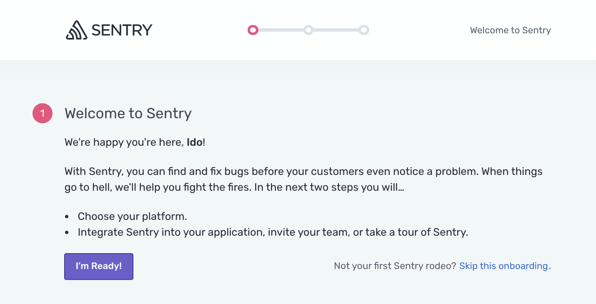
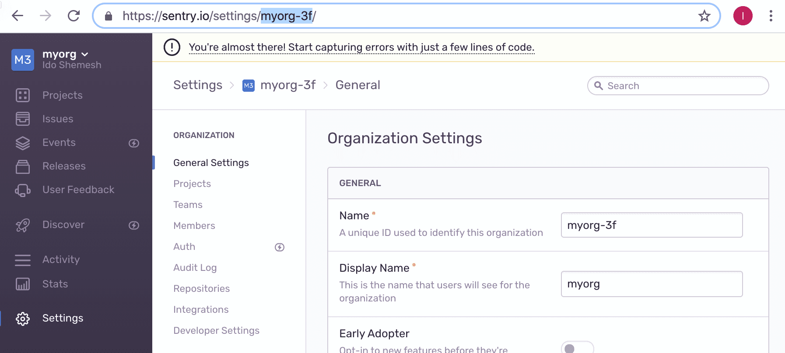

Sentry offers a hosted cloud solution in addition to an open-source solution, both are functionally the same. Despite open-source being a core value for us at Sentry, it isn't necessarily recommended for everyone. As Sentry evolves, many customers are finding that self-hosted Sentry can quickly become expensive to maintain, scale, and support, making our SaaS product, the better and less costly option.

For additional reading on considering SaaS, take a look at:

- [Self Hosted or Cloud Sentry?](https://sentry.io/_/resources/about-sentry/self-hosted-vs-cloud/)
- [XS:Code > Open Source is Free - But Expensive](https://blog.xscode.com/686/open-source-is-free-but-expensive/)

## Migrating to Cloud

Organizations that start with self-hosted Sentry invest time and effort in configuring and customizing their Sentry Org. Once they decide to move to a SaaS account, it's important for them to know that they can migrate a lot of that investment into their new account instead of starting from scratch.

To make this migration as seamless as possible, Sentry has a migration workflow that allows you to migrate most of your account's settings and configurations. This includes project settings, alert rules, enabled data scrubbers, team settings, saved search queries, integration platform metadata (Sentry 10), and so forth.

One thing to note is we won't be able to transfer over historical event data, but new incoming events will populate the projects in your new organization. You will also need to re-invite all your members and add them to the correct teams.

## How to Migrate

### 1. Sign up

Before you begin the migration process, [sign up](https://sentry.io/signup/) for a new organization in Sentry.

Once you complete the onboarding steps, grab your **org slug** from the browser URL or under `Settings > General Settings`. We'll need this information to know where to migrate your data.

<Note>

You can modify your org slug in the org settings.

</Note>

### 2. Choose a plan

Take a look at our [plans](https://sentry.io/pricing/) and select one that suits your needs based on the different features and capabilities. Notice that plan pricing varies based on the type of _Contract_ and _Monthly Event Volume_, so make sure you are familiar with your current/expected monthly usage (number of events per month).

If you're expecting higher volumes or you're interested in our Enterprise capabilities (priority support and SLAs, single-tenant options, for example), please [contact us](https://sentry.io/contact/enterprise/) regarding our **Enterprise Plan**.

### 3. Export your data

Sentry open-source provides a command line interface that allows you to perform various operations that are unachievable within the web UI. One of those is `export`, exporting your data into a transport JSON.

Run the following command in your terminal to start the export script and redirect the output (_containing_ the transport JSON) to a file:

    $ docker-compose run --rm web export > sentry_export.json

This invokes the sentry CLI `export` command on a new isolated instance of our Docker web container.

### 4. Ship it to us

To kick-off the migration process, contact us using the form available in - [Switch to Hosted Sentry](https://sentry.io/from/self-hosted/). Once we get your request, one of our support reps will reach out through a support ticket to get the following details:

- Your **Organization slug**.
- **Selected plan**. If you're unsure, let us know. We'll be happy to help you make the right decision. Also, if you think you'll need an Enterprise plan, we can connect you with the right person to discuss details.
- The **sentry_export.json** file.

Alternatively, you can also shoot us an email at <support@sentry.io> with the subject: `Self-Hosted Migration Application`.

Once we have your organization set up on sentry.io, we'll apply a **$100 credit** to your account for migrating from self-hosted Sentry.
