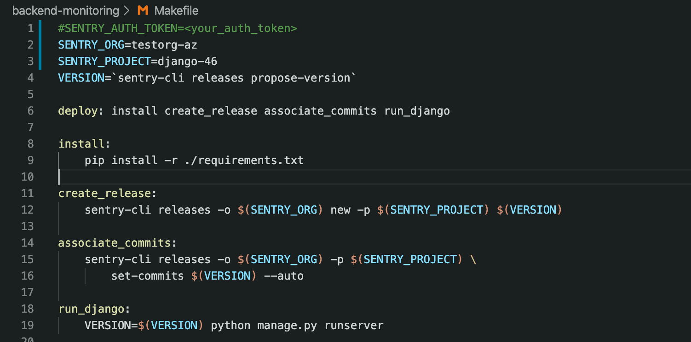

Sentry has various configuration options to help enhance the SDK functionality. The options can help provide additional data needed to debug issues even faster or help control what is sent to Sentry by filtering. Learn more in [Configuration](/platforms/python/guides/django/configuration/).

## Releases

A _release_ is a version of your code that is deployed to an environment. Configuring the release helps you figure out if there is a regression in your code, create accountability, resolve issues within Sentry, and stay up to date with your deployments. Releases need to be configured within your SDK and then managed through the [sentry-cli](/product/cli/).

Sentry currently supports integrations with GitHub, Bitbucket, Azure DevOps, GitLab, and others. For a complete list of our integrations, check out our [Integrations documentation](/product/integrations/).

To set up the release in this project:

1. Open the file `settings.py`. Notice that we add the `release` configuration option when initializing the SDK:

   ```python
   release=os.environ.get("VERSION"),
   ```

2. Open the `Makefile` you ran in the previous tutorial.

   

3. Notice that we're setting the release version name as an environment variable that is then used in the application's runtime. We're letting the CLI propose a release version name, but you'd probably want to apply your naming conventions:

   ```bash
   VERSION=`sentry-cli releases propose-version`
   ```

4. Then we create the new release for our project with the proposed or selected name.

   ```bash
   > create_release:
      sentry-cli releases -o $(SENTRY_ORG) new -p $(SENTRY_PROJECT) $(VERSION)
   ```

5. In the previous tutorial, we configured the GitHub integration and added the code repository for commit tracking. Now we can associate commits from that repository to the new release by running the command:

   ```bash
   > associate_commits:
         sentry-cli releases -o $(SENTRY_ORG) -p $(SENTRY_PROJECT) \
         set-commits $(VERSION) --auto
   ```

## Breadcrumbs

_Breadcrumbs_ are the trail of events that led up to the error. They can be quite useful when trying to reproduce an issue. Depending on the platform, the SDK will track various types of breadcrumbs by default (for backend SDKs those are DB queries, network events, logging, and others), and you can add custom breadcrumbs as well.

To add breadcrumbs to our app:

1. Open the file `myapp > view.py`.

2. Notice we import `add_breadcrumb` from the SDK lib.

   ```python
   from sentry_sdk import add_breadcrumb
   ```

3. We create a custom breadcrumb for each method handler in the view classes. This breadcrumb will be added to the trail of breadcrumbs associated with any error triggered through these method call flows. For instance, under `HandledErrorView:get`:

   ```python
    add_breadcrumb(
      category='URL Endpoints',
      message='In the handled function',
      level='info',
   )
   ```

## Environment

_Environment_ is a powerful configuration option that enables developers using Sentry to perform various workflows, such as filtering issues and triggering alerts, in the context of the deployment environment in which the errors occurred.

1. Open the `settings.py` file.

2. Notice that we initialize the SDK with the `environment` configuration option. Any event that's subsequently captured by the SDK will be tagged with the configured environment value.

   ```python
    environment:"Production"
   ```

   > Environment values are freeform strings. Neither the Sentry SDK nor [sentry.io](https://sentry.io) will not limit you to any specific value or format. In this example, we hardcoded the value. In a real-life app, the value would probably be determined dynamically through a properties file, system, or environment variable.

## Next

[Capturing Errors](/guides/integrate-backend/capturing-errors/)
