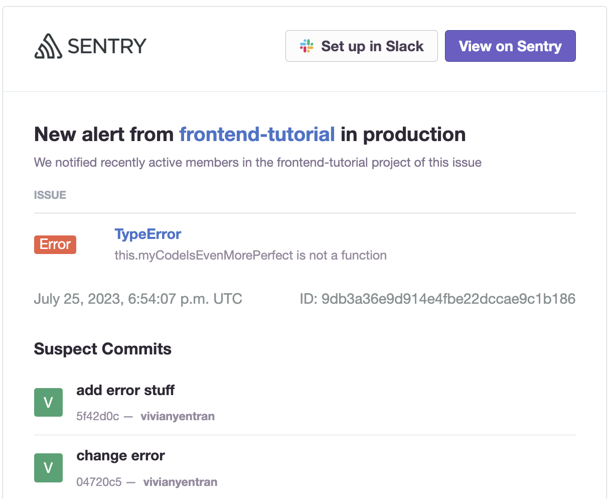
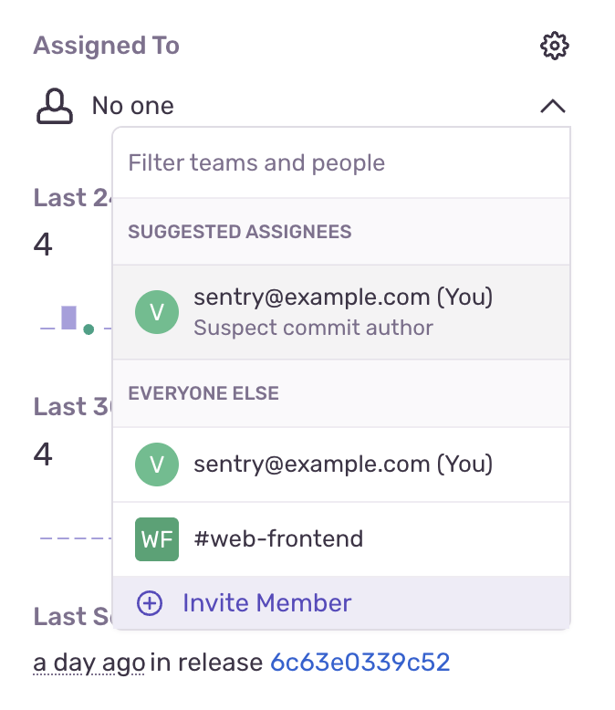

<Include name="only-error-issues-note.mdx" />

Sentry uses commit metadata from your source code repositories to help you resolve your issues faster. This is done by suggesting _suspect commits_ that might have introduced an error right in your **Issue Details** page. It also allows Sentry to display _suggested assignees_ — the list of the authors of those commits — and suggest their assignment to resolve the issue.

Now that you've created a release, you can tell Sentry which commits are associated with this latest version of your code; this is called _commit tracking_.

## 1. Integrate Your GitHub Account and Repository

Use Sentry's GitHub integration to link your source code repository to your Sentry project. This enables Sentry to use commit metadata to help you streamline issue triaging.

1. To integrate GitHub with your Sentry org, follow the [GitHub Integration Install instructions](/product/integrations/source-code-mgmt/github/#install). Be sure to give the integration access to the appropriate repository — in this case, the `frontend-tutorial` repo you forked.

   After you've added the integration, you should be redirected to a page showing your GitHub repositories in Sentry. Verify that the right repos have been added.

1. Go to the "Code Mappings" tab.

1. Click "Add Code Mapping".

1. Fill out the information requested to add a code mapping between your Sentry project and the `frontend-tutorial` repository's `main` or `master` branch. Tell Sentry that your components live in the `src/` directory:

   

### UI Walkthrough

Follow along with the animated gif below to see how to integrate your GitHub account and repository.

<div style="position: relative; padding-bottom: calc(48.66707997520149% + 41px); height: 0; width: 100%">
  <iframe
    src="https://demo.arcade.software/OlEYtzImezSBwsV8SVc8?embed"
    frameborder="0"
    loading="lazy"
    webkitallowfullscreen
    mozallowfullscreen
    allowfullscreen
    style="position: absolute; top: 0; left: 0; width: 100%; height: 100%;color-scheme: light;"
    title="FE Tutorial -> Install GitHub Config & Add Code Mapping"
  ></iframe>
</div>

## 2. Set Up Commit Tracking

A _release_ is a version of your code deployed to an environment. See the [Releases](/product/releases/) documentation to learn more. Sentry uses releases to match up your source maps and source code. Releases can also be used to enable Sentry's [Suspect Commits](/product/issues/suspect-commits/) feature.

The Sentry Webpack plugin can automatically configure release information and send it to Sentry when you create a new build of your project. Let's enable this feature.

1. Go back to your `frontend-tutorial` project and stop it with `Ctrl + C`.

1. To start associating commits and releases, add the following lines of code to `webpack.config.js` in your Sentry Webpack plugin config:

   ```javascript {filename:webpack.config.js}
      sentryWebpackPlugin({
         org: "<your_org>",
         project: "<your_project>",

         // Auth tokens can be obtained by creating an internal integration
         // at https://<organiaztion_id>.sentry.io/settings/developer-settings/
         // and need "Release: Admin" and "Organization: Read & Write" permissions
         authToken: process.env.SENTRY_AUTH_TOKEN,

         // Enable automatically creating releases and associating commits
         release: {
         create: true,
         setCommits: {
            auto: true,
         },
         },
      }),
   ```

1. Save the file.

## 3. Create a New Error and Commit

Now that releases are set up to track commits, tweak the error and create a new commit to verify that this works.

1. In `src/components/App.js`, edit line 97. This will make sure Sentry recognizes a new error that it can associate with the release you will create.

   ```javascript {filename:src/components/App.js}
   this.myCodeIsMorePerfect();
   ```

1. Save the file.

1. Add all your changes to git with:

   ```bash
   git commit -am 'Added a new error and some other stuff'
   git push
   ```

1. Create another production build. During this process, the webpack plugin will create a new release and associate your commit to that release.

   ```bash
   npm run build
   ```

1. Run your production build:

   ```bash
   npx serve build
   ```

1. Create a new issue for Sentry by generating another error in your app. Open the URL your app is running is, add products to your cart, and click "Checkout". You should soon see a new issue in Sentry.

## 4. Verify Suspect Commits and Suggested Assignees

Now suspect commits and suggested assignees should start appearing on the **Issue Details** page. Sentry determines these using files observed in the stack trace, authors of those files, and ownership rules.

1. Check your email for the alert about the new error. Notice that a new "Suspect Commits" section has been added to the email.

   

1. Click "View on Sentry" to open the **Issue Details** page.

1. Verify that the "Suspect Commits" section now points to the suspected commit that likely introduced the error. You can click on the commit link to see the actual commit details on GitHub.

1. In the right side panel, click under "Assigned To" to open the dropdown to see suggested assignees. You'll see that the author of the suspect commit is listed as a suggested assignee for this issue.

   

   You can assign the issue to the suggested assignee by clicking on their email. Alternatively, you can choose to assign the issue to other users or teams associated with the project.

### UI Walkthrough

The gif below shows how to view suspect commits and suggested assignees for an issue.

<div style="position: relative; padding-bottom: calc(43.44919786096257% + 41px); height: 0; width: 100%">
  <iframe
    src="https://demo.arcade.software/XIrI8grPiEtHHSfCpCOt?embed"
    frameborder="0"
    loading="lazy"
    webkitallowfullscreen
    mozallowfullscreen
    allowfullscreen
    style="position: absolute; top: 0; left: 0; width: 100%; height: 100%;color-scheme: light;"
    title="FE Tutorial -> See Suspect Commits & Suggested Assignees"
  ></iframe>
</div>

## 5. Verify Release Configuration

Verify that releases have been configured correctly.

1. In the main panel's "Tags" section, find the `release` tag and hover over the release id link. You should see in the popup that the release now contains commit data.

1. Click on the release ID link to open the **Release Details** page.

1. Select the "Commits" tab. Notice that release now contains the associated list of commits.

### UI Walkthrough

The gif below shows how to view commits associated with the release.

<div style="position: relative; padding-bottom: calc(43.44919786096257% + 41px); height: 0; width: 100%">
  <iframe
    src="https://demo.arcade.software/9MPvlig6reJdsDgm9TDZ?embed"
    frameborder="0"
    loading="lazy"
    webkitallowfullscreen
    mozallowfullscreen
    allowfullscreen
    style="position: absolute; top: 0; left: 0; width: 100%; height: 100%;color-scheme: light;"
    title="FE Tutorial -> See Release Commit Data"
  ></iframe>
</div>

## 6. Use Stack Trace Links

Stack trace links allows you to jump from a stack trace in [sentry.io](https://sentry.io) to the corresponding file in your source code provider. This is done by matching the file path in the stack trace to the file path in your source code provider.

1. Go to the **Issue Details** page for the error you generated in the previous step.

1. Click "Tell us where your source code is" so Sentry can verify your code mapping.

1. In the popup, verify or enter the file path and the correct GitHub URL.

1. Click "Save". You should now see that the stack trace is linked to the code file in GitHub.

1. Click "Open this line in GitHub" to go directly to the line of code causing the error.

### UI Walkthrough

The gif below walks through how to set up and view stack trace links in the UI.

<div style="position: relative; padding-bottom: calc(51.714285714285715% + 41px); height: 0; width: 100%">
  <iframe
    src="https://demo.arcade.software/HR7uFBvdCNskDARgf4hi?embed"
    frameborder="0"
    loading="lazy"
    webkitallowfullscreen
    mozallowfullscreen
    allowfullscreen
    style="position: absolute; top: 0; left: 0; width: 100%; height: 100%;color-scheme: light;"
    title="FE Tutorial -> Add Stack Trace Linking"
  ></iframe>
</div>

## More Information

With GitHub integrated and your releases linked to your sources and commits, you can use Sentry's suspect commits, suggested assignees, and stack trace links to help you triage and resolve issues faster. To learn more about how to get the most value out of releases and integrations, check out these resources:

- [Create Release and Associate Commits](/product/releases/setup/)
- [Global Integrations](/product/integrations/)

## Next Steps

You should now have Sentry's error monitoring set up with source maps and suspect commits working.

On top of error monitoring, Sentry offers other features to help you detect and fix problems with your apps, like:

- [Session Replay](/product/session-replay/) to view a a video-like reproduction of your user sessions when errors occur.
- [Performance Monitoring](/product/performance/) to track application performance and errors across services.
- [Profiling](/product/profiling/) to get deeper level of visibility on top of traditional tracing.

As well as [Codecov](https://docs.codecov.com/docs) to give you automated code coverage reports as part of your CI/CD.
