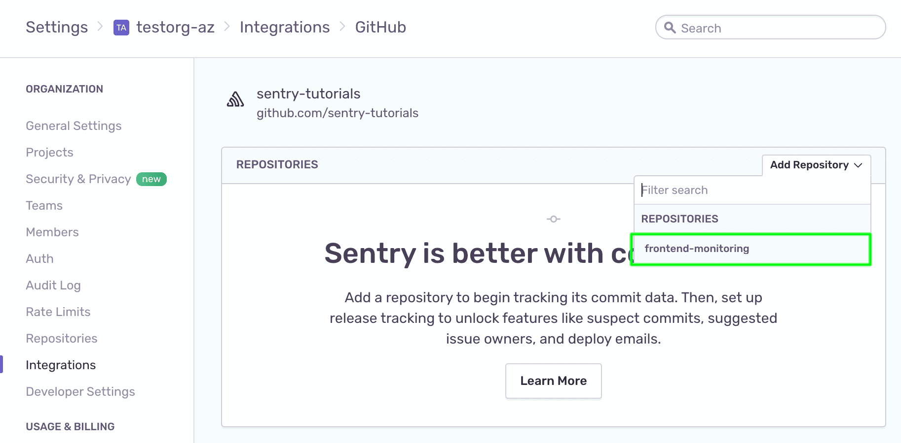
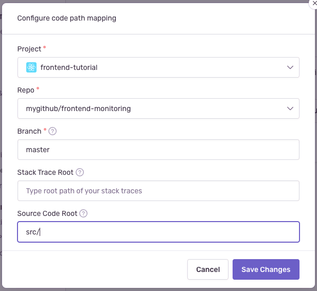
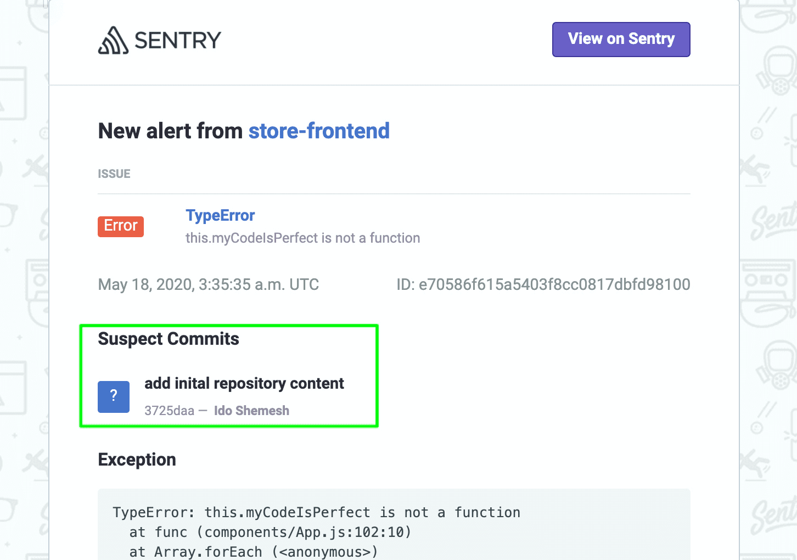
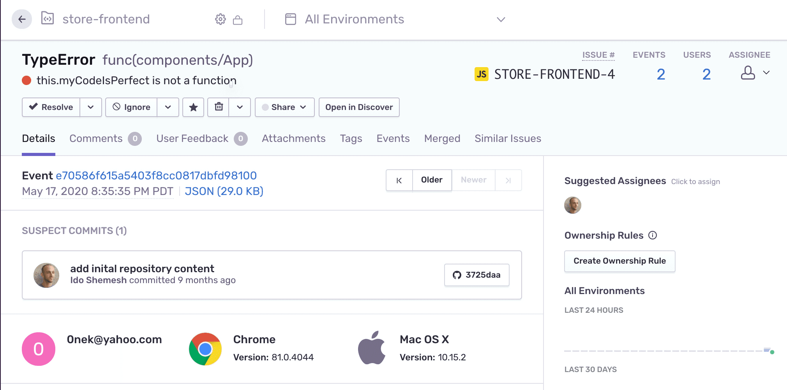
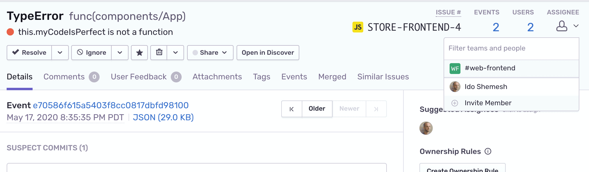
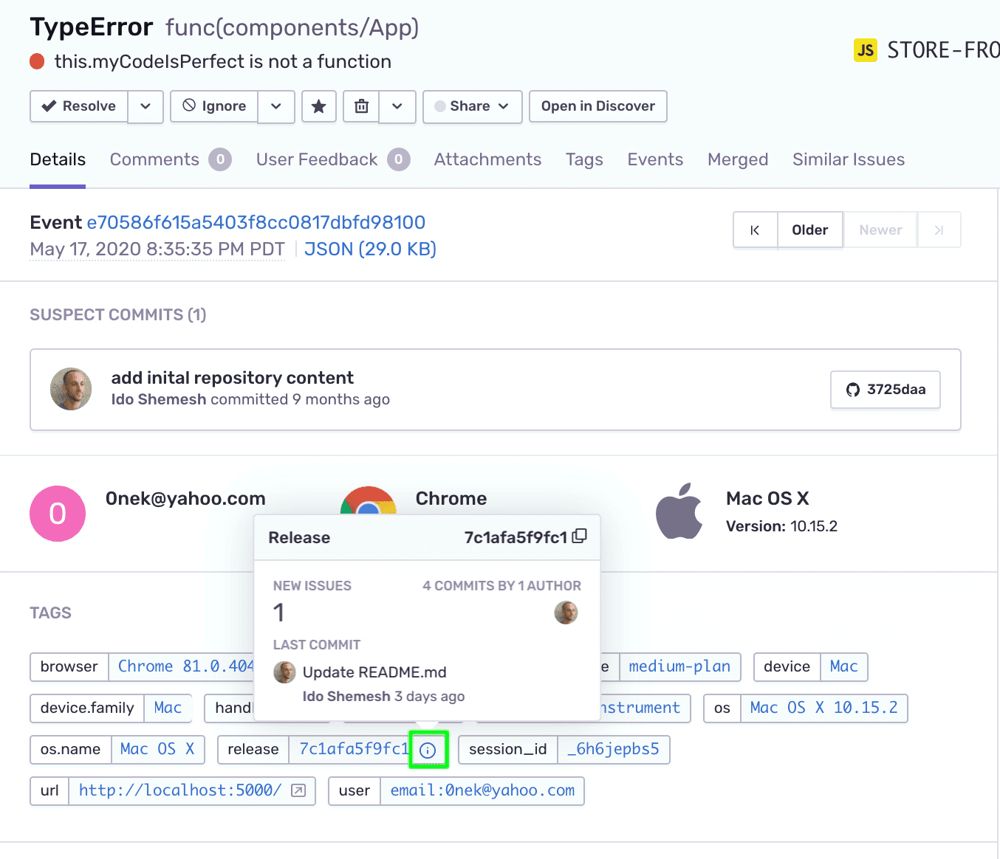
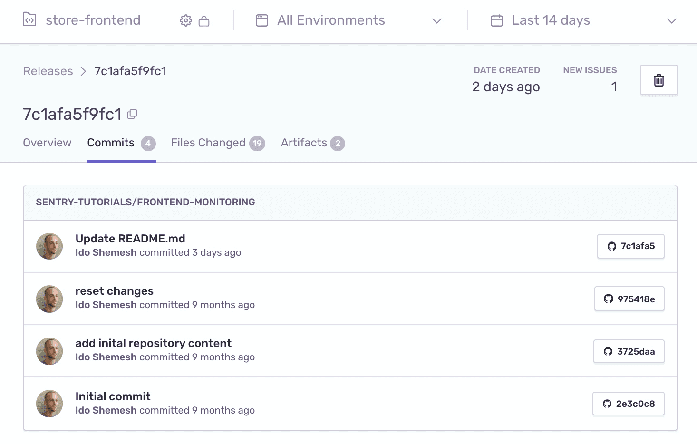
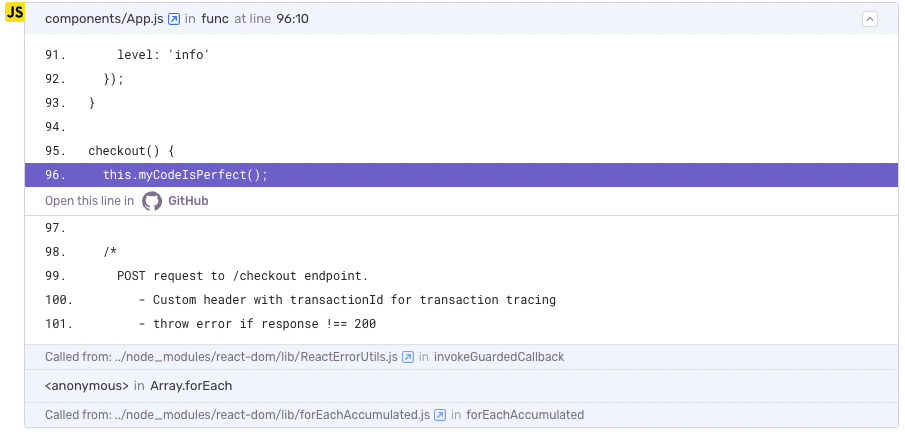

<Include name="only-error-issues-note.mdx" />

Sentry uses commit metadata from your source code repositories to help you resolve your issues faster. This is done by suggesting _suspect commits_ that might have introduced an error right in your **Issue Details** page. It also allows Sentry to display _suggested assignees_ — the list of the authors of those commits — and suggest their assignment to resolve the issue.

Now that you've created a release, you can tell Sentry which commits are associated with this latest version of your code; this is called _commit tracking_.

## Step 1: Integrate Your GitHub Account and Repository

1. To integrate GitHub with your Sentry org, follow the instructions in [our GitHub documentation](/product/integrations/source-code-mgmt/github/).

2. Add the `frontend-tutorial` repository from your GitHub account.

   

3. Click the "Code Mappings" tab

4. Add a code mapping between the `frontend-tutorial` repository and your Sentry project and the `main` or `master` branch depending on your repository. Tell Sentry that your components live in the `src/` directory:

   

## Step 2: Set Up Commit Tracking

A _release_ is a version of your code deployed to an environment. See the [Releases](/product/releases/) documentation to learn more. Sentry uses releases to match up your source maps and source code. Releases can also be used to enable Sentry's [Suspect Commits](/product/issues/suspect-commits/) feature.

The Sentry webpack plugin automatically configures release information and sends it to Sentry when you create a new build of your project.

## Step 3: Suspect commits and suggested assignees

Now suspect commits and suggested assignees should start appearing on the **Issue Details** page. Sentry determines these using files observed in the stack trace, authors of those files, and ownership rules.

1. Refresh the browser and generate an error by adding products to your cart and clicking "Checkout".

2. Check your email for the alert about the new error. Notice that a new "Suspect Commits" section has been added to the email.

   

3. Click "View on Sentry" to open the **Issue Details** page.

4. In the main area of the page, notice the "SUSPECT COMMITS" section now points to a commit that most likely introduced the error. You can click on the commit button to see the actual commit details on GitHub.

5. In the right side panel, under "Suggested Assignees", you'll see that the author of the suspect commit is listed as a suggested assignee for this issue.

   

   You can assign the suggested assignee to the issue by clicking on the icon. However, in this case, the commit originates in the repository upstream, and the suggested assignee is not part of your organization. Alternatively, you can manually assign the issue to other users or teams assigned to the project.

6. Click on the "ASSIGNEE" dropdown and select one of the project users or teams.

   

7. In the main area of the page, under "TAGS", find the `release` tag and **hover over** the "i" icon.

8. In the popup that appears, notice the release now contains the commit data.

   

9. Click on the release "i" icon to open the **Release Details** page.

10. Select the "Commits" tab. Notice that release now contains the associated list of commits.

    

## Step 4: Using Stack Trace Links

Stack trace links allows you to jump from a stack trace in [sentry.io](https://sentry.io) to the corresponding file in your source code provider. This is done by matching the file path in the stack trace to the file path in your source code provider.

1. Go to the **Issue Details** page for the error you generated in the previous step.

2. If the code mapping is set up correctly, in the stack trace you should see a link with "Open this line in GitHub":

   

## More Information

- [Create Release and Associate Commits](/product/releases/setup/)
- [Global Integrations](/product/integrations/)
