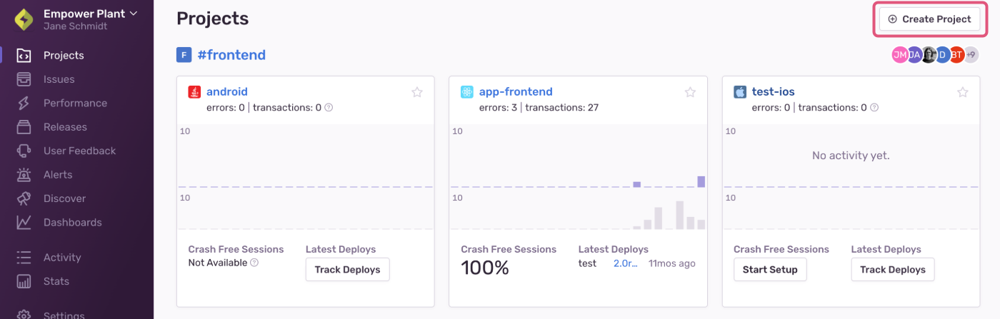
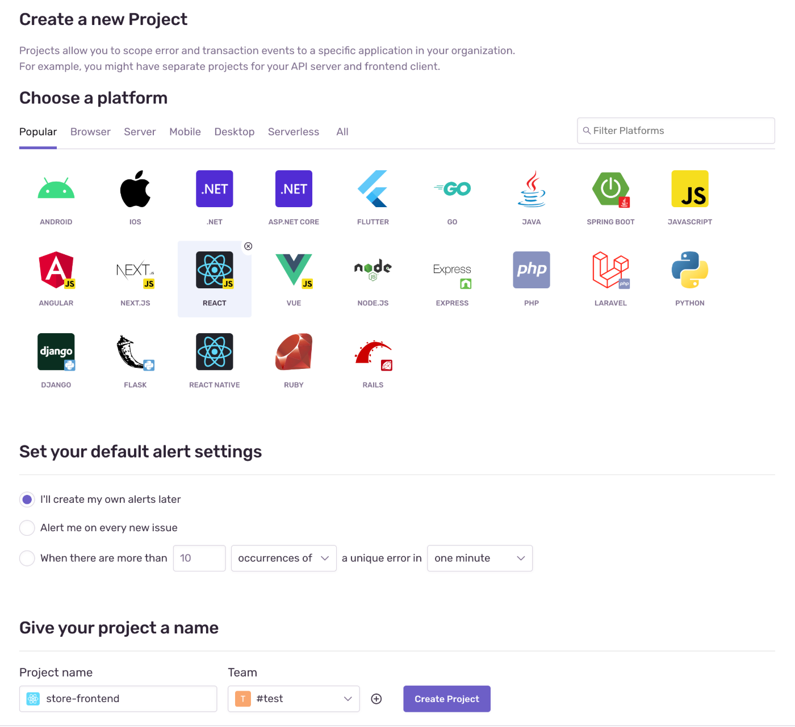
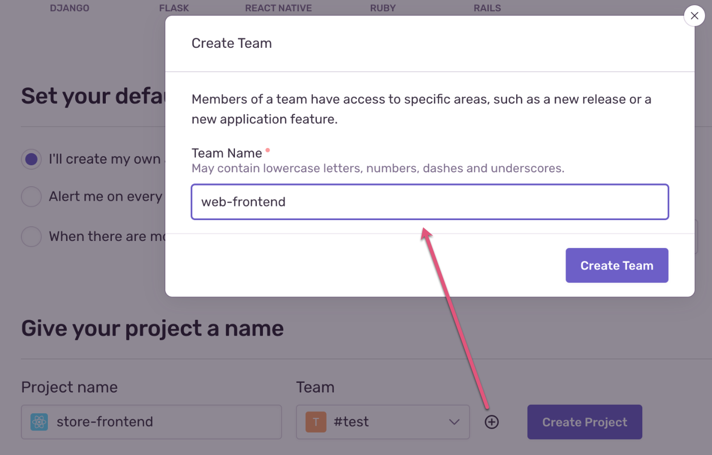
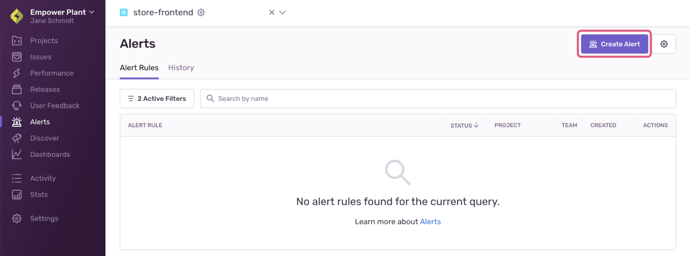
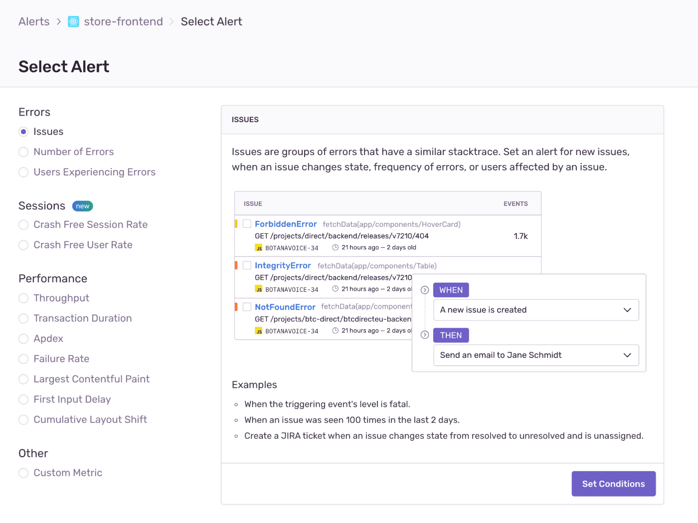
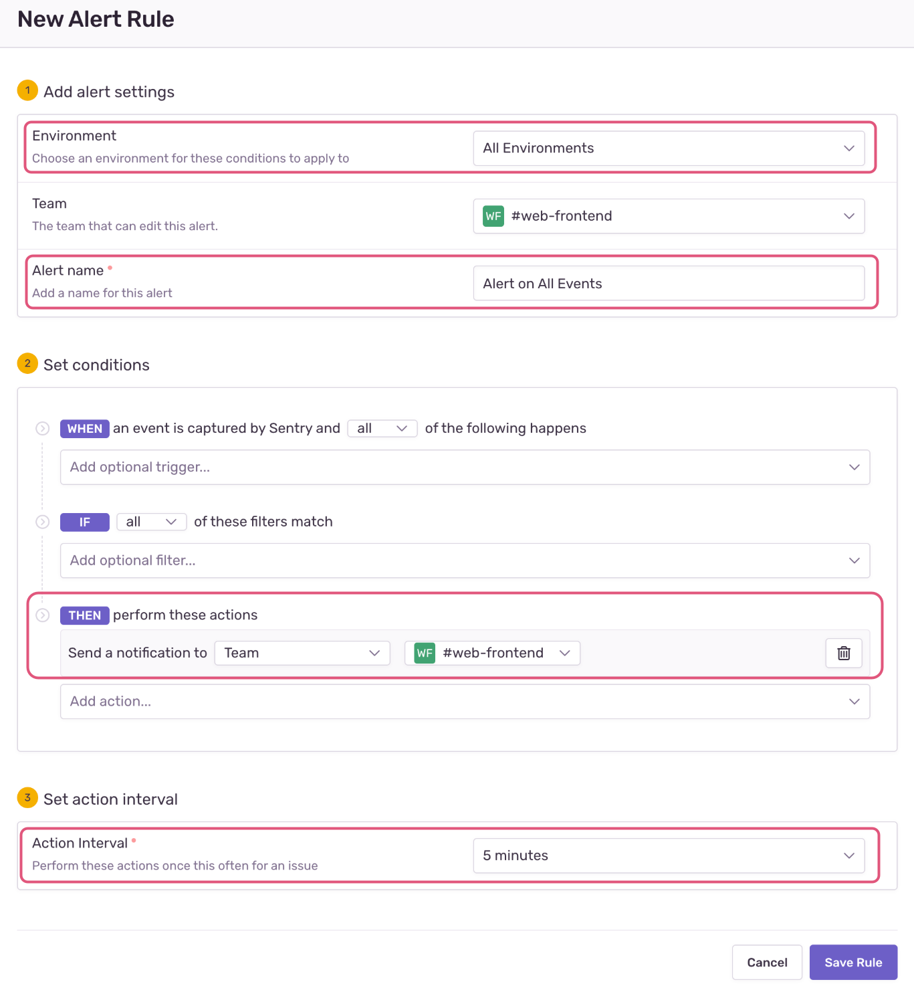

In this tutorial, you create a new _project_ in your Sentry account. Projects allow you to scope events to a distinct application in your organization and assign responsibility and ownership to specific users and teams within your organization. You can create a project for a particular language or framework used in your application. For example, you might have separate projects for your API server and frontend client. For more information see [best practices for creating projects](/product/accounts/getting-started/#4-create-projects)

## Step 1: Create the project

1. Log in to your [Sentry organization](https://sentry.io).

1. Select **Projects** from the left side navigation menu to display the list of all your projects.

1. Click on the "+ Create Project" button.

   

   > If there are no projects in your account, you might be redirected to the onboarding wizard to create your first project.

   - Select the language or framework for your project based on the code you wish to monitor — in this case, "React".

   - Under "Set your default alert settings", select "I'll create my own alerts later".

   - Give the project a name in the "Project name" field.

   - Assign a team to the project by selecting one in the "Team" dropdown.

     

     > If you haven't defined any teams, you can either select the default org team (the team that has the same name as your Sentry org) or click on the "+" button to create a new team.

     

   - Click "Create Project". This takes you to the configuration page. Read through the quick Getting Started guide.

1. Copy the "DSN" key and keep it handy as you will be copying the key into the source code. You can also find this information any time in **[Project] > Settings > Client Keys (DSN)**.

   

   > The DSN (or Data Source Name) tells the SDK where to send the events, associating them with the project you just created.

1. Click on the "Got it!" button at the bottom to create the project.

## Step 2: Create an alert rule

You can create various [alert rules](/product/alerts-notifications/alerts/) for each project and let Sentry know when, how, and whom you want to notify when errors occur in your application. _Alert rules_ consist of _conditions_ and _actions_, which are performed when the associated conditions are met. When creating a new project, you can choose to create it with an alert rule that notifies all project team members (by email) the first time a new _issue_ appears. This means that the next time a **similar error** occurs, the notification is not triggered since the error is not "new".

In this step, you create a new alert rule that notifies **every time** an event occurs, even if it's associated with an already existing issue. In a real-life scenario you'd probably add additional conditions, as you wouldn't want to be notified every time an event happens in your frontend code on your end user's browsers.

1. Select **Alerts** in the left side menu.

1. Click "Create Alert".

   

   > If your project isn't already selected, you'll be prompted to do that before you start rule setup.

1. Select "Issues" as the alert type and click "Set Conditions".

   

1. Enter the following values:

   - In the "Environment" field, select "All Environments"
   - Enter "Alerts on All Events" in the "Alert name" field
   - Under "THEN" conditions, select "Send notification to Suggested Assignees, Team, or Member", and then "Team" in the dropdown list that's displayed; select your team
   - Set the action interval to five minutes

   

   > The new alert rule notifies the selected team members every time _an event is captured_ in _All Environments_. By default, the notification will be sent by email, but you can change your team notification settings in the "Notifications" tab of **Settings > Teams > [Team]**.

1. Click "Save Rule" to create the new rule.

## Next

[Introduce Sentry SDK to Your Frontend Code](/guides/integrate-frontend/initialize-sentry-sdk/)
