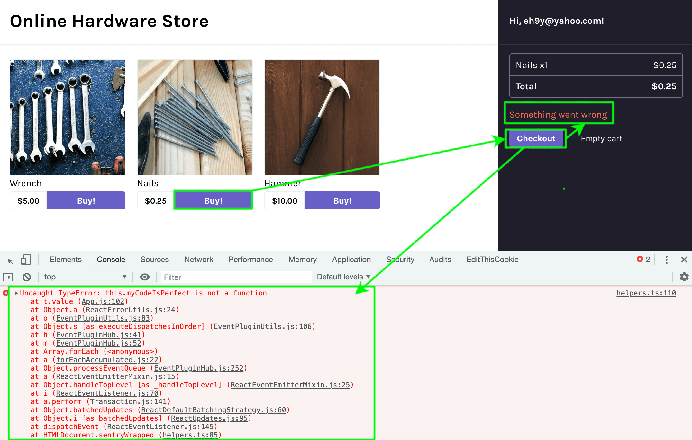
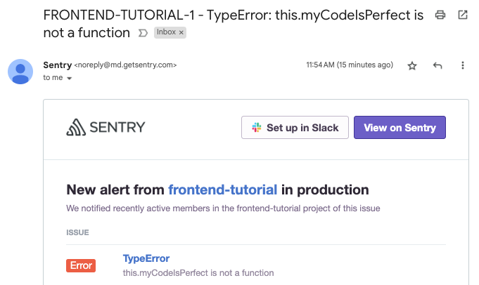

Now that the sample app is up and running on your local environment integrated with the Sentry SDK, you're ready to generate the first error.

## 1. Trigger an Error

To start using Sentry's error monitoring feature, you need some errors first. Let's add in an obvious error that will be easy to see in Sentry.

If you're using your own source code, skip this step. Instead, select your [platform](/platforms/) and follow its **Verify** step inside the **Getting Started** guide to introduce an error.

1. Open `src/components/App.js` and uncomment line 97.

   ```javascript {filename:src/components/App.js}
   this.myCodeIsPerfect();
   ```

   The function `myCodeIsPerfect()` isn't defined, so this will throw an error.

1. Save the file.

1. Refresh your browser and open the browser developer console.

   The app is running in develop mode, so the change to your app should work after a refresh. You shouldn't see any errors in the console yet.

1. Click on any of the "Buy!"" buttons to add products to your shopping cart.

1. Click the "Checkout" button on the right panel to generate an error.

   <div style="position: relative; padding-bottom: calc(36.37860082304527% + 41px); height: 0; width: 100%">
     <iframe
       src="https://demo.arcade.software/fEC5K0E8owyg5R45ePEo?embed"
       frameborder="0"
       loading="lazy"
       webkitallowfullscreen
       mozallowfullscreen
       allowfullscreen
       style="position: absolute; top: 0; left: 0; width: 100%; height: 100%;color-scheme: light;"
       title="FE Tutorial -> Checkout Demo"
     ></iframe>
   </div>

   Notice that:

   - An error message "Something went wrong" displays in the app.
   - The error appears in the browser console.

     

   - An alert is sent to your email address configured on Sentry notifying you about an error that occurred in your app.

     

## 2. View the Error in Sentry

Now that you've triggered an error, let's see what it looks like in Sentry.

1. Open the **Issues** page in [Sentry.io](https://sentry.io/). Make sure your project is selected in the projects dropdown.

2. Select the error from the issues list to to view the full details and context of this error.

   Note that Sentry aggregates similar errors (events) into one [Issue](/product/issues/). If you trigger this error multiple times, you won't see more issues appear. Instead, you'll see the number of events for that issue increase.

3. On the [Issue Details](/product/issues/issue-details/) page, scroll down to the stack trace.

   Notice that the stack trace is _minified_. JavaScript is typically minified to reduce to the size of the source code. This means you can't see the actual lines of code from your app in the stack trace.

   With a little configuration, Sentry can unminify your code back to its readable form and display your source code in each stack frame. You'll set this up in the next section.

### UI Walkthrough

The animated gif below walks through how to view error details in Sentry.

<div style="position: relative; padding-bottom: calc(52.1021021021021% + 41px); height: 0; width: 100%">
  <iframe
    src="https://demo.arcade.software/nTTSJdR4TyqHATbVMOzA?embed"
    frameborder="0"
    loading="lazy"
    webkitallowfullscreen
    mozallowfullscreen
    allowfullscreen
    style="position: absolute; top: 0; left: 0; width: 100%; height: 100%;color-scheme: light;"
    title="FE Tutorial - View First Error"
  ></iframe>
</div>

## Next

At this point, you've verified that Sentry is monitoring errors for your app. So you know there's an issue, but where do you go to fix it? In the next section, you'll learn how to [Enable Readable Stack Traces in Your Errors](/product/sentry-basics/integrate-frontend/upload-source-maps/) so Sentry can show you exactly which line in which file is causing the issue.
