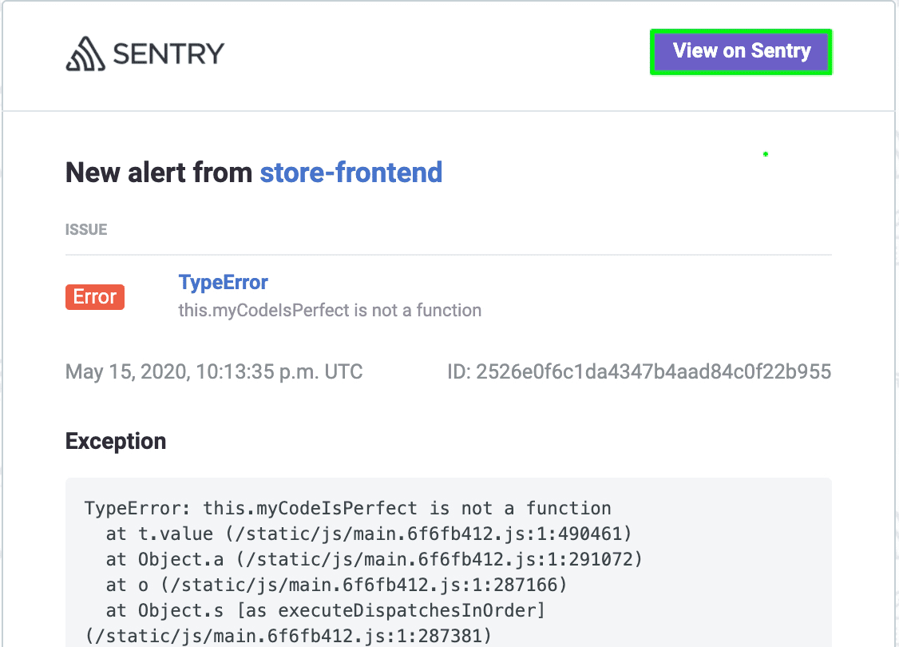

Now that the demo app is up and running on your local environment integrated with the Sentry SDK, you're ready to generate the first error.

<Note>

If you're not using the provided React demo code, follow [the Verification step](/platforms/javascript/#verify) to introduce an error to your source code and then continue with [Step 2](#step-2-handle-the-error) here.

</Note>

## Step 1: Capture your first event

1. Launch the demo app by opening the [localhost link](http://localhost:5000) in your browser.

2. Open the browser's "Console" to verify that an error has occurred.

   

3. Click on any of the "Buy!" buttons to add products to your shopping cart.

4. Click the "Checkout" button on the right panel to generate an error.

   

   Notice that:

   - An error message "Something went wrong" displays in the app
   - The error appears in the browser console
   - An alert is sent to your email address configured on Sentry notifying you about an error that occurred in your app

     

## Step 2: Handle the error

1. Go to your email and open the notification from Sentry.

   

2. Click "View on Sentry" to view the full details and context of this error in your Sentry account.

   

   > Note that Sentry aggregates similar errors (events) into one _issue_.

3. In your account, scroll down to the "Exception" stack trace.

   

   - Notice that the stack trace is _minified_. JavaScript is typically minified to reduce to the size of the source code.
   - Sentry can unminify the code back to its readable form and display source (code) context lines in each stack frame, which is covered in the next section.

## Next

[Enable Readable Stack Traces in Your Errors](/guides/integrate-frontend/upload-source-maps/)
