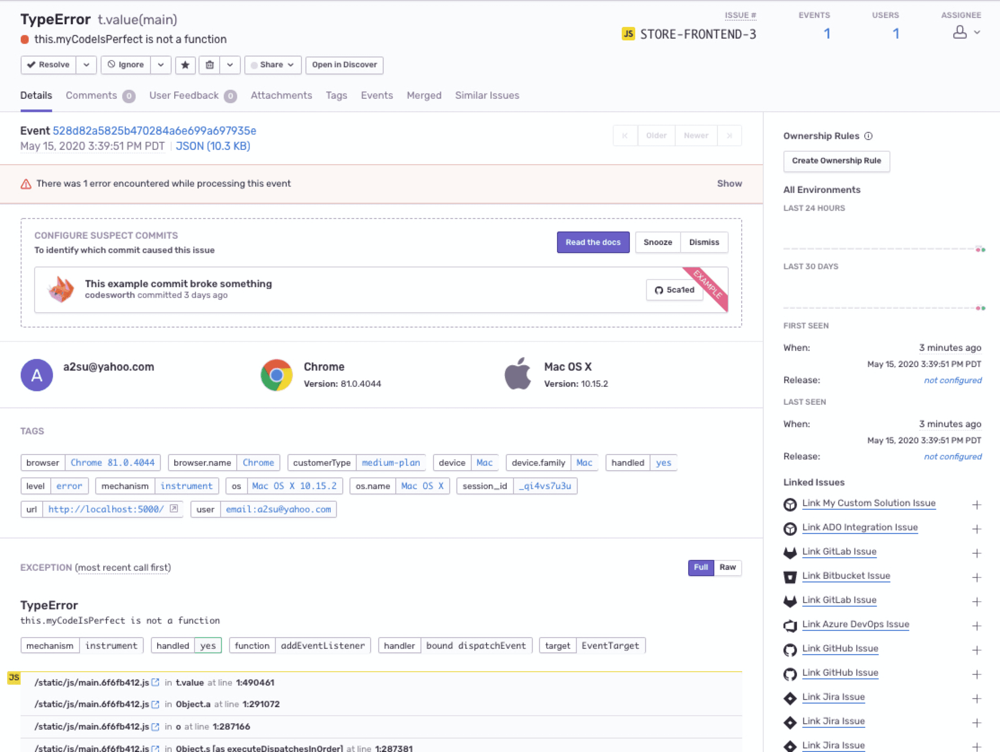
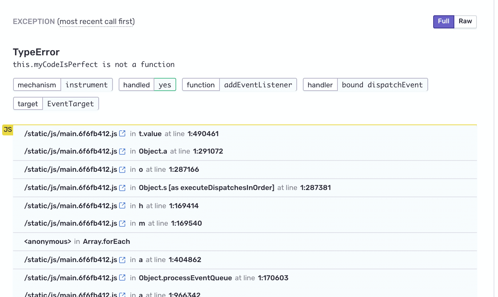

Now that the demo app is up and running on your local environment integrated with the Sentry SDK, you're ready to generate the first error.

If you're using your own source code, you can skip this section. Instead:

- Select your [platform](/platforms/) and follow its **Verify** step inside the **Getting Started** guide to introduce an error.
- Then continue with [Step 2: Handle the error](#step-2-handle-the-error) here.

## Step 1: Trigger an Error

Let's add in an obvious error that will be easy to see in Sentry.

1. Open `src/components/App.js` and uncomment line 97

   ```javascript {filename:src/components/App.js}
   this.myCodeIsPerfect();
   ```

   The function `myCodeIsPerfect()` isn't defined, so this will throw error.

   Save the file.

1. Refresh your browser and open the browser developer console

   The app is running in develop mode, so the change to your app should work after a refresh. You shouldn't see any errors in the console yet.

1. Click on any of the "Buy!" buttons to add products to your shopping cart.

1. Click the "Checkout" button on the right panel to generate an error.

   

   Notice that:

   - An error message "Something went wrong" displays in the app
   - The error appears in the browser console
   - An alert is sent to your email address configured on Sentry notifying you about an error that occurred in your app

     

## Step 2: Handle the error

1. Open up your project in [Sentry.io](https://sentry.io/).

2. Select the error from the Issues list to to view the full details and context of this error.

   

   Note that Sentry aggregates similar errors (events) into one [Issue](product/issues/), so if you trigger this error multiple times you won't see more Issues appear in the list.

3. On the [Issue Details](/product/issues/issue-details/) page, scroll down to the stack trace.

   

   Notice that the stack trace is _minified_. JavaScript is typically minified to reduce to the size of the source code. This means you can't see the actual lines of code from your app in the stack trace.

   With a little configuration, Sentry can unminify your code back to its readable form and display your source code in each stack frame. You'll set this up in the future section.

## Next

[Add Custom Context to Your Errors](/guides/integrate-frontend/add-context/)
