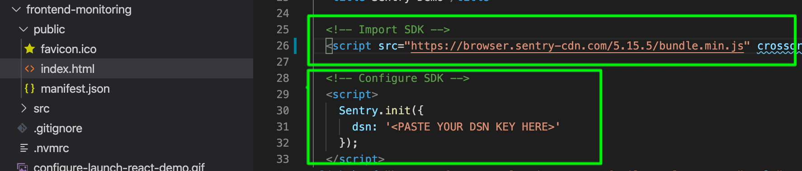
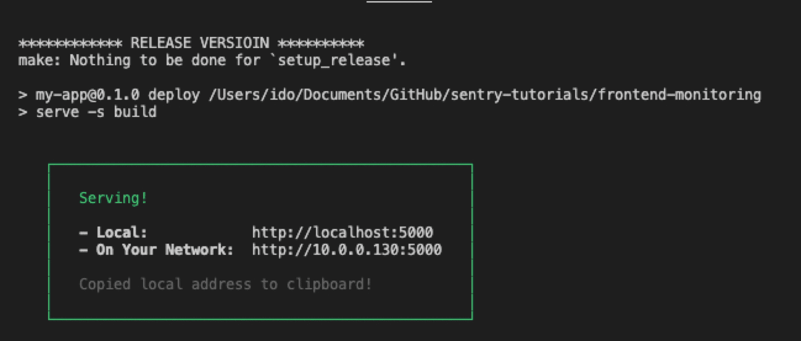

This section walks you through how to import the sample application into your local development environment, add the Sentry SDK, and initialize it.

If you're using your own source code, you can skip this section. Instead:

- Select your [platform](/platforms/) and follow its **Getting Started** guide to add the Sentry SDK to your code.
- Then, skip to the [next step](/guides/integrate-frontend/generate-first-error/).

## Step 1: Clone the Sample Application

1. Fork the [sample application's repository](https://github.com/getsentry/frontend-tutorial) on GitHub.

1. Clone the forked respository to your local environment:

   ```bash
   git clone git@github.com:getsentry/frontend-tutorial.git
   ```

1. Open the "frontend-tutorial" project in your preferred code editor.

## Step 2: Add the Sentry SDK

Sentry captures data by using a platform-specific SDK within your application runtime. To use the SDK, import and configure it in your source code. This demo project uses [Sentry's React SDK](https://github.com/getsentry/sentry-javascript/tree/develop/packages/react).

1. Open the `index.html` file (located under `_./frontend-monitoring/public/_`).

   

   > Notice that we import and initialize the SDK as early as possible in our code. When initializing the SDK, we provide the desired configuration. The only mandatory configuration option is the **DSN** key, however, the SDK supports multiple other configuration options. Learn more in our [Configuration documentation](/platforms/javascript/configuration/).

2. In the Sentry SDK configuration, enter the `DSN` key value you copied from the project created in the [previous steps](#step-1-get-the-code).

   ```javascript
   Sentry.init({
     dsn: "<PASTE YOUR DSN KEY HERE>",
   });
   ```

## Step 3: Install and run the demo app

To build and run the demo application on your localhost:

1. Open a shell terminal and change directory to the `frontend-monitoring` project folder.

2. Use the `.nvmrc` file to set the Node version compatible with this project. Run:

   ```bash
   > nvm use
   ```

3. Install project dependencies by running:

   ```bash
   > npm install
   ```

4. Build, deploy, and run the project on your localhost by running:

   ```bash
   > npm run deploy
   ```

   

   > Once the deploy finishes successfully, you'll see the confirmation in your terminal.

## Next

[Capture Your First Error](/guides/integrate-frontend/generate-first-error/)
