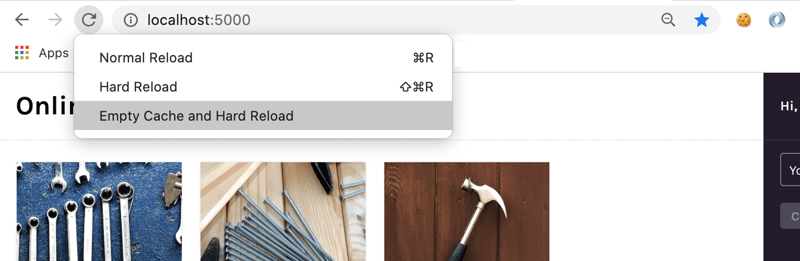

When creating web applications, most development workflows involve transforming your JavaScript code via transpilation and minification to make it run more efficiently in the browser. Source map files serve as a guide for tools like Sentry to convert the transformed version of your JavaScript back to the code that you wrote. Source map files can be generated by your JavaScript build tool.

## 1. Generate Source Map Files Using Your Build Tool

The sample project uses Webpack as its build tool. We'll configure it to generate source maps and check that they are output.

1. To configure Webpack to generate source maps, open `webpack.config.js` and uncomment line 11:

   ```javascript {filename:webpack.config.js}
   devtool: "source-map",
   ```

1. Save the file.

1. Webpack only generates source maps when you create a production build. To do so, stop your app running in develop mode with `Ctrl + C` and start a production build by running:

   ```bash
   npm run build
   ```

   You should see a new `build` folder in your project. Inside, there should be a `main.js` file and a `main.js.map` file. `main.js` is your minified JavaScript. `main.js.map` is the source map file.

## 2. Upload Your Source Maps to Sentry

1. Install the Sentry Webpack plugin

   ```bash
   npm install @sentry/webpack-plugin --save-dev
   ```

1. Open `webpack.config.js` and uncomment lines 3 and lines 16-24 to add the plugin configuration to Webpack.

   ```javascript {filename:webpack.config.js}
   const { sentryWebpackPlugin } = require("@sentry/webpack-plugin");

   ...

   module.exports = {
      ...
     plugins: [
         sentryWebpackPlugin({
            org: "<your_org>",
            project: "<your_project>",

            // Auth tokens can be obtained by creating an internal integration
            // at https://<organization_id>.sentry.io/settings/developer-settings/
            // and need "Release: Admin" and "Organization: Read & Write" permissions
            authToken: process.env.SENTRY_AUTH_TOKEN,
         }),
      ],
      ...
   }
   ```

1. Replace `<your_org>` with your Sentry organization slug. This is part of your Sentry URL (for example, https://<organization_slug>.sentry.io/projects/) and can also be found in the **Organization Settings** page.

1. Replace `<your_project>` with your project's name.

1. Save the file.

1. Create a Sentry authentication token:

   1. Go to **Organization Settings**.
   1. In the left side panel, under "Developer Settings", click "Custom Integrations".
   1. Click "Create New Integration".
   1. Select "Internal Integration".
   1. Click "Next".
   1. Name your integration.
   1. Under "Permissions", for "Release", select "Admin" from the dropdown.
   1. Under "Permissions", for "Organization", select "Read & Write" from the dropdown.
   1. Click "Save Changes". This will create a new internal Sentry integration and org-level auth token.
   1. Once the save is confirmed, scroll down to the bottom of the page and copy the token under "TOKENS".

   The gif below walks through how to create an authentication token in the UI:

   <div style="position: relative; padding-bottom: calc(51.885474860335194% + 41px); height: 0; width: 100%">
     <iframe
       src="https://demo.arcade.software/Rw34T3RDwHxtHTKlPfJw?embed"
       frameborder="0"
       loading="lazy"
       webkitallowfullscreen
       mozallowfullscreen
       allowfullscreen
       style="position: absolute; top: 0; left: 0; width: 100%; height: 100%;color-scheme: light;"
       title="FE Tutorial -> Create Auth Token"
     ></iframe>
   </div>

1. Paste the following into your terminal, replacing `<your_authentication_token>` with the authentication token you copied from Sentry.

   ```bash {filename:.env}
   export SENTRY_AUTH_TOKEN=<your_authentication_token>
   ```

## 3. Trigger Another Error

1. Create a fresh production build with your changes from the previous step:

   ```bash
   npm run build
   ```

1. Confirm that your source maps were correctly uploaded to Sentry and associated with your project's latest release. Your terminal output should include a `Source Map Upload Report`, which might look like the following:

   ```bash
   > Organization: <your_org>
   > Project: <your_project>
   > Release: 0d40018e21151113e224f208fb934a0d29f10508
   > Dist: None
   > Upload type: artifact bundle
   Source Map Upload Report
      Minified Scripts
         ~/f320b889-aa78-4850-8625-802a2ee9aca3-0.js (sourcemap at main.js.map, debug id f320b889-aa78-4850-8625-802a2ee9aca3)
      Source Maps
         ~/f320b889-aa78-4850-8625-802a2ee9aca3-0.js.map (debug id f320b889-aa78-4850-8625-802a2ee9aca3)
   [sentry-webpack-plugin] Info: Successfully uploaded source maps to Sentry
   ```

1. Run your production build:

   ```bash
   npx serve build
   ```

1. Open the production build of the sample application in your browser.

   The sample app should be running at [http://localhost:3000/](http://localhost:3000/) or the URL output in your terminal in the last step.

1. In your browser, make sure that the dev console is open and perform an "Empty Cache and Hard Reload" to make sure the updated code is being served.

   

1. Generate the error again by adding products to your cart and clicking "Checkout".

1. Go to the **Issues** page in Sentry. Since you added a new release, a new issue should be created even though it's the same error as before.

1. Click on the new issue to open its **Issue Details** page.

1. Notice that there's now a release tag for the issue and that the error stack trace is now un-minified. The stack trace now includes the file name, method name, line and column number, and source code context in every stack frame.

<div style="position: relative; padding-bottom: calc(50.470673425054315% + 41px); height: 0; width: 100%">
  <iframe
    src="https://demo.arcade.software/h8HE2fg7lTfWCxuelAoy?embed"
    frameborder="0"
    loading="lazy"
    webkitallowfullscreen
    mozallowfullscreen
    allowfullscreen
    style="position: absolute; top: 0; left: 0; width: 100%; height: 100%;color-scheme: light;"
    title="FE Tutorial -> View Readable Stack Trace"
  ></iframe>
</div>

## Next

Now you have all the information you need about the error and a clear stack trace. To get even more value out of Sentry, [Enable Suspect Commits & Stack Trace Linking](/product/sentry-basics/integrate-frontend/configure-scms/) so you can go directly to the code and assign the right developer to handle the issue.
