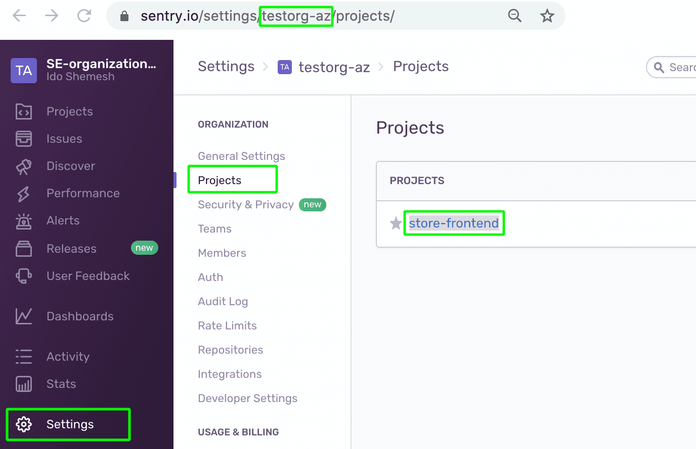
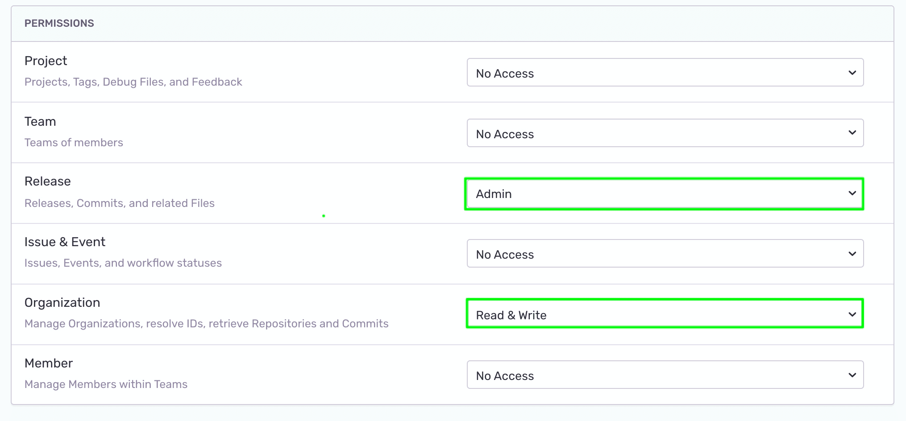
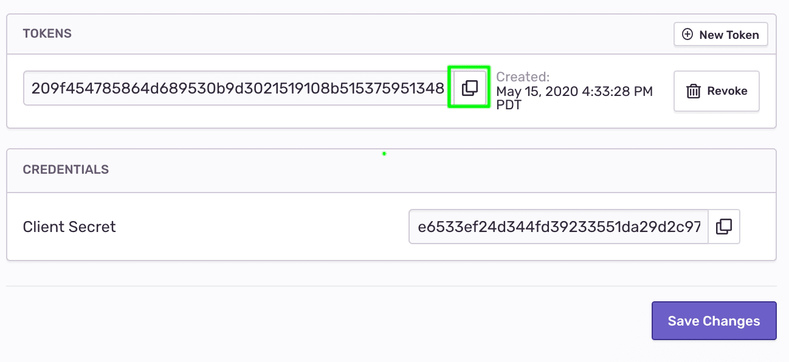
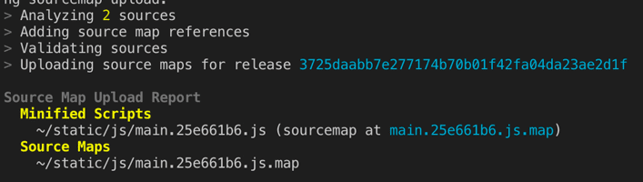
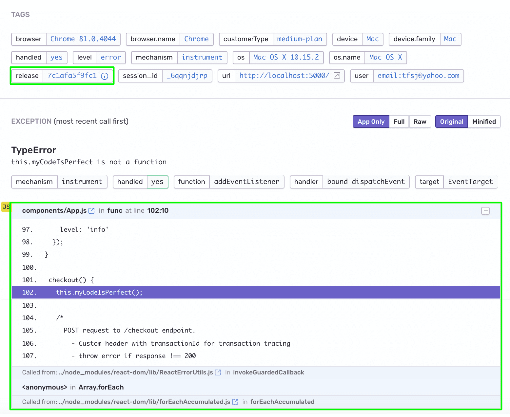
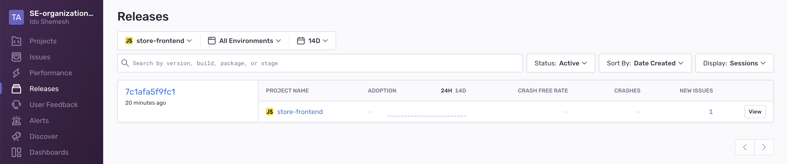
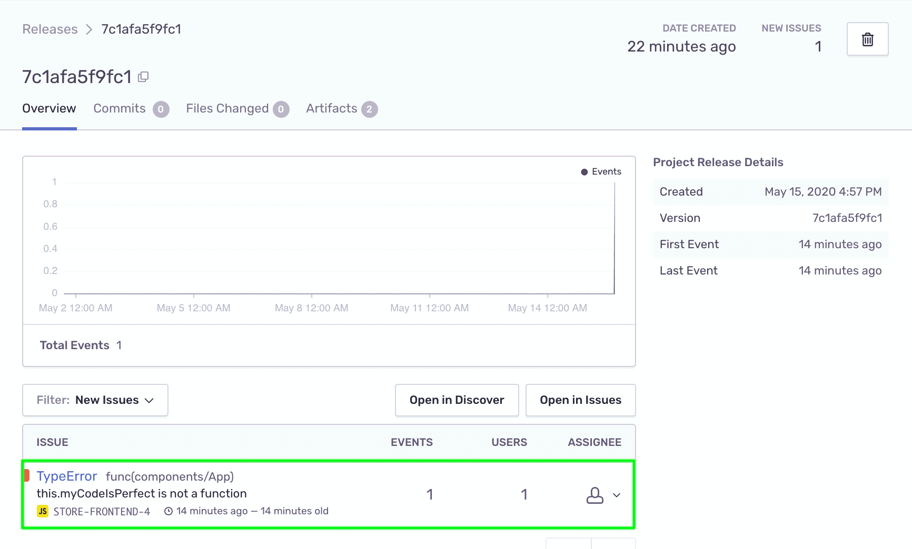
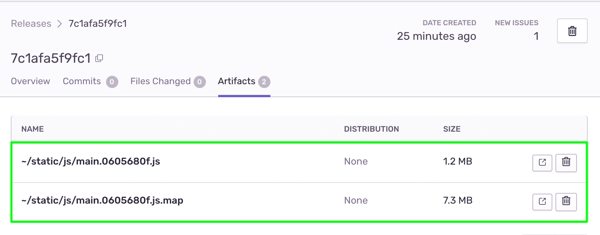

When creating web applications, most development workflows involve transforming your JavaScript code via transpilation and minification to make it run more efficiently in the browser. Source map files serve as a guide for tools like Sentry to convert the transformed version of your JavaScript back to the code that you wrote. Source maps files can be generated by your JavaScript build tool.

## Step 1: Generate Source Map Files Using Your Build Tool

The sample project uses webpack as its build tool. We'll configure it to generate source maps and check that they are output.

1. To configure webpack to generate source maps, open `webpack.config.js` and uncomment line 11:

   ```javascript {filename:webpack.config.js}
   devtool: "source-map",
   ```

1. Webpack only generates source maps when you create a production build. To do so, stop your app running in develop mode with Ctrl + C and start a production build by typing:

   ```bash
   npm run build
   ```

   You should see a new folder in your project called "build". Inside, there should be a `main.js` file and a `main.js.map` file. `main.js` is your minified JavaScript. `main.js.map` is the source map file.

## Step 2: Upload Your Source Maps to Sentry

1. Install the Sentry webpack plugin

   ```bash
   npm install @sentry/webpack-plugin --save-dev
   ```

1. Open `webpack.config.js` and uncomment lines 3 and lines 16-23 to add the plugin configuration to webpack.

   ```javascript {filename:webpack.config.js}
   const { sentryWebpackPlugin } = require("@sentry/webpack-plugin");
   ```

   ```javascript {filename:webpack.config.js}
   sentryWebpackPlugin({
      org: "<your org>",
      project: "<your project>",

      // Auth tokens can be obtained by creating an internal integration
      // at https://<organiaztion_id>.sentry.io/settings/developer-settings/
      // and need "Release: Admin" and "Organization: Read & Write" permissions
      authToken: process.env.SENTRY_AUTH_TOKEN,
   }),
   ```

1. Replace `<your org>` and `<your project>` with your Sentry organization ID and your project name.

   To find your organization ID and project name values:

   - Open your Sentry account and click **Settings > Projects**.
   - Your organization ID, is part of the browser URL (for example, https://sentry.io/settings/**organization_id**/projects/).
   - Your project name is the name that appears in the project tile.

     

1. Create a Sentry authentication token:

   - In the Organization Settings menu, click "Developer Settings" in the left side panel.
   - Click on "New Internal Integration".

     

   - Enter a name.
   - Under "Permissions" select "Admin" in the "Release" dropdown, and "Read & Write" in the "Organization" dropdown.

     

   - Click "Save Changes".
   - This will create a new internal Sentry integration and org-level auth token.
   - Once the save is confirmed, scroll down to the bottom of the page and copy the token under "TOKENS".

     

1. Paste the following into your terminal, replacing `<your authentication token>` with the authentication token you copied from Sentry.

   ```bash {filename:.env}
   export SENTRY_AUTH_TOKEN=<your authentication token>
   ```

## Step 3: Trigger Another Error

1. Create a fresh production build with your changes from the previous step:

   ```bash
   npm run build
   ```

1. Notice that your terminal output provides you a "Source Map Upload Report" to confirm that your source maps were correctly uploaded to Sentry.

1. Run your production build:

   ```bash
   npx serve build
   ```

1. Open the production build of the sample application in your browser

   The sample app should be running at [http://localhost:3000/](http://localhost:3000/) or the URL output in your terminal in the last step.

   

1. Look at the terminal log. Notice that the minified scripts and source maps were uploaded to the release version.

   

1. In your browser, make sure that the dev console is open and perform an "Empty Cache and Hard Reload" to make sure the updated code is being served.

   

1. Generate the error again by adding products to your cart and clicking "Checkout".

1. Check your Email for the alert about the new error and click "View on Sentry" to open the **Issue Details** page.

1. Notice that:

   - The event is now tagged with the `Release ID`.
   - The error stack trace is now un-minified and includes the file name, method name, line and column number, and source code context in every stack frame.

   

## Step 4: Explore the release

Creating a release version and uploading the source maps through the Sentry CLI, creates a `Release` entity in your Sentry account.

1. In [sentry.io](https://sentry.io), click "Releases" in the left side panel. Notice that a new release version was created:

   

2. Click on the release and you'll see that the error in your app has been associated with this release and is listed as a "New Issue".

   

3. Click on the "Artifacts" tab, and notice the minified resources and source maps are available for this release and are used to source map stack traces.

   

## Next

Now that we have all the information we need about the error and a clear stack trace, the next thing is to assign the right developer to handle it.

[Enable Suspect Commits](/product/sentry-basics/integrate-frontend/configure-scms/)
