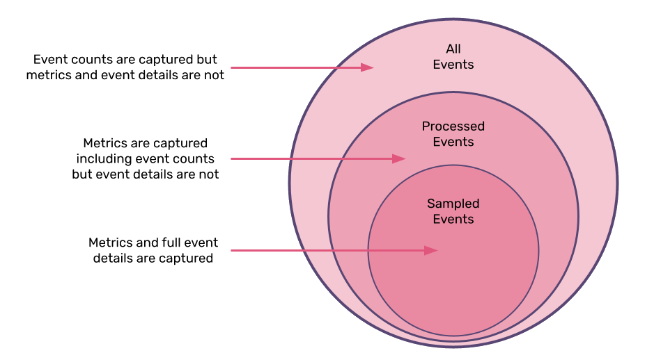

<Note>

This feature is available only if you're in the Early Adopter program. Features available to Early Adopters are still in-progress and may have bugs. We recognize the irony. If you’re interested in being an Early Adopter, you can turn your organization’s Early Adopter status on/off in General Settings. This will affect all users in your organization and can be turned back off just as easily.

</Note>

When you're using [sentry.io](https://sentry.io), the transaction information that you see is generated by one of two types of events:

- Processed events - All the events that you send to Sentry, based on your SDK sample rate. Underlies _metric-backed_ data.
- Indexed events - A sub-set of your processed events, based on your dynamic sampling settings. Underlies _events-based_ data.

_Processed_ events can include all the events that occur in your application or a sub-set of those. The number of these events that you send to Sentry is based on the sample rate that you set in the SDK. These events represent aggregate data. This is used in areas of the application like **Performance** and **Dashboards**. The larger your set of processed events, the better able we are to provide you with statistically significant insights into the performance of your application. In [sentry.io](https://sentry.io), you may see the data generated from these events referred to as _metrics_ or _metric-backed_.

Because these events represent aggregate data, Sentry doesn't store the full transaction data. So when you're viewing information in [sentry.io](https://sentry.io) that's based on these events, or based on metrics data, you can't drill down into the specifics of these events.

_Indexed_ events are a sub-set of your processed events, and this sub-set is created based on your dynamic sampling settings. These are the events that you decide to keep from your processed events that Sentry stores for you. For these events, we store the complete transaction data, so you can drill down into each event for further insights. In [sentry.io](https://sentry.io), you may see the data generated from these events referred to as _transaction data_ or _events-based_.

<!-- TO DO: TALK ABOUT DIFFERENT USE CASES HERE -->

## Custom Performance Metrics

Custom performance metrics on transactions allow you to define metrics that are important to your application and send them to Sentry. Currently, you can set these in the [JavaScript SDK (version `7.0.0` or higher)](/platforms/javascript/performance/instrumentation/performance-metrics/).
