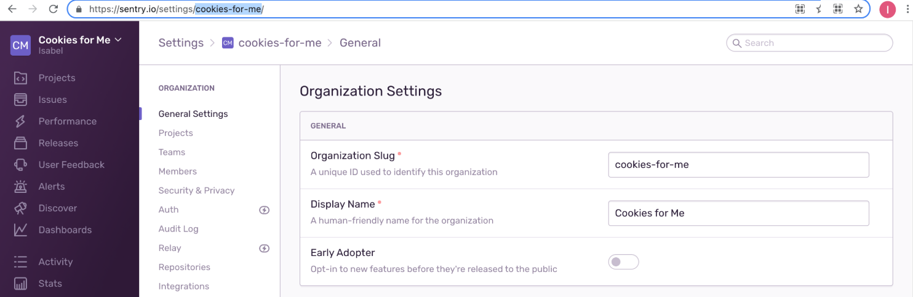

Sentry offers a cloud-hosted, software-as-a-service (SaaS) solution in addition to a self-hosted solution, which are both functionally the same. However, many customers find that self-hosted Sentry can quickly become expensive to maintain, scale, and support, making our SaaS product the better and less costly option.

For additional reading on considering SaaS, take a look at:

- [Self Hosted or Cloud Sentry?](https://sentry.io/_/resources/about-sentry/self-hosted-vs-cloud/)
- [XS:Code > Open Source is Free - But Expensive](https://dev.to/helad11/open-source-is-free-but-expensive-3h8a)
- [Frequently asked migration questions](https://sentry.io/from/self-hosted/)

## Migrating to Cloud

If your organization started with self-hosted Sentry, you've invested time and effort in configuring and customizing your Sentry org. Once you decide to move to a SaaS account, it's important to know that you can migrate a lot of that investment into your new account instead of starting from scratch.

To make this migration as seamless as possible, Sentry has a migration workflow that allows you to migrate most of your account's settings and configurations.

One thing to note is we won't be able to transfer over historical event data, but new incoming events will populate the projects in your new organization. You will also need to re-invite all your members and add them to the correct teams.

## How to Migrate

### 1. Sign up

Before you begin the migration process, [sign up](https://sentry.io/signup/) for a new organization in Sentry.

Once you complete the onboarding steps, get your **org slug** from the browser URL or in **Settings > General Settings**. We'll need this information to know where to migrate your data.

<Note>

You can also modify your org slug in the org settings.

</Note>

### 2. Choose a plan

Take a look at our [plans](https://sentry.io/pricing/) and select one that suits your needs based on the different features and capabilities. Note that plan pricing varies based on the type of _Contract_ and _Monthly Event Volume_, so make sure you are familiar with your current/expected monthly usage (number of events per month).

If you're expecting higher volumes or you're interested in our Enterprise capabilities (priority support and SLAs, and single-tenant options, for example), please [contact us](https://sentry.io/contact/enterprise/) regarding our **Enterprise Plan**.

### 3. Export your data

Self-hosted Sentry provides a script that allows you to perform a backup of your basic data into a JSON file. For versions of self-hosted under 23.3.1, an `export` command is required instead. See [here](https://develop.sentry.dev/self-hosted/backup/) for more.

Run the following command in your terminal to start the backup script and export your data:

    $ ./scripts/backup.sh

This invokes the Sentry CLI `export` command on a new isolated instance of our Docker web container.

The export migrates your account's settings and configurations, including:

- Project settings
- Alert rules
- Enabled data scrubbers
- Team settings
- Saved search queries
- Integration platform metadata (Sentry 10)

### 4. Send it to us {#4-ship-it-to-us}

To kick off the migration process, contact us using the form at [Switch to Hosted Sentry](https://sentry.io/from/self-hosted/). Once we get your request, one of our support reps will reach out through a support ticket to get the following details:

- Your **Organization slug**.
- **Selected plan**. If you're unsure, let us know. We'll be happy to help you make the right decision. Also, if you think you'll need an Enterprise plan, we can connect you with the right person to discuss details.
- The **sentry_export.json** file.

Alternatively, you can send us an email at [support@sentry.io](mailto://support@sentry.io]) with the subject: `Self-Hosted Migration Application`.

Once we have your organization set up on [sentry.io](https://sentry.io), we'll apply a **$100 credit** to your account for migrating from self-hosted Sentry.
