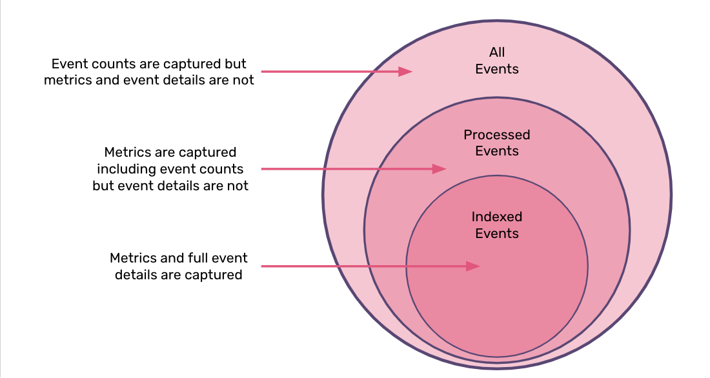
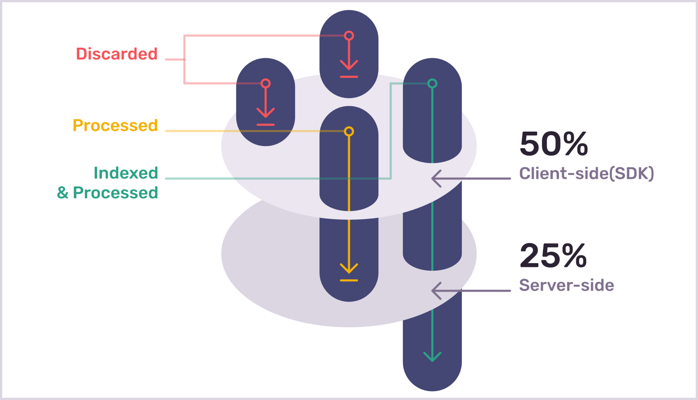
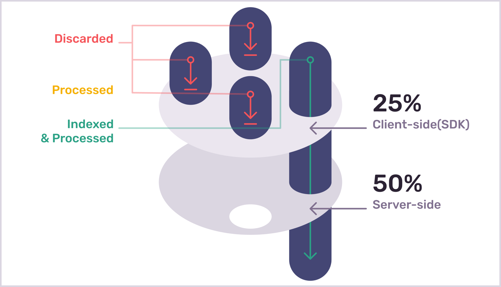

<Include name="limited-avail-note.mdx" />

When you're using [sentry.io](https://sentry.io), the transaction information that you see is generated by one of two types of events:

- Processed events - All the transaction events that you send to Sentry, based on your client-side sample rate in your SDK.
- Indexed events - A sub-set of your processed transaction events, based on your settings in [Dynamic Sampling](/product/data-management-settings/dynamic-sampling/). Underlies _events-based_ data.

Having both of these types of events allows you to view more accurate performance metrics based on all the transaction events you send to Sentry (or your _processed events_), while retaining a smaller number of more relevant transaction events that you can explore in full detail (your _indexed events_).

## Client-Side (SDK) Sampling

_Processed_ transaction events can include all the events that occur in your application or a sub-set of those. The number of these transactions that you send to Sentry is based on your client-side sample rate that you set in the SDK. These transactions represent aggregate data, which is used in areas of the application like **Performance** and **Dashboards**. In [sentry.io](https://sentry.io), you may see the data generated from these transaction events referred to as _metrics_ or _metric-backed_.

Because these transactions represent aggregate data, Sentry doesn't store the full transaction data. So when you're viewing information in [sentry.io](https://sentry.io) that's based on these transactions, you can't drill down into the specifics of individual transaction events.

With this larger set of processed transaction events, we're better able to provide you with more accurate insights into the performance of your application. To increase the accuracy of these insights, increase your client-side sampling rate.

To learn about configuring your client-side sample rate, check out the [SDK-specific documentation](/platform-redirect/?next=/configuration/sampling/).

## Server-Side Sampling

_Indexed_ transaction events are a sub-set of your processed events, and this sub-set is created based on your server-side sampling settings in **[Project] > Settings > Dynamic Sampling**. These are the transactions that you decide to keep from your processed events and that Sentry stores for you. For these events, we store the complete transaction data, so you can drill down into each event for further insights. In [sentry.io](https://sentry.io), you may see the data generated from these transaction events referred to as _transaction data_ or _events-based_.

Increase your server-side sample rate to get more individual transaction events to view or search and set server-side sampling rules to have more relevant transaction events stored.

To learn more about setting server-side sampling rules, check out the full [Dynamic Sampling documentation](/product/data-management-settings/dynamic-sampling/).

## How Sentry Samples

Before looking at how Sentry samples in more detail, there are some concepts you need to know:

- Total transaction volume: Total number of transactions the Sentry SDK has observed before any sampling has begun.
- Client-side (SDK) sampling: The process of selecting which transactions are discarded or sent to Sentry for processing.
- Server-side sampling: The process of selecting which transactions are indexed after being processed. This is controlled by your [Dynamic Sampling](/product/data-management-settings/dynamic-sampling/) settings.

Whether you’re sampling client-side or server-side, it’s always relative to the total transaction volume. Using the first illustration below as an example, we start the process of client-side sampling with a total transaction volume of 4. The client-side sample rate is set at 50%, which leaves only 2 transactions being sent to Sentry for processing. Server-side sampling then takes these 2 processed transactions and indexes only 1 of them because it's sampling at 25% (or a quarter) of the total transaction volume.

In the next illustration, we show what would happen if the client-side sample rate was lower than the server-side rate. We again start the process of client-side sampling with a total transaction volume of 4. The client-side sample rate is lower this time, set at 25%, leaving only 1 transaction being sent to Sentry for processing. At this stage, you might be asking, “how can the server-side sample 50% of the total transaction volume when the client has already discarded 75%?”. The answer: it can’t. So even though the server-side sample rate is set to 50% of the total volume, the server-side sample rate would actually be capped at 25% and it will only index the 1 transaction it received from the client.

Ultimately, your server-side sample rate must always be equal or lower than your client-side sample rate.

