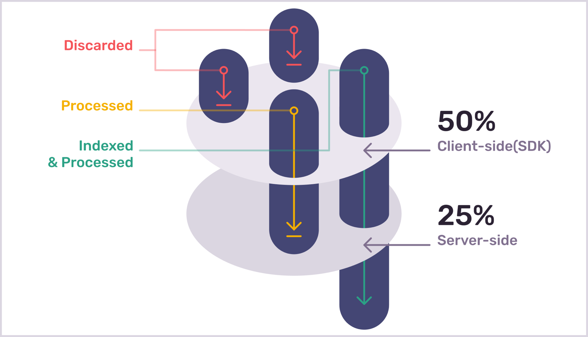

<Note>

This feature is in beta and is only available if your organization is participating in its limited release. Features in beta are still in-progress and may have bugs. We recognize the irony. If you’re interested in participating, [join the waitlist](https://sentry.io/for/performance/#updates-signup).

</Note>

When you're using [sentry.io](https://sentry.io), the transaction information that you see is generated by one of two types of events:

- Processed events - All the events that you send to Sentry, based on your client-side or SDK sample rate. Underlies _metric-backed_ data.
- Indexed events - A sub-set of your processed events, based on your [server-side sample rate](/product/data-management-settings/server-side-sampling/). Underlies _events-based_ data.

We call this ability to set sample these in these different ways _dynamic sampling_. Dynamic sampling is a suite of features that allow you to view accurate and statisically significant performance metrics based on all the events you send to Sentry (or your _processed events_), while retaining a smaller number of more relevant events that you can explore in full detail (your _indexed events_).

## Client-Side (SDK) Sampling

_Processed_ events can include all the events that occur in your application or a sub-set of those. The number of these events that you send to Sentry is based on your client-side sample rate or the sample rate that you set in the SDK. These events represent aggregate data. This is used in areas of the application like **Performance** and **Dashboards**. The larger your set of processed events, the better able we are to provide you with statistically significant insights into the performance of your application. In [sentry.io](https://sentry.io), you may see the data generated from these events referred to as _metrics_ or _metric-backed_.

Because these events represent aggregate data, Sentry doesn't store the full transaction data. So when you're viewing information in [sentry.io](https://sentry.io) that's based on these events, you can't drill down into the specifics of these events.

With this larger set of processed events, we're better able to provide you with statistically significant insights into the performance of your application. To increase the accuracy of these insights, increase your client-side sampling rate.

To learn about configuring your client-side sample rate, check out the [SDK-specific documentation](/platform-redirect/?next=/configuration/sampling/).

## Server-Side Sampling

_Indexed_ events are a sub-set of your processed events, and this sub-set is created based on your dynamic sampling settings. These are the events that you decide to keep from your processed events that Sentry stores for you. For these events, we store the complete transaction data, so you can drill down into each event for further insights. In [sentry.io](https://sentry.io), you may see the data generated from these events referred to as _transaction data_ or _events-based_.

Increase your server-side sampling rate to get better sampled or individual events to view and search.

To learn more about setting server-side sampling rules, check out the full [Server-Side Sampling documentation](/product/data-management-settings/server-side-sampling/).

<!-- TO DO: TALK ABOUT DIFFERENT USE CASES HERE -->

## How Sentry Samples

Before understanding how Sentry samples, there are some concepts you need to know:

- Total transaction volume: Total number of transactions the Sentry SDK has observed before any sampling has begun.
- Client-side (SDK) sampling: The process of selecting which transactions are discarded or sent to Sentry for processing.
- Server-side sampling: The process of selecting which transactions are indexed after being processed.

Whether you’re sampling client-side or server-side, it’s always relative to the total transaction volume. Using the first illustration below as an example, we start the process of client-side sampling with a total transaction volume of 4. The client-side sample rate is set at 50%, which leaves only 2 transactions being sent to Sentry for processing. Server-side sampling then takes these 2 processed transactions and indexes only 1 of them because it's sampling at 25% (or a quarter) of the total transaction volume.

In the next illustration, we show what would happen if the client-side sample rate was lower than the server-side rate. We again start the process of client-side sampling with a total transaction volume of 4. The client-side sample rate is lower this time, set at 25%, leaving only 1 transaction being sent to Sentry for processing. At this stage, you might be asking, “how can the server-side sample 50% of the total transaction volume when the client has already discarded 75%?”. The answer: it can’t. So even though the server-side sample rate is set to 50% of the total volume, it will only index the 1 transaction it received from the client.

Ultimately, your server-side sample rate must always be equal or lower than your client-side sample rate.

