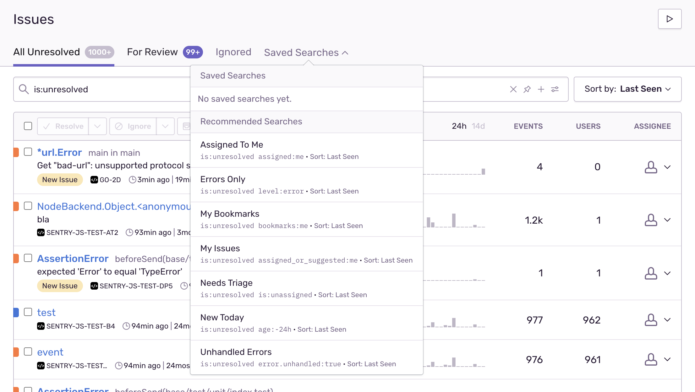
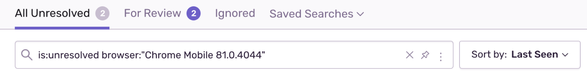
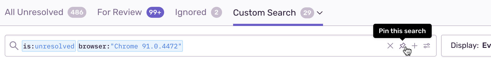
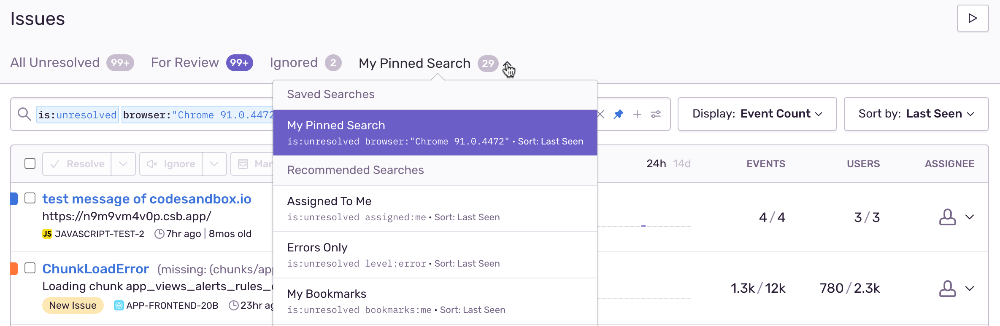
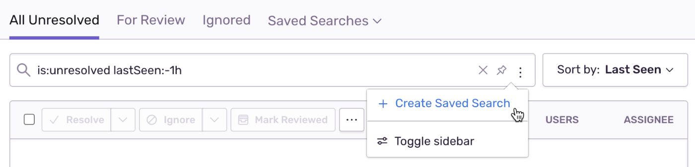
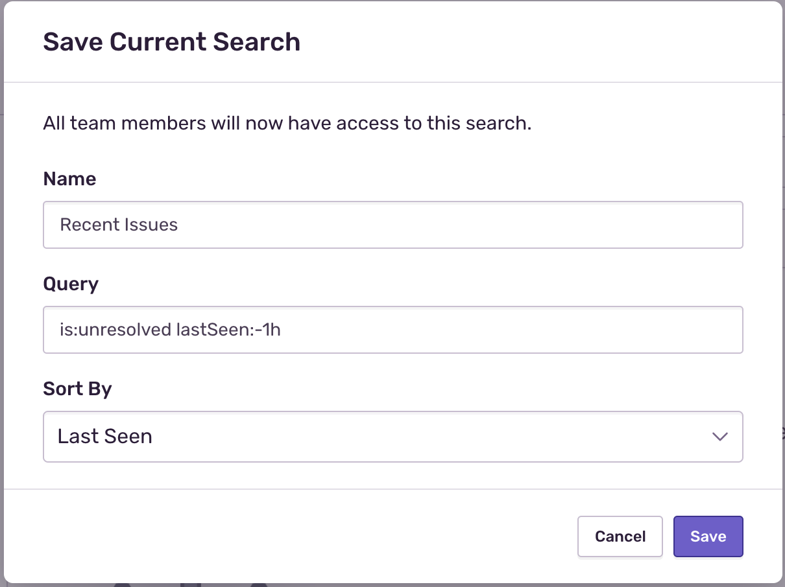
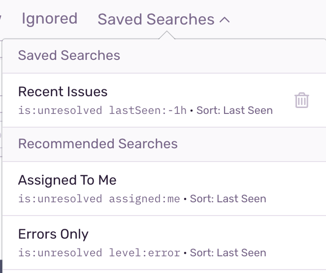
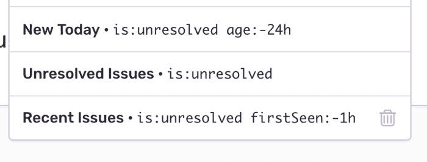

Search is available on several major Sentry views: Issues, Events, and Releases.

<Alert title="Looking for information on Discover?" level="info">

Discover is Sentry's powerful query builder for aggregating raw event data and has its own unique syntax not covered here. For more information, see [full Discover documentation](/product/discover-queries/).

</Alert>

## Syntax

Queries are constructed using a `key:value` pattern, with an optional raw search at the end. Each `key:value` pair is a `token` and the optional raw search is itself a single `token`. The `key:value` pair `tokens` are treated as issue or event properties. The optional raw search is treated as a single `token` and searches event titles/messages.

For example:

```
is:resolved user.username:"Jane Doe" server:web-8 example error
```

In the example above, there are three keys (`is:`, `user.username:`, `server:`), but four tokens:

- `is:resolved`
- `user.username:"Jane Doe"`
- `server:web-8`
- `example error`

The tokens `is:resolved` and `user.username:"Jane Doe"` are standard search tokens because both use reserved keywords. See [Issue Properties](#issue-properties) and [Event Properties](#event-properties) for appropriate keyword usage. The token `server:web-8` is pointing to a custom tag sent by the Sentry SDK. See [Custom Tags](#custom-tags) for more information on how to set tags.

The token `example error` is utilizing the optional raw search and is passed as part of the issue search query (which uses a CONTAINS match similar to SQL). When using the optional raw search, you can provide _one_ string, and the query uses that entire string.

NOTE: Search for [Releases](/product/releases/) supports raw text but not query syntax.

### Using `OR` and `AND`

NOTE: `OR` and `AND` search conditions are only available for [Discover](/product/discover-queries/), [Performance](/product/performance/), and [Metric Alerts](/product/alerts-notifications/metric-alerts/).

Use `OR` and `AND` between tokens, and use parentheses `()` to group conditions. `AND` can also be used between non-aggregates and aggregates. However, `OR` cannot.

- Non-aggregates filter data based on specific tags or attributes. For example, `user.username:jane` is a non-aggregate field.

- Aggregates filter data on numerical scales. For example, `count()` is an aggregate function and `count():>100` is an aggregate filter.

Some examples of using the `OR` condition:

```
# a valid `OR` query
browser:Chrome OR browser:Opera

# an invalid `OR` query
user.username:janedoe OR count():>100
```

Also, the queries prioritize `AND` before `OR`. For example, "x `AND` y `OR` z" is the same as "(x `AND` y) `OR` z". Parentheses can be used to change the grouping. For example, "x `AND` (y `OR` z)".

### Explicit Tag Syntax

We recommend you never use reserved keywords (such as `project_id`) as tags. But if you do, you must use the following syntax to search for it:

```
tags[project_id]:tag_value
```

### Advanced

<Alert title="Note" level="info">
Advanced search is available for organizations on the new Developer, Team, and Business plans.
</Alert>

#### Exclusion

By default, search terms are `AND`-ed together; they return the intersection of issues/events that match all search terms.

To change this, you can use the negation operator `!` to _exclude_ a search parameter.

```
is:unresolved !user.email:example@customer.com
```

In the example above, the search query returns all Issues that are unresolved _and_ have not affected the user with the email address `example@customer.com`.

#### Wildcards

Search supports the wildcard operator `*` as a placeholder for specific characters and strings.

```
browser:"Safari 11*"
```

In the example above, the search query will match on `browser` values like `"Safari 11.0.2"`, `"Safari 11.0.3"`, etc.

You may also combine operators like so:

```
!message:"*Timeout"
```

In the above example, the search query returns results which do not have message values like `ConnectionTimeout`, `ReadTimeout`, etc.

## Search Properties

In the examples above, we've highlighted a couple of example properties you can search on: `is`, `user`, `server`, `browser`, etc. Below is a canonical list of all available search terms.

### Issue Properties

Issues are an aggregate of one or more events. Searchable properties include workflow status, assignment, aggregate counts, and age.

Below is a list of Issue-level tokens reserved and known to Sentry:

`age`

: Restrict results to issues created since `age`. The syntax is similar to the Unix `find` command:

Issues new in the last 24 hours:

`age:-24h`

Issues older than 12 hours:

`age:+12h`

Issues created between 12 and 24 hours ago:

`age:+12h age:-24h`

Supported suffixes:

`m -> minutes` `h -> hours` `d -> days` `w -> weeks`

`assigned`

: Filter on the user which the issue is assigned to.

Values can be a user ID (your email address), `me` for yourself, `me_or_none` for yourself or no assignee, or `#team-name`.

`assigned_or_suggested`

: Filter on the user or team to which the issue is assigned or suggested to be assigned. Suggested assignees are determined by matching [ownership rules](/product/error-monitoring/issue-owners/) and [suspect commits](/product/releases/suspect-commits/).

Values can be a user ID (your email address), `me` for yourself, `me_or_none` for yourself or no assignee/suggestions, or `#team-name`.

`bookmarks`

: Filter on the user which the issue is bookmarked by.

Values can be your user ID (your email address) or `me` for yourself.

`first-release`

: Restrict results to issues first seen within the given release.

Exact match on the version of a release, or `first-release:latest` to pick the most recent release.

`has`

: Restrict results to issues which have _any_ value for a tag.

`has:user`

`is`

: Filter on various properties of an issue.

Issue state:

`is:unresolved is:resolved is:ignored`

Issue assigned:

`is:assigned is:unassigned`

Issue linked (to an external issue tracker):

`is:linked is:unlinked`

`lastSeen`

: Restrict results that were last seen since or until a given point in time. Usage is similar to the `age` token (see above).

Issues last seen 30 days ago or more:

`lastSeen:+30d`

Issues last seen within the last two days:

`lastSeen:-2d`

`status`

: Filter on the status of an issue.

Values are `resolved`, `unresolved`, and `ignored`.

`timesSeen`

: Restrict results to issues that have been seen exactly, at least, or at most some number of times.

Exact match:

`timesSeen:10`

Upper or lower bounds:

- `timesSeen:>10`
- `timesSeen:>=10`
- `timesSeen:<10`
- `timesSeen:<=10`

### Event Properties

Events are the underlying event data captured using Sentry SDKs (read: errors and exceptions).

When searching on Event properties within the Issues search, Issue Search will return any Issue that has _one or more events_ matching the supplied event filters.

Below is a list of Event-level tokens reserved and known to Sentry:

`location`

: Restrict results to the events with a matching location.

`message`

: Restrict results to a matching message

`environment`

: Restrict results to events tagged with the given environment.

`release`

: Restrict results to events tagged with the given release.

Exact match on the version of a release, or `release:latest` to pick the most recent release.

`transaction`

: Restrict results to events tagged a URL template/job name.

`geo.country_code`<br />
`geo.region`<br />
`geo.city`<br />

: Restrict results to events triggered by a geographic area.

`http.method`<br />
`http.referer`<br />
`http.url`<br />

: Restrict results based on the HTTP request context.

`user.id`<br />
`user.email`<br />
`user.username`<br />
`user.ip`<br />

: Restrict results to events affecting the given user.

`event.timestamp`

: Restrict results to events that occurred at the given timestamp. This filter can be passed twice to provide a range.

Events occurred on January 2, 2016:

`event.timestamp:2016-01-02`

Events between 01:00 and 02:00 (UTC):

`event.timestamp:>=2016-01-02T01:00:00 event.timestamp:<2016-01-02T02:00:00`

The following comparative operators are available:

- greater than (`>`)
- greater than or equal (`>=`)
- less than (`<`)
- less than or equal (`<=`)

`device.arch`<br />
`device.battery_level`<br />
`device.brand`<br />
`device.charging`<br />
`device.locale`<br />
`device.model_id`<br />
`device.name`<br />
`device.online`<br />
`device.orientation`<br />
`device.simulator`<br />
`device.uuid`

: Restrict results to events tagged with a specific device attribute.

`os.build`<br />
`os.kernel_version`

: Restrict results to events tagged with a specific operating system property.

`stack.abs_path`<br />
`stack.filename`<br />
`stack.function`<br />
`stack.module`<br />
`stack.package`<br />
`stack.stack_level`<br />
`stack.lineno`<br />

: Restrict results to events with a matching stack property. Note: For Native SDK users, `stack.package` is the Native equivalent for `stack.module`. For more details about enhancing search, see the full documentation on [adding context and customizing tags](/platforms/native/enriching-events/).

`error.type`<br />
`error.value`<br />
`error.mechanism`<br />
`error.handled`<br />

: Restrict results to events with a matching error property.

### Custom Tags

Additionally, you can use any tag you’ve specified as a token. Tags are various key/value pairs that get assigned to an event, and you can use them later as a breakdown or quick access to finding related events.

Most SDKs generally support configuring tags by configuring the scope:

<PlatformContent includePath="set-tag" />

Several common uses for tags include:

- The hostname of the server
- The version of your platform (for example, iOS 5.0)
- The user’s language

## Premade Searches

Premade searches are common search terms that we think you're likely to use. The premade searches will appear in the order of which you've most recently used them.



## Pinned Searches

You can pin a search, and it will become the default view you see on your Issues view. The pinned search is only visible to you and is relevant across your projects.

1. Type a search into the search bar.

   

2. Click the pin icon next to that search.

   

3. Once pinned, Sentry will add the search to the Saved Search Dropdown. The search label in the text will read: My Pinned Search.

   

### Changing a Pinned Search

To change your pinned search, do the following:

1. Select your pinned search. Un-click the pin icon. Your default search will return to `is:unresolved`.

2. Do another search. Click the pin icon. The query listed as 'My Pinned Search' will now be the new pinned query, instead of the original one.

### Pinning a Premade Search

You can pin a premade search the same way you pin any other search. When you've selected a premade search, and the premade search query populates the search bar, pin it.

## Organization Wide Saved Searches

### Creating an org-wide saved search

Owners and managers can create a persistent view for their organization by creating custom saved searched. These saved searches will not be associated with a specific project, but with all projects (and users) across the org.

1. Type a search into the search bar, then click the "add to Organization saved searches" icon just to the right of it. Keep in mind that you need to be an owner or manager within the org to use this feature.

   

2. Name the search in the resulting modal and click 'Save.'

   

3. The view will then become part of the saved search dropdown.

   

### Deleting an org-wide saved search

When an owner or manager hovers over a custom saved search, they should see a trash can icon. The trash can icon functions exactly like you might expect, and removes the custom saved search from the dropdown.


