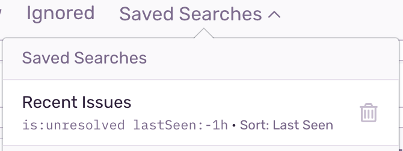

In [sentry.io](https://sentry.io) you can access premade searches, pin searches that you find most useful, and take advantage of organization-wide saved searches.

## Premade Searches

Premade searches are common search terms that we think you're likely to use. The premade searches are listed under "Recommended Searches" in the "Saved Searches" dropdown, and they're listed in order of when you've most recently used them.

## Pinned Searches

You can pin a search, and it will become the default view you see on the **Issues** page. The pinned search is only visible to you and is relevant across your projects.

1. Type a search into the search bar.

   

2. Click the pin icon next to that search.

   

3. Once pinned, Sentry will add the search to the "Saved Searches" dropdown. The search label in the text will read, "My Pinned Search".

   

### Changing a Pinned Search

To change your pinned search, do the following:

1. Select your pinned search. Un-click the pin icon. Your default search will return to `is:unresolved`.

2. Run another search. Click the pin icon. The query listed as "My Pinned Search" will now be the new pinned query, instead of the original one.

### Pinning a Premade Search

You can pin a premade search the same way you pin any other search. When you've selected a premade search, and the premade search query populates the search bar, pin it.

## Organization Wide Saved Searches

### Creating an org-wide saved search

Owners and managers can create a persistent view for their organization by creating custom saved searched. These saved searches are not associated with a specific project, but with all projects (and users) across the org.

1. Type a search into the search bar, click the actions menu (three dots). Select "Create Saved Search".

   

2. In the modal that opens, name the search and set the sort order for the issues list. You can also update the query here. Then click "Save".

   

3. The view will then become part of the "Saved Search" dropdown.

   

### Deleting an org-wide saved search

When you hover over a custom saved search, you can see a trash icon next to the name of the search. Click the trash icon to remove the custom saved search from the dropdown.

This action is only available for organization owners or managers.

