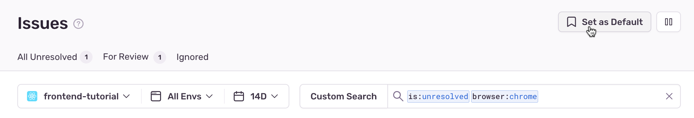
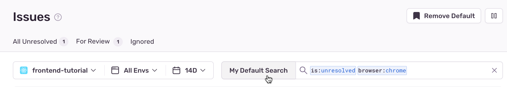

Sentry allows you to save searches you've made on the **Issues** page. At the top of the page, next to the search bar, click "Custom Search" to access the "Saved Searches" sidebar.

<iframe src="https://demo.arcade.software/HAFALQf66PkKnKlfrgE8?embed" frameborder="0" loading="lazy" webkitallowfullscreen mozallowfullscreen allowfullscreen style="position: absolute; top: 0; left: 0; width: 100%; height: 100%;color-scheme: light;" title="Search - Open Saved Searches "></iframe>

## Recommended Searches

Recommended searches are common search terms that we think you're likely to use. These premade searches are listed under "Recommended Searches" in the "Saved Searches" sidebar.

## Custom Saved Searches

Organization users in all roles can create their own saved searches. These searches are only visible to the person who created them and apply to all their projects. If you're an organization owner or manager, you have the option to make your saved searches visible only to yourself or to your entire organization. Organization-wide saved searches are not associated with a specific project, but with all projects across the organization.

1. In the "Saved Searches" sidebar, click "Add saved search" to create a new custom search.

2. In the modal that opens, name the search and set your query filters and sort order. If you're an organization owner or manager, you'll also have the option to make the search visible to all users in your organization. Then click "Save".

3. The new search will be added to the "Saved Searches" sidebar. Click the name of the search to apply it.

<iframe src="https://demo.arcade.software/ke653JR4g3cyyfL0VZtI?embed" frameborder="0" loading="lazy" webkitallowfullscreen mozallowfullscreen allowfullscreen style="position: absolute; top: 0; left: 0; width: 100%; height: 100%;color-scheme: light;" title="Search - Add Saved Search"></iframe>

## Edit or Delete a Saved Search

You can edit or delete any of your personal saved searches, as well as organization-wide searches if you're an organization owner or manager. To do so, hover over the search in the sidebar and click the more options icon ("...") to access the "Edit" and "Delete" buttons.

## Set a Default Search

You can set a search query as the default view you see on the **Issues** page. The default search is only visible to you and is applied across your projects.

1. Enter search terms into the search bar, or select a saved search from the sidebar.

2. Click the "Set as Default" button located in the header.

   

Once defaulted, Sentry will name the search "My Default Search" and return to it whenever you navigate to the **Issues** page.

