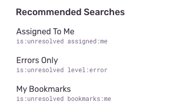
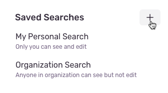
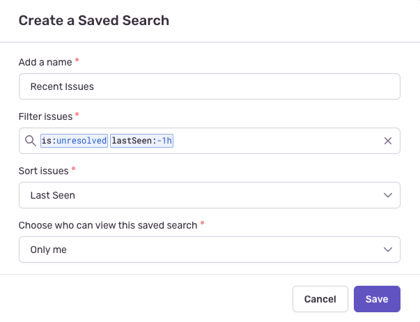
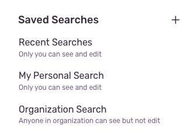
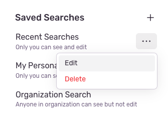
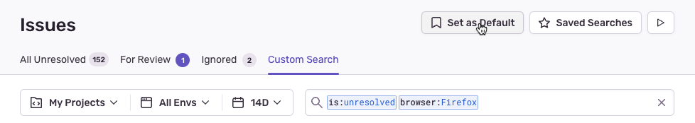
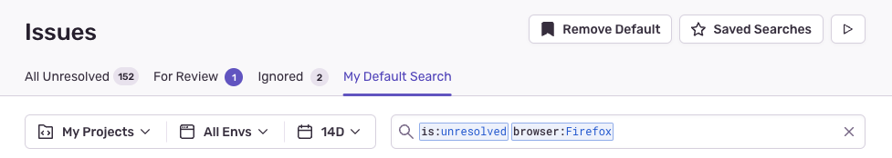

Sentry allows you to save searches you've made on the **Issues** page. You can access these in the "Saved Searches" sidebar by clicking the "Saved Searches" button at the top right of the page.

## Recommended Searches

Recommended searches are common search terms that we think you're likely to use. These premade searches are listed under "Recommended Searches" in the "Saved Searches" sidebar.

## Custom Saved Searches

Organization users in all roles can create their own saved searches. These searches are only visible to the person who created them and apply to all their projects. If you're an organization owner or manager, you have the option to make your saved searches visible only to yourself or to your entire organization. Organization-wide saved searches are not associated with a specific project, but with all projects across the organization.

1. If the saved searches sidebar is not visible, click "Saved Searches" to open it. Then click the create button.

   

2. In the modal that opens, name the search and set query and sort order. If you're an organization owner or manager, you'll also have the option to make the search visible to all users in your organization. Then click "Save".

   

3. The new search will be added to the "Saved Searches" sidebar. Click the name of the search to apply it.

   

## Edit or Delete a Saved Search

You can edit or delete any of your personal saved searches, as well as organization-wide searches if you're an organization owner or manager. To do so, hover over the entry in the sidebar and open the context menu (three dots) to access the "Delete" button.

## Set a Default Search

You can set a search query as the default view you see on the **Issues** page. The default search is only visible to you and is applied across your projects.

1. Enter search terms into the search bar, or select a saved search from the sidebar.

2. Click the "Set as Default" button located in the header.

   

Once defaulted, Sentry will name the search "My Default Search" and return to it whenever you navigate to the **Issues** page.

