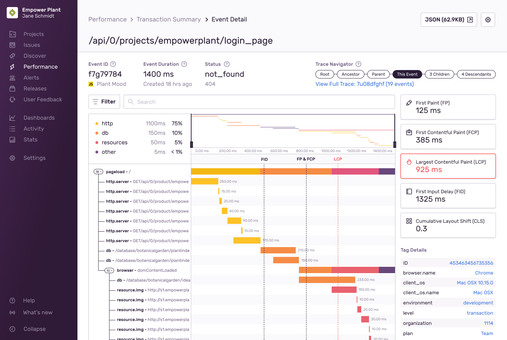
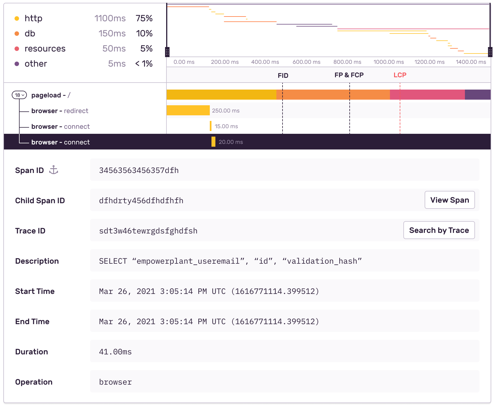
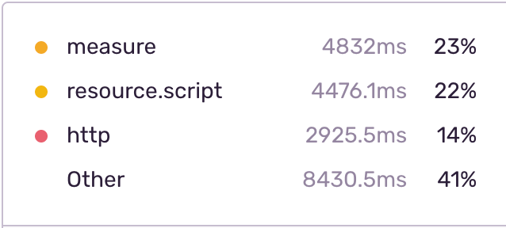
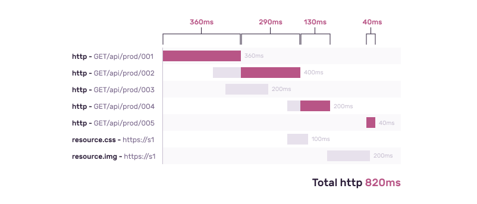
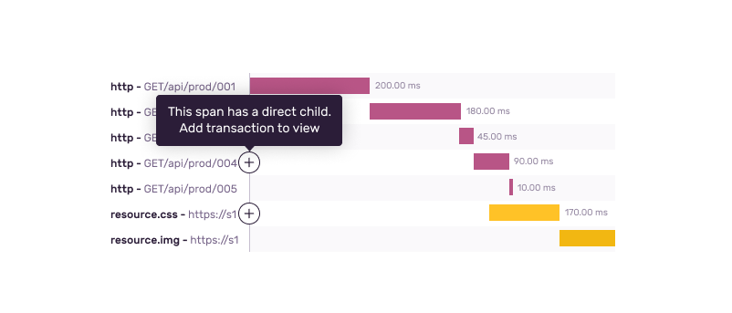

From [Performance](/product/performance/) and [Discover](/product/discover-queries/), you can drill all the way down into a span for a single transaction and traverse multiple directions. This will accelerate your ability to debug slow HTTP requests, database queries, identify associated errors, and root out other bottlenecks.



You can get to an event detail from either a [Transaction Summary](/product/performance/transaction-summary/) or [Query Builder](/product/discover-queries/query-builder/). In [Discover](/product/discover-queries/), performing a search with the `event.type:transaction` or going into a pre-built query such as "Transactions by Volume" will generate a list of event IDs. Event IDs will be linked to open the corresponding **Event Detail** page.

<Alert>
  Currently, only root transactions are searchable. Any span data that inherits from its
  root are not.
</Alert>

Information about the specific event, such as the event ID, project, duration, time of occurrence, and status, is located at the top. You can find more information under "Tag Details".

## Trace Navigator

The trace navigator (which displays top right of the span view) is an abbreviated view of the related [trace](/product/sentry-basics/tracing/distributed-tracing) for the current transaction. It displays up to six nodes, each representing different groups of the event's trace:

- **Root**: Starting transaction
- **Ancestor**: Events in the generations between the Root and the Parent of the current Event
- **Parent**: Event that directly started the current event
- **This Event**: Node representing the current event being viewed
- **Children**: Events that the current event directly started
- **Descendants**: Future generations of events created by children of this event


If a node is associated with errors, it is displayed in red and has a flame icon next to it. Click "Trace ID" to open the [Trace View](/product/sentry-basics/tracing/trace-view).

## Span View

The span view is a split view where the left-hand side shows the transaction’s span tree, and the right-hand side represents each span as a colored rectangle. Within the tree view, Sentry identifies spans by their `op` and `description` values. If a span doesn’t have a description, Sentry uses the span’s id as a fallback. The first span listed is always the transaction’s root span, from which all other spans in the transaction descend.



In cases where single parent-child spans are heavily nested, we may automatically group them for ease of use. This may occur with operations such as `django.middleware`. To ungroup these spans, click on the Autogroup link.

### Operations Breakdown

The operations breakdown shows you how much time was spent in each operation within a transaction. For each operation, the breakdown displays the operation type, duration, and percentage of the total duration.



Spans can overlap, but the total duration is based on operations that do not overlap and contribute to the overall duration. You can see this illustrated in the http example below.



The breakdown can help you find transactions with an unusual distribution of operations, which might point to an underlying problem.

### Minimap

The minimap (above the waterfall) reflects the entirety of the transaction broken into spans. You can either click and drag your cursor across the minimap to zoom in or adjust the window selection by dragging the handlebar (black dashed lines) in from the side. This will affect the range you see in the waterfall view.

### Waterfall

The waterfall view is a split view where the left reflects the transaction's span tree, and the right reflects each span as a horizontal bar (colors represent the operation). Within the tree, Sentry identifies spans by their `operation` and `description` values. If a span doesn't have a description, Sentry uses the span's ID as a fallback. The first span listed is always the transaction's root span, from which all other spans in the transaction descend.

### Span Details

Clicking on a span row expands the details of that span. From here, you can see all attached properties, such as tags and other field data. With the trace ID, you'll be able to view all transactions within that given trace. Click "Search by Trace" to view that **Discover** list. Learn more about [distributed tracing](/product/sentry-basics/tracing/distributed-tracing/) in our docs.

<Alert>

The span view may be limited to one project at a time if you're on the [Team plan](https://sentry.io/pricing/). Further, project permissions may affect access to some of these transactions.

</Alert>

#### Traversing & Adding Transactions

You can click any part of a span row itself to investigate its details. In the details, spans that have child transactions have a “View Transaction” button in the “Child Transaction” row. Clicking this button leads to another transaction or list of transactions.

In some cases, spans may be the parent of one or more transactions, and these spans are identified by the add icon. Clicking this icon will pull in the first child transaction and display its span tree nested beneath the parent span. When that transaction is displayed, the remove icon will appear so that you can hide the transaction again.



#### Adding Query Information and Parameters to Spans

Currently, every tag has a maximum character limit of 200 characters. Tags over the 200 character limit will become truncated, losing potentially important information. To retain this data, you can split data over several tags instead.

For example, a 200+ character tagged request:

`https://empowerplant.io/api/0/projects/ep/setup_form/?user_id=314159265358979323846264338327&tracking_id=EasyAsABC123OrSimpleAsDoReMi&product_name=PlantToHumanTranslator&product_id=161803398874989484820458683436563811772030917980576`

The 200+ character request above will become truncated to:

`https://empowerplant.io/api/0/projects/ep/setup_form/?user_id=314159265358979323846264338327&tracking_id=EasyAsABC123OrSimpleAsDoReMi&product_name=PlantToHumanTranslator&product_id=1618033988749894848`

Instead, using `span.set_tag` and `span.set_data` you could structure the details of this query as metadata. This could be done over `columns`, `table`, and `conditions`, in this case, resulting in three different calls:

```python
import sentry_sdk

#  ...

columns = ["first_column", "second_column", "third_columns", "fourth_column", "fifth_column", "sixth_column"]

table = "this_is_a_long_table_name"

conditions = "first_column=some_value AND second_column=some_other_value AND third_column=yet_another_value"

with sentry_sdk.start_span(op="db", transaction="query api") as span:
    span.set_tag("table", table)
    span.set_data("columns", columns)
    span.set_data("conditions", conditions)

    query = "SELECT {columns} FROM {table} WHERE {conditions}".format(
        columns=columns,
        table=table,
        conditions=conditions,
    )

    # ...
```

### Missing Instrumentation

Gaps between spans may be marked as "Missing Instrumentation." This means a duration in the transaction that isn't accounted for by any of the transaction's spans. It likely means that you need to manually instrument that part of your process. Go back to [Getting Started](/product/performance/getting-started/) for details.
