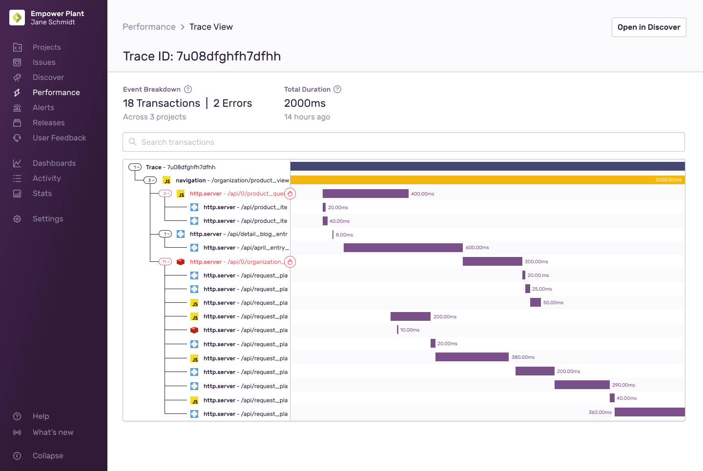

With the [trace](/product/sentry-basics/tracing/distributed-tracing) view, you can drill down into the details of a single trace and traverse every transaction in that trace. This will accelerate your ability to debug slow services, identify related errors, and root out other bottlenecks. There are multiple entry points to get to the trace view.

## Entry Points

- [Issue Details](/product/issues/issue-details/): In the issue detail, click "View Full Trace" below the event ID (paired with Trace Navigator).
- [Event Details](/product/performance/event-detail/): In an event detail, click the trace ID on the top right (paired with Trace Navigator).
- [Transaction Summary](/product/performance/transaction-summary/): In the transaction summary, click the trace ID in the event table.
- [Query Builder](/product/discover-queries/query-builder/): In Discover, build a query with the trace column, then click the trace ID in the resulting event table.

At the top, you'll find a breakdown of the number of transactions and errors in this trace and how many projects they span across. You'll also get the total duration for this trace from start to end.

## Transaction View

The transaction view provides a split view similar to the [span view](/product/sentry-basics/tracing/event-detail/#span-view). On the left, you can view the trace's transaction tree. On the right, you can view a representation of each transaction as a colored rectangle. The first row lists the trace itself, with all other spans descending from that trace. Clicking on any of the other rows will provide more detail about that transaction, including tags and other field data. You can either access more details about that [specific event](/product/performance/event-detail/) by clicking "View Transaction" or get a [transaction summary](/product/performance/transaction-summary/) by clicking "View Summary".

<Alert>
  Note that this view only shows up to 100 transactions from the trace. The full
  list of transactions is available through a linked Discover query.
</Alert>

## Troubleshooting

### Orphan Traces and Broken Subtraces

In a fully instrumented system, a span in one service will connect to a transaction in a subsequent service. For a variety of reasons, a transaction in a service may not arrive in Sentry. When Sentry encounters these types of transactions within a trace, the transactions are linked with a dashed line since they can no longer be directly connected to the root, creating an orphan trace.

In addition, broken subtraces can occur when Sentry receives an error for a trace, but the corresponding transaction does not exist. Such errors are linked using dashed lines and clicking on the row takes you to the corresponding **Issue Details** page.

Also, in these cases you can click "Open In Discover" to see all the events in the trace.

Broken subtraces may be caused by:

- SDK sampling. Setting a sample rate that's too low may prevent the SDK from sending a transaction. We recommend sending us all of your transaction data.
- [Ad blockers](/platforms/javascript/troubleshooting/#dealing-with-ad-blockers) may prevent transactions in browsers being sent, but HTTP requests to backend projects will still create child transactions
- [Rate-limiting](/product/accounts/quotas/#limiting-events) on a project may cause only some events to be sent to Sentry
- [Project permissions](/product/accounts/membership/#restricting-access) may mean you do not have access to transactions in another project
- [Differences in quota limits](/product/accounts/quotas/) between transactions and errors. When a quota limit is reached - for example, for transactions - an error is received, but corresponding transaction is not.
- Exceeding the span limit. Transactions are associated via the child spans of the parent transaction, but if the number of spans exceed the limit, the association cannot be made

### Multiple Roots

Each trace ID should have only one root, a transaction without any parents. Automatic instrumentation should prevent multiple roots; however, if the trace ID of your transactions is being set using custom instrumentation, you may encounter multiple roots.
