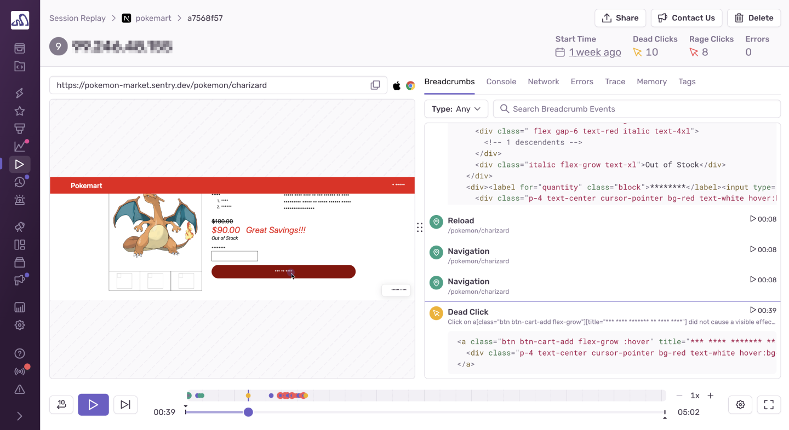

<Include name="beta-note-session-replay.mdx" />

Session Replay shows you a video-like reproduction of your user sessions so you can see what happened before, during, and after an error or performance issue occurred. Gain deeper debugging context into issues so that you can reproduce and resolve problems faster without the guesswork. As you play back each session, you can see every user interaction in relation to network requests, DOM events, and console messages. It’s effectively like having [DevTools](https://developer.chrome.com/docs/devtools/overview/) active in your production user sessions.

Replays are integrated with other areas of the Sentry product so you can see how the user experience is impacted by errors and slow transactions. Replays associated with error events will appear on the [Issue Details](/product/issues/issue-details/) page, while those showing slow transactions will appear on the [Transaction Summary](/product/performance/transaction-summary/) page.

## What is a Replay?

A replay is **not** a video recording. It’s a video-like reproduction of a user session, built using the  [rrweb recording library](https://www.rrweb.io/). Replays are created from snapshots of your web application’s DOM state (the browser’s in-memory representation of HTML). A user session can span multiple page loads, including page refreshes.

The start of a replay recording can be triggered by:

- A user session being part of a sampling rate, as controlled by [replaysSessionSampleRate](/platforms/javascript/session-replay/#sampling). When a user loads a page, a decision is made whether to sample it or not.
- An error occurring during a session that’s not being recorded. The session is then recorded based on [replaysOnErrorSampleRate](/platforms/javascript/session-replay/#sampling)
- Manually calling the [replay.start()](/platforms/javascript/session-replay/configuration/#start-and-stop-recording) method

The end of a replay recording can be triggered by:

- User inactivity within the tab/page that’s being recorded. (If a user doesn’t click or navigate around the site for more than 5 minutes. Mouse scrolls, mouse movements, and keyboard events don’t currently qualify as activity.)
- A recording reaching the maximum replay duration limit (currently 60 minutes)
- Manually calling the [replay.stop()](/platforms/javascript/session-replay/configuration/#start-and-stop-recording) method

<Note>

Unlike [sessions](/product/releases/health/#session) on the **Releases** page, user sessions in Session Replay can span multiple page loads.

</Note>

## Learn More

<PageGrid />
