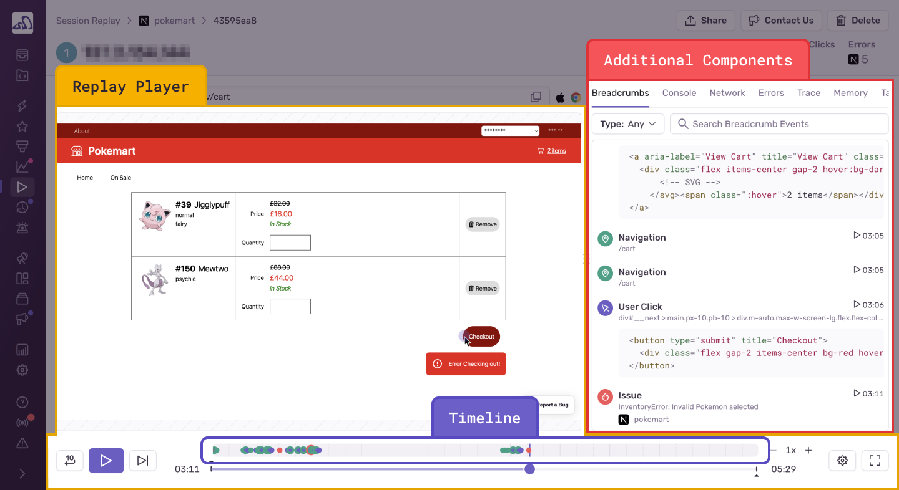
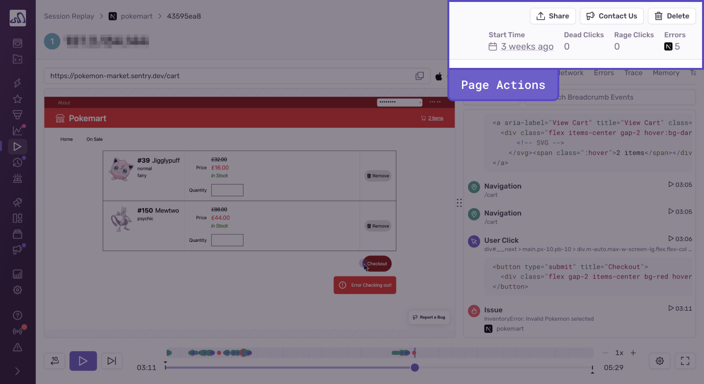
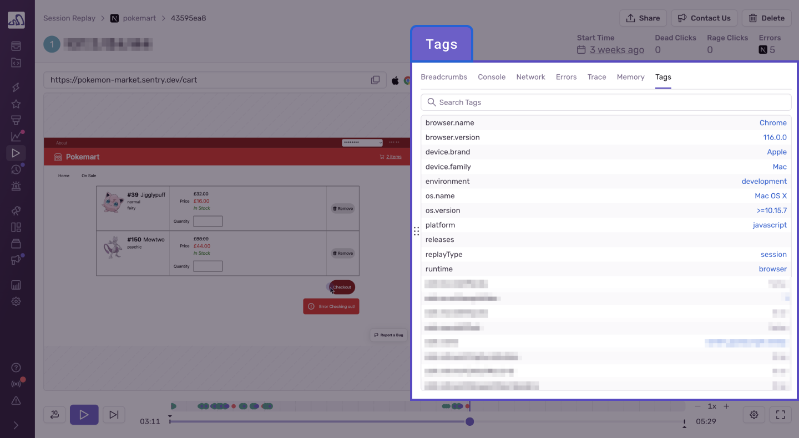

<Include name="feature-stage-beta-session-replay.mdx" />

Every replay has a detailed view that contains the embedded video player and rich debugging context. Playing back the video will allow you to see every user interaction in relation to console messages, DOM events, and network requests. It’s like having [DevTools](https://developer.chrome.com/docs/devtools/overview/) active for your production user sessions. Almost every component on this page is connected through timestamps. See the breakdown of each component and why it’s valuable:

- **Replay Player:** Video-like reproduction of a user session created from DOM snapshots. This is where you can visualize exactly what actions the user took during a user session, and how the website behaved within this specific user’s environment, including browser, latency, settings, and so on. Most importantly, you can see which actions lead to an error and take the guesswork out of debugging.
  - By default, the Session Replay SDK is configured to replace all text nodes and user input with asterisks (\*), and to remove media elements. See all privacy configuration options [here](/platforms/javascript/session-replay/privacy/).

* **Breadcrumbs:** The replay breadcrumbs show when key user interactions took place, specifically: user clicks, user inputs, [page navigations, page loads](/product/performance/transaction-summary/#what-is-a-transaction), as well as [custom breadcrumbs](/product/sentry-basics/integrate-backend/configuration-options/#breadcrumbs) set by the organization and the [Largest Contentful Paint (LCP)](/product/performance/web-vitals/#largest-contentful-paint-lcp) web vital. These breadcrumbs are synced with the replay player and will auto-scroll as the video plays.
  - Some [breadcrumb types](/product/issues/issue-details/breadcrumbs/) visible in **Issue Details** are not 1:1 to the replay breadcrumbs list. The trail of events typically seen in the Issue Details page are now displayed in the Console and Network components of the **Replay Details** page.

- **Timeline:** This is the section at the top of the **Replay Details** page that illustrates where significant events (such as errors and user interactions) happen over the course of the replay. This allows users to easily scrub to key events by dragging across the timeline. It also visually conveys the amount of time that took place between events.

* **Console:** A list of all messages that were emitted to the web console. This includes debugging information included in the web application, as well as browser-generated messages to the developer. As the video plays, there’s a visual indicator that tracks through the table of console messages, highlighting which messages happened prior to, or next to this point in the video. You can also click the timestamp on the far right of the console message to bring yourself to that point in the replay player.

- **Network:** A list of all network requests that were initiated by the page while the replay recording was active. As the video plays, there’s a visual indicator that tracks through the table of network requests, highlighting which requests happened prior to, or next to this point in the video. You can also click the timestamp on the far right of each request to bring yourself to that point in the replay player. If configured, Sentry can also show the actual [HTTP request body and headers](/platforms/javascript/session-replay/configuration/#network-details).

* **DOM Events:** DOM event breadcrumbs, like user clicks, are augmented with surrounding HTML source code to help users understand which event was targeted. As the video plays, there’s a visual indicator that tracks through the table of DOM events, highlighting which events happened prior to, or next to this point in the video. You can also click the timestamp on the far right of each DOM event to bring yourself to that point in the replay player.

- **Trace:** Connects all the [trace(s)](/product/sentry-basics/tracing/distributed-tracing#traces-transactions-and-spans) that happened during the replay.
  - Due to transaction sampling, this view may be missing traces.

* **Issues:** See the [issue(s)](/product/issues/issue-details/error-issues/) that correspond to frontend errors that occurred in the replay and the impact these issues have had holistically across _all users_ on your application.

- **Memory:** The view shows a heap size chart displaying the total amount of memory being used by JavaScript objects.
  - This view is only available when the replay was recorded on a Chromium-based browser.

## Share Replays

Share a replay at a specific timestamp with a Sentry member by clicking the “Share” button in the top-right corner of the **Replay Details** page. This allows you to share replays at the point of a critical event or user flow with other Sentry members in your organization.

## Delete Replays

Delete an individual replay by clicking the “Delete” button in the top-right corner of **the Replay Details** page. If you need to bulk delete replays, contact [support@sentry.io](mailto:support@sentry.io). You can’t delete replays that are in-progress.

## Tags

Find a complete list of built-in fields and custom tags associated with a replay under the “Tags” tab next to Breadcrumbs for additional context around the replay you’re viewing.

## Retention

Replays are retained for 90 days in sentry.io (the same retention period as other event types, such as Errors and Transactions). The retention period is not configurable.
