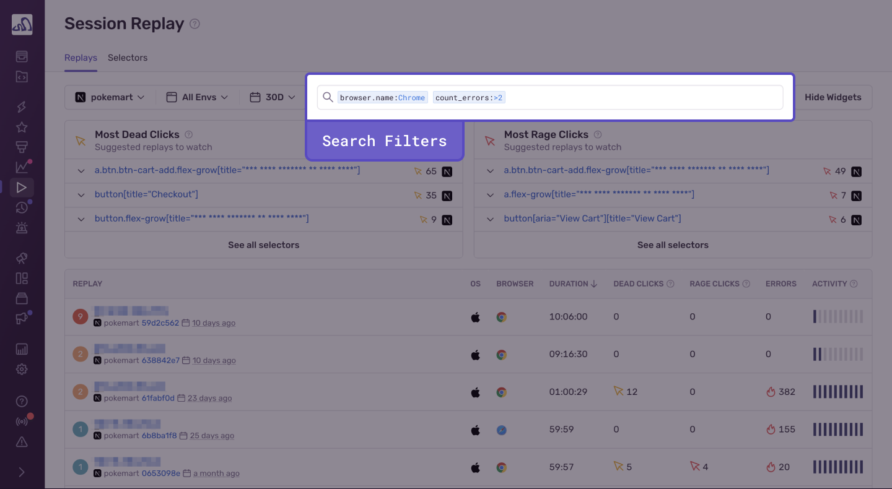

<Include name="feature-stage-beta-session-replay.mdx" />

You can search for or browse replays of user sessions on the **Replay** page, where they’re organized chronologically by default. You’ll see the following information for each session:

- **Project**: The project in which the session was recorded.
- **Start Time**: How long ago the replay was triggered. (Replays can appear here while the recording is still in progress.)
- **Duration**: The length of the replay. (Recordings can range from 1 second to 60 minutes.)
- **Errors:** The number of frontend errors identified by Sentry, as encountered in the replay. (Sometimes the error count reported is different from the actual errors captured. Read more in [Error Linking](/platforms/javascript/session-replay/#error-linking).)
- **Activity**: The activity level as determined by the number of errors encountered, their duration, and the number of UI events.

By default, the IP address is used to identify each replay on this page. This can be changed in your organization and project settings. If you’d like to set an email or a username instead, call [Sentry.setUser()](/platforms/javascript/enriching-events/identify-user) in your client-side configuration.If you’ve enabled the option to “Prevent Storing of IP Addresses” in either your project-level or organization-wide settings, the IP address will appear redacted on the **Replay** page. For more information, read about [several data scrubbing options](/product/data-management-settings/scrubbing/server-side-scrubbing/) in the Sentry app on either an organization-wide or a project level.

Replays can appear on this page while they’re still in progress. You can’t delete in-progress replays.

Each replay will bring users to the [**Replay Details**](/product/session-replay/replay-details/) page.

## Filtering Replays

All replays have built-in key fields, and may have [custom tags](/platforms/javascript/enriching-events/tags/) if you have them set up. The search bar operates similarly to the one in the Discover [Query Builder](/product/discover-queries/query-builder/#filter-by-search-conditions). Use it to enter these keys and assign them values. This will filter down your list of replays so you can quickly find the ones with the criteria you care about. For example, you can refine your replays search to a specific browser by using `browser.version:` as a key field and assigning the version as a value. For a list of all the built-in key fields/replay properties, check out our [Searchable Properties](/product/sentry-basics/search/searchable-properties/#replay-properties) documentation.

