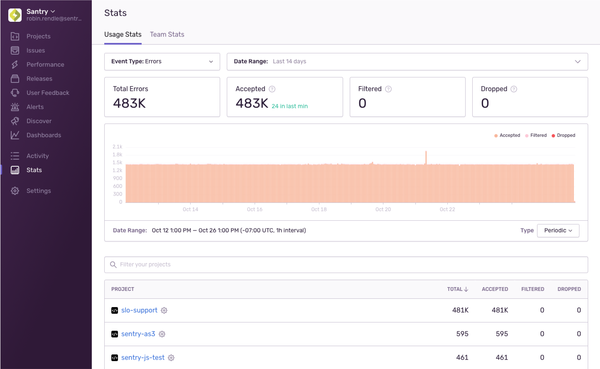
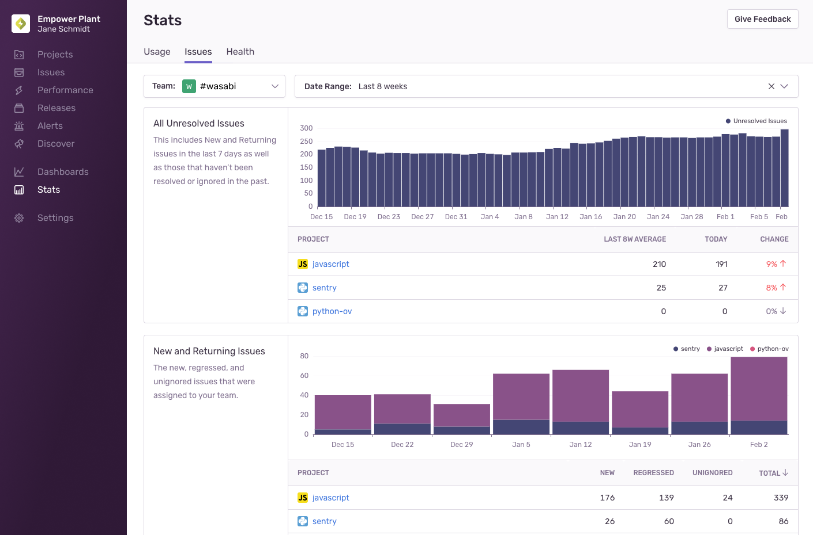
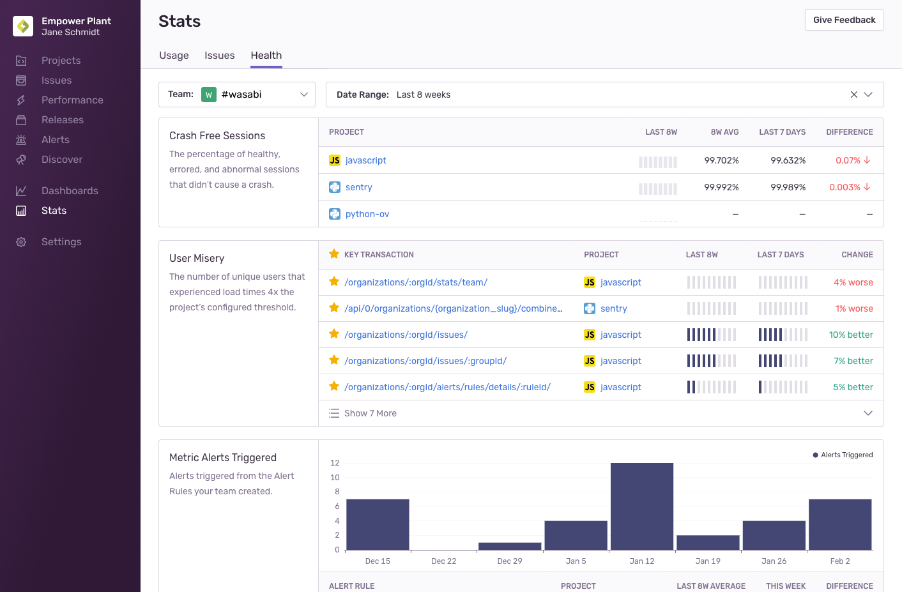

The **Stats** page has three tabs: [Usage](#usage-stats), [Issues](#issue-stats), and [Health](#health-stats).

The "Usage" tab shows your organization’s event and attachments usage, while also providing a high-level overview of how different projects are using Sentry. The "Issues" tab shows a breakdown of the issues assigned to your team and how they triaged them, while the "Health" tab provides an overview of your team’s project health.

## Usage Stats {#usage-stats}

The "Usage" tab shows you the events (errors and transactions) and attachments Sentry has received across your entire organization along with a list of all projects and their consumption of each of those. Your usage falls into one of three categories: _Accepted_, _Filtered_, or _Dropped_. Filtered events and attachments are ones that were blocked due to your [inbound data filter](/product/data-management-settings/filtering/) rules. Dropped events and attachments are ones the system dropped or discarded due to rate limits, quotas, spike protection, or because of invalid data.

You can see which projects have had a recent spike or are the most active and may need more attention. On this page, you can also control the date range that’s displayed, allowing you to focus on a smaller period of time or zoom out for a longer view. The page is designed for org admins, but is available to all team members. This is helpful if a team member who isn't an admin is tasked with reviewing these statistics. Also, this allows team members associated with specific projects to use this page to investigate why their events are being dropped.

With the dropdowns at the top of the page, you can set whether the page displays stats for errors, transactions, or attachments, as well as the date range. With the date selector, the time period can be set from an hour to a maximum of 90 days, and all of the page elements change dynamically when you update this setting.

<Note>
  This page does not include data about sessions because they are not a billable event
  type.
</Note>

### Usage Cards

The cards on the page provide high-level usage stats about events and attachments, including the total number of either for the period, as well as which ones were accepted, filtered, or dropped.

### Summary Chart

The chart on this page displays a breakdown of events and attachments over the selected date range. Depending on the date range that you set the chart to display, each bar in the chart represents a different amount of time or interval. For example, if you set the chart to display seven days, each bar in the chart represents one hour, but if you set it to display 90 days, each bar represents one day. You can also use the “Type” dropdown to set whether the chart shows a cumulative count of events or attachments, or a daily (or hourly) count.

When you set a date range that results in intervals of one day or more, the time zone is displayed in UTC to ensure consistency for users across different time zones. For time periods with intervals of less than 24 hours, the time zone is based on your "Timezone" setting in **User Settings > Account Details**.

### Project Usage Stats Table

The “Project” table provides insight into per-project usage of your errors, transactions, and attachments over time. The table shows you the total errors, transactions, or attachments. Those are further broken down into the accepted, filtered, and dropped categories.

Each project in the table has individual settings, which you can access from by clicking the settings icon (gear wheel) next to the name of the project. For instance, you might want to go to the project settings so you can limit the quota consumed by its DSNs. Clicking the name of the project takes you to the **Project Details** page.

The table displays only the projects of the teams that you belong to, unless you have permissions to see all projects.

## Issues Stats {#issue-stats}

<Include name="business.mdx" />

The "Issues" tab shows activity about issues assigned to your team; how many new issues were detected, how many resolved issues regressed, and how they were triaged.

#### All Unresolved Issues

The "All Unresolved Issues" chart and table show new and returning issues per project in the last seven days, as well as those that haven’t been resolved or ignored in the past.

#### New and Returning Issues

The "New and Returning Issues" chart and table show the new, regressed, and unignored issues that were assigned to your team.

#### Issues Triaged

The "Issues Triaged" chart and table show how many new and returning issues were reviewed by your team each week. Reviewing an issue includes marking it as reviewed, resolving it, assigning it to another team, or deleting it.

#### Age of Unresolved Issues

The "Age of Unresolved Issues" chart and table show how long ago the oldest seven unresolved issues were first created for the projects your team owns, sorted by their age.

#### Time to Resolution

The "Time to Resolution" chart shows the mean time it took for issues to be resolved by your team each week.

## Health Stats {#health-stats}

<Include name="business.mdx" />

The "Health" tab shows information about the overall health of your projects; the crash free sessions, user misery of your team’s key transactions, the number of alerts triggered by your team’s alert rules, and the number of releases per project.

#### Crash Free Sessions

The "Crash Free Sessions" table shows the percentage of sessions that didn’t cause a crash for the selected date range.

#### User Misery

The "User Misery" table shows transactions where users experienced load times four times the project’s configured threshold, with the number of unique users for each of those transactions.

#### Metric Alerts Triggered

The "Metric Alerts Triggered" chart and table show alert rules that have been triggered for the projects your team owns.

#### Number of Releases

The "Number of Releases" chart and table show the releases that were created for each of your team's projects.
