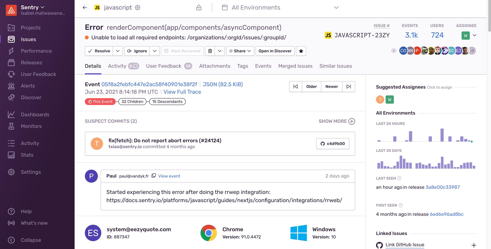

While event data allows you to collect information about errors in your application, getting any extra helpful feedback can be crucial in determining the root cause of an issue. Sentry provides the ability to collect additional information with User Feedback.

The **User Feedback** page in [sentry.io](https://sentry.io) displays feedback submissions from users who experienced an error while using your application. Each submission includes the name and email address entered by the user, as well as their description of what happened to produce the error:

In each submission, you can click the “View Event” link, which takes you to the **Issue Details** page for that error event (or instance of the issue). From there, you can dig into what caused the issue and start working to resolve it:

<Note>

User feedback is only applicable for [error issues](/product/issues/issue-details/error-issues/). Other categories of issues (such as, [performance issues](/product/issues/issue-details/performance-issues/)) do not support this feature.

</Note>

## Set Up

There are two ways to collect user feedback in Sentry: via [a web API](https://docs.sentry.io/api/projects/submit-user-feedback/), or by using an embeddable widget or API in the SDK itself, which you can [configure](/platform-redirect/?next=/enriching-events/user-feedback/) to collect feedback when a user experiences an error.
