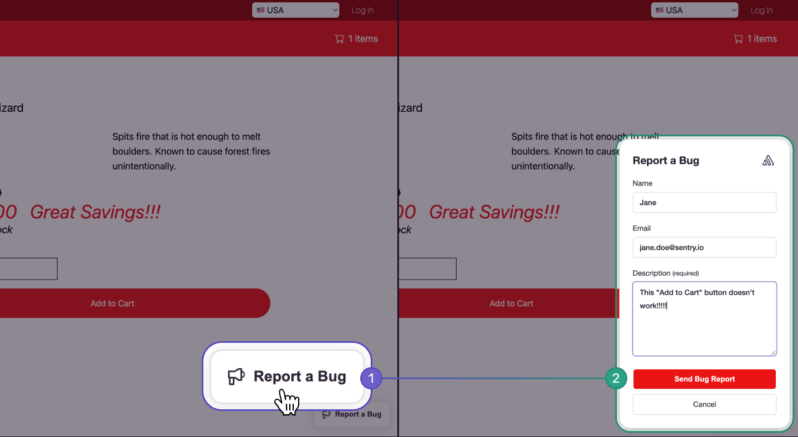
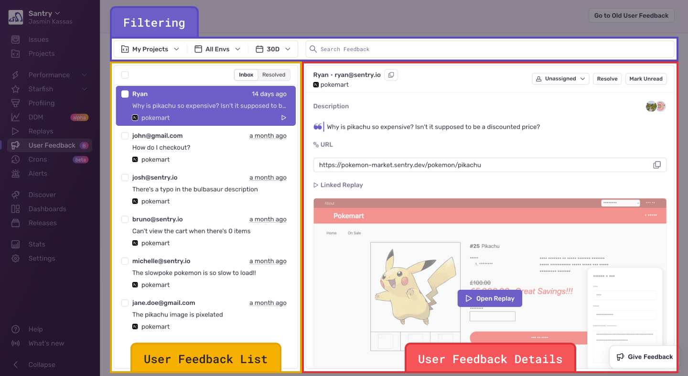
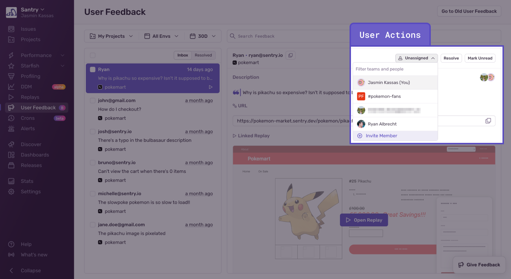
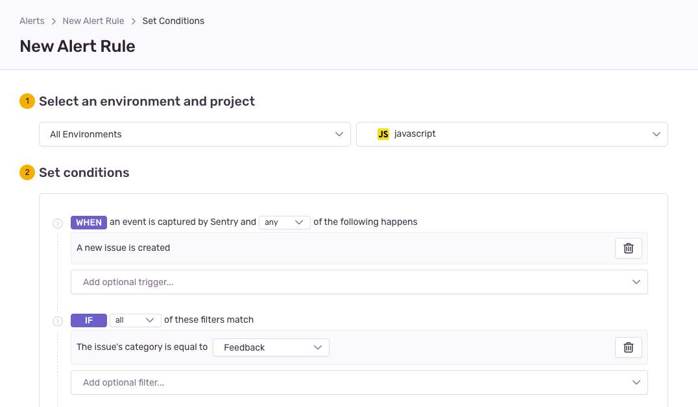

Sentry automatically detects errors thrown by your application, such as performance issues and user experience problems like rage clicks. But there are other frustrations your users may encounter (broken permission flows, broken links, typos, misleading UX, business logic flaws, and so on).

That’s where Sentry’s User Feedback Widget and Crash-Report User Feedback features come in. Setting up one or both, lets you collect feedback from your end-users when they run into bugs in your application. Sentry then links that feedback to available rich debugging context, including errors, replays, and tags such as URL, allowing you to get to the root of the problem faster.

For example, using Session Replay with the User Feedback Widget could save you time, helping you quickly understand the context of the user problem by seeing exactly what they experienced before submitting their feedback.

## User Feedback Widget

The User Feedback Widget is an out-of-the-box, persistent widget you can add anywhere on your web application. It allows users to submit feedback quickly and easily any time they encounter something that isn’t working as expected. Learn more about how to install and customize it [here](https://github.com/getsentry/sentry-javascript/tree/develop/packages/feedback#setup).

Feedback collected via the Feedback Widget may have some or all of the following information, (depending on what you mark as required and what’s available from the error context):

* Description from the user
* User email
* Associated replay event (you’ll have up to 60 seconds of replay recording before the user submitted the feedback.)
* Learn more about how to set up Session Replay here.
* URL of the page the user was on when they submitted the feedback
* Tags

## Crash-Report User Feedback

Another way to collect feedback is by installing the Crash-Report User Feedback modal. This allows users to submit feedback after they experience an error via an automatic modal that pops up after an error occurs. Learn more about how to install and customize it [here](https://docs.sentry.io/platforms/javascript/enriching-events/user-feedback/#embeddable-javascript-widget).

Feedback collected via the Crash-Report modal will have the following information:

* Description from the user
* Sentry Issue preview and link to the Issue Details page
* URL of the page the user was on when they submitted the feedback
* Tags

Where to View User Feedback

Whether you choose to collect user feedback via a Feedback Widget, a Crash-Report modal, or both, you’ll be able to view it from the **User Feedback List** page. The page is  chronologically-organized with the most recent, unresolved feedback at the top. You can click on individual feedback to see more details  all in one view, similar to your e-mail inbox. The right-hand side of the **User Feedback List** page, our **User Feedback Details** view,  shows the user’s description with any available debugging context.

<Note>

Crash-report feedback can also be found on the User Feedback tab of the associated Issue Details page.

</Note>

You can narrow down the results on your **User Feedback List** page by using the project, environment, and date range filters.

## Triaging User Feedback Submissions

You can either manually resolve user feedback submissions on the **User Feedback Details** view by clicking the “Resolve” button in the top-right corner, or bulk resolve by multi-selecting the feedback:

You can also assign a team member to a specific user feedback submission on the **User Feedback Details** view.

## Getting User Feedback Alerts

If you want to get an alert every time new user feedback comes in via the User Feedback Widget, make sure you have Sentry's default issue alert ("Alert me on every new issue") turned on for the project for which you’re setting up User Feedback on, no action is required to have alerting on each user feedback report from the widget.

If you don't have Sentry's default issue alert turned on, follow these steps:

1. Create a [New Alert Rule](https://sentry.io/alerts/new/issue/) in Sentry.
2. Scroll to the "Set conditions" section and set the "IF" filter to `The issue's category is equal to… "Feedback"`.
3. Choose which actions to perform in the “THEN” filter.
4. Add an alert name and owner.

To be alerted when crash-report feedback comes in, set up Workflow Notifications as described [here](https://docs.sentry.io/product/alerts/notifications/#workflow-notifications).
