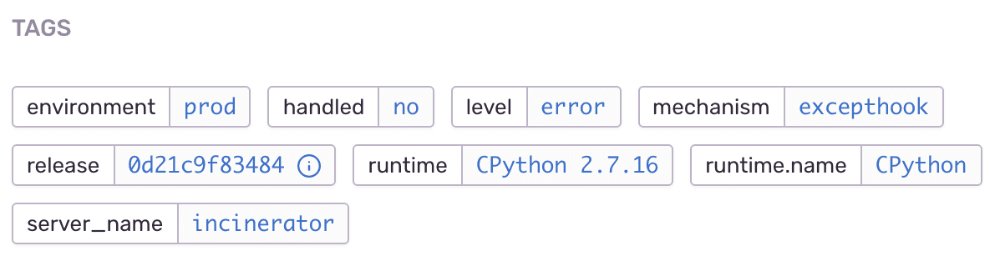

Data is sent with every event, and is either predefined or custom:

- **Predefined data** is data that Sentry recognizes. This data enhances your ability to understand and investigate the source and impact of the data when viewing it in the Sentry web UI. For example, in Sentry, the concept of user helps Sentry display the number of unique users affected by an event.
- **Custom data** is arbitrary structured or unstructured extra data you can attach to your event.

Regardless of whether the data sent to Sentry is predefined or custom, additional data can take two forms, tags and context:

- *Tags* are key/value string pairs that are both indexed and searchable. Tags power UI features such as filters and tag-distribution maps. Tags help you quickly access related events and view the tag distribution for a set of events. Common uses for tags include hostname, platform version, and user language.

    Once you've started sending tagged data, you'll see it in the Sentry web UI: the filters within the sidebar on the Project page, summarized within an event, and on the tags page for an aggregated event.

    We’ll automatically index all tags for an event, as well as the frequency and the last time the Sentry SDK has seen a value. We also keep track of the number of distinct tags and can assist you in determining hotspots for various issues.

    Most SDKs generally support configuring tags by configuring the scope:

    ```JavaScript
    Sentry.setTag("page_locale", "de-at");
    ```

    

- *Context* includes additional diagnostic information attached to an event. By default, contexts are not searchable, but for convenience Sentry turns information in some predefined contexts into tags, making them searchable.

   

## What Sentry Sends Automatically

Certain data is sent to Sentry automatically. This section explains the predefined data, some of which is simply the type of device or browser being used at the time of the event. Other predefined data you can modify, such as the `level` of the event. The final type of predefined data, `environment` and `release`, affect the UI experience or enable features within the product to help better identify issues in your application.

### Predefined Data

Sentry turns additional, predefined data or specific attributes on the data into _tags_, which you can use for a variety of purposes, such as searching in the web UI for the event or delving deeper into your application. For example, you can use tags such as `level` or `user.email` to surface particular errors. You can also enable Sentry to track [releases](/workflow/releases/), which unlocks features that help you delve more deeply into the differences between deployed releases.

If Sentry captures some predefined data but doesn’t expose it as a tag, you can set a custom tag for it.

`request`, `device`, `OS`, `runtime`, `app`, `browser`, `GPU`, `logger`, and `monitor` are the most typical predefined data sent with an event. In addition, the following are sent, and can be modified for your team's use:

`level`

: Defines the severity of an event. The level can be set to one of five values, which are, in order of severity: `fatal`, `error`, `warning`, `info`, and `debug.error`. Learn how to set the level in [Set the Level](#set-the-level)

`user`

: Providing user information to Sentry helps you evaluate the number of users affecting an issue and evaluate the quality of the application. Learn how to capture user information in Capture the User

`fingerprint`

: Sentry uses one or more fingerprints to determine how to group errors into issues. Learn more about Sentry's approach to grouping algorithms in [Grouping Events into Issues](/data-management/event-grouping/). Learn how to override the default group in very advanced use cases in [Modify the Default Fingerprint](#modify-the-default-fingerprint)

`environment`

: Environments help you better filter issues, releases, and user feedback in the **Issue Details** page of the web UI. Learn how to set and [manage environments](/enriching-error-data/environments/)

`release`

: A release is a version of your code that you deploy to an environment. When enabled, releases also help you determine regressions between releases and their potential source as discussed in the [releases documentation](/workflow/releases/). For JavaScript developers, a release is also used for applying [source maps] to minified JavaScript to view original, untransformed source code.

## Modifying Defaults

Modify the defaults with any of the following:

### Set the Level

To set the level out of scope, you can call `captureMessage()` per event:

```JavaScript
Sentry.captureMessage('this is a debug message', 'debug');
```

To set the level within scope, you can call `setLevel()`:

```JavaScript
Sentry.configureScope(function(scope) {
   scope.setLevel(Sentry.Severity.Warning);
});
```

or per event:

```JavaScript
Sentry.withScope(function(scope) {
   scope.setLevel("info"); Sentry.captureException("info");
});
```

### Capture the User

Users consist of a few critical pieces of information that construct a unique identity in Sentry. Each of these is optional, but one **must** be present for the Sentry SDK to capture the user:

`id`

: Your internal identifier for the user.

`username`

: The username. Typically used as a better label than the internal id.

`email`

: An alternative (or addition) to the username. Sentry is aware of email addresses and can display things such as Gravatars and unlock messaging capabilities.

`ip_address`

: The user's IP address. If the user is unauthenticated, Sentry uses the IP address as a unique identifier for the user. Sentry will attempt to pull this from the HTTP request data, if available.

To capture a user:

```JavaScript
Sentry.setUser({"email": ["john.doe@example.com](mailto:%22john.doe@example.com)"});
```

In addition, you can provide arbitrary key/value pairs beyond the reserved names, and the Sentry SDK will store those with the user.

### Modify the Default Fingerprint

By default, Sentry runs one of our built-in grouping algorithms to generate a fingerprint based on information available within the event such as `stacktrace`, `exception`, and `message`.

You can override the default grouping by passing the `fingerprint` attribute an array of strings. The following extra values are available for fingerprints:

- `default`: adds the default fingerprint values
- `transaction`: groups by the event’s transaction
- `function`: groups by the event’s function name
- `type`: groups by the event’s exception type name
- `module`: groups by the event’s module name
- `package`: groups by the event’s package name

If you wish to append information, thus making the grouping slightly less aggressive, you can add the special string `default` as one of the items.

This minimal example puts all exceptions of the current scope into the same issue/group:

```JavaScript
Sentry.configureScope(function(scope) {
  scope.setFingerprint(['my-view-function']);
});
```

In addition, you can review two real-world use cases.

1. Splitting a group up into more groups, because the groups are too big:

    Your application queries an external API service, so the stack trace is generally the same (even if the outgoing request is very different).

    The following example splits up the default group Sentry would create (represented by `default`) further, while also splitting up the group based on the API URL.

    ```JavaScript
    function makeRequest(path, options) {
        return fetch(path, options).catch(function(err) {
            Sentry.withScope(function(scope) {
                scope.setFingerprint(['{{ default }}', path]);
                Sentry.captureException(err);
            });
        });
    }
    ```

2. Merging many groups into one group:

    If you have an error that has many different stack traces and never groups together, you can merge them together by omitting `default` from the fingerprint array.

    ```JavaScript
    Sentry.withScope(function(scope) {
      scope.setFingerprint(['Database Connection Error']);
      Sentry.captureException(err);
    });
    ```

## Extra Context

In addition to the structured context that Sentry understands, you can send a key paired with a data object which the Sentry SDK will store alongside the event. These are not indexed, and the Sentry SDK uses them to add additional information about what might be happening:

To configure tags:

```JavaScript
Sentry.setTag("page_locale", "de-at");
```

**Important:** Sentry strongly recommends against setting custom tags that use reserved names.

Custom contexts allow you to attach arbitrary data (strings, lists, dictionaries) to an event. You cannot search these, but they are viewable on the issue page:


To configure extra context:

```JavaScript
Sentry.setContext("character_attributes", {
  name: "Mighty Fighter",
  age: 19,
  attack_type: "melee"
});
```

When sending extra context, *be aware of maximum payload size*, especially if you want to send the whole application state as extra data. Sentry does not recommend this approach since application state can be very large and easily exceed the 200kB maximum that Sentry has on individual event payloads. When this happens, you’ll receive an `HTTP Error 413 Payload Too Large` message as the server response or (when you set `keepalive: true` as a `fetch` parameter), the request will stay pending forever (for example, in Google Chrome).

Sentry will try its best to accommodate the data you send, but Sentry will trim large context payloads or truncate the payloads entirely.

For more details, see the [full documentation on SDK data handling](https://develop.sentry.dev/sdk/data-handling/).

### Passing Context Directly

Starting in version 5.16.0 of our JavaScript SDKs, some of the contextual data can be provided directly to `captureException` and `captureMessage` calls. Provided data will be merged with the one that is already stored inside the current scope, unless explicitly cleared using a callback method.

This functionality works in three different variations:

1.  Plain object containing updatable attributes
2.  Scope instance from which we will extract the attributes
3.  Callback function that will receive the current scope as an argument and allow for modifications

We allow the following context keys to be passed: `tags`, `extra`, `contexts`, `user`, `level`, `fingerprint`.

#### Example Usages

```JavaScript
Sentry.captureException(new Error("something went wrong"), {
  tags: {
    section: "articles",
  }
});
```

Explicitly clear what has been already stored on the scope:

```JavaScript
Sentry.captureException(new Error("clean as never"), (scope) => {
  scope.clear();
  scope.setTag("clean", "slate");
  return scope;
});
```

Use Scope instance to pass the data (its attributes will still merge with the global scope):

```JavaScript
const scope = new Sentry.Scope();
scope.setTag("section", "articles");
Sentry.captureException(new Error("something went wrong"), scope);
```

Use Scope instance to pass the data and ignore globally configured Scope attributes:

```JavaScript
const scope = new Sentry.Scope();
scope.setTag("section", "articles");
Sentry.captureException(new Error("something went wrong"), () => scope);
```

### Unsetting Context

Context is held in the current scope and thus is cleared out at the end of each operation — request and so forth. You can also push and pop your own scopes to apply context data to a specific code block or function.

Sentry supports two different scopes for unsetting context:

1. A global scope, which Sentry does not discard at the end of an operation
2. A scope created by the user

This will be changed for all future events:

```JavaScript
Sentry.setUser(someUser);
```

This will be changed only for the error caught inside the `withScope` callback and automatically restored to the previous value afterward:

```JavaScript
Sentry.withScope(function(scope) {
  scope.setUser(someUser);
  Sentry.captureException(error);
});
```

If you want to remove globally configured data from the scope, you can call:

```JavaScript
Sentry.configureScope(scope => scope.clear())
```

To learn more about setting the Scope, see our documentation on Scopes and Hubs.

## Next Steps:

 - [Return to **Getting Started**](/sdks/javascript/)
 - [Return to the main enriching event data page](index)
