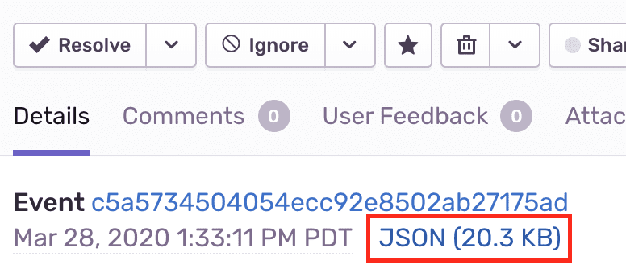

If you need help solving issues with your Sentry JavaScript SDK integration, you can read the edge cases documented here. If you need additional help, you can view our forums, and customers on a paid plan may also contact support.

## Debugging Additional Data

You can view the JSON payload of an event to see how Sentry stores additional data in the event. The shape of the data may not exactly match the description.



For more details, see the [full documentation on Event Payload](https://develop.sentry.dev/sdk/event-payloads/).

## Max JSON Payload Size

`maxValueLength` has a default value of 250, but you can adjust this value according to your needs if your messages are longer. Please note that not every single value is affected by this option.

## CORS Attributes and Headers
To gain visibility into a JavaScript exception thrown from scripts originating from different origins, do two things:

1. Add a crossorigin=”anonymous” script attribute

```bash
 <script src="http://another-domain.com/app.js" crossorigin="anonymous"></script>
 ```
The script attribute tells the browser to fetch the target file “anonymously.” Potentially user-identifying information like cookies or HTTP credentials won’t be transmitted by the browser to the server when requesting this file.

2. Add a Cross-Origin HTTP header

 ```bash
 Access-Control-Allow-Origin: *
 ```

Cross-Origin Resource Sharing (CORS) is a set of APIs (mostly HTTP headers) that dictate how files ought to be downloaded and served across origins.

By setting `Access-Control-Allow-Origin: *`, the server is indicating to browsers that any origin can fetch this file. Alternatively, you can restrict it to a known origin you control:

```bash
 Access-Control-Allow-Origin: https://www.example.com
 ```

Most community CDNs properly set an `Access-Control-Allow-Origin` header.

```bash
 $ curl --head https://ajax.googleapis.com/ajax/libs/jquery/2.2.0/jquery.js | \
 grep -i "access-control-allow-origin"

 Access-Control-Allow-Origin: *
 ```

## `instrument.js` Line Numbers for Console Log statements

If `instrument.js` displays in your console while debugging, add Sentry to your framework [blackboxing](https://developer.chrome.com/devtools/docs/blackboxing) settings like: `/@sentry/` so Chrome ignores the SDK stackframes when debugging.

## Dealing with Ad-Blockers

When you are using our CDN, ad-blocking or script-blocking extensions may prevent our SDK from being fetched and initialized properly. Because of this, any call to SDKs API will fail and may cause your application to misbehave. If this applies to your use-case, any of the following solutions will mitigate this issue.

The best way to deal with script-blocking extensions is to use the SDK package directly through the `npm` and bundle it with your application. This way, you can be sure that the code will be always be there as you expect it to be.

The second way is to download the SDK from our CDN and host it yourself. This way, the SDK will still be separated from the rest of your code, but you'll be certain that it won't be blocked since its origin will be the same as the origin of your website.

You can easily fetch it using `curl` or any other similar tool:

```bash
$ curl https://browser.sentry-cdn.com/5.20.1/bundle.min.js -o sentry.browser.5.20.1.min.js -s
```

The last option is to use `Proxy` guard, which will make sure that your code won't break, even when you call our SDK, which was blocked. `Proxy` is supported by all browser except Internet Explorer, though there are no extensions in this browser. Also if `Proxy` is not in any of your user's browser, it will be silently skipped, so you don't have to worry about it breaking anything.

Place this snippet immediately **above** the `<script>` tag containing our CDN bundle. The snippet in a readable format presents like this:

```javascript
if ("Proxy" in window) {
  var handler = {
    get: function(_, key) {
      return new Proxy(function(cb) {
        if (key === "flush" || key === "close") return Promise.resolve();
        if (typeof cb === "function") return cb(window.Sentry);
        return window.Sentry;
      }, handler);
    }
  };
  window.Sentry = new Proxy({}, handler);
}
```

If you would like to copy and paste the snippet directly, here it is minified: 

```html
<script>if("Proxy"in window){var n={get:function(o,e){return new Proxy(function(n){return"flush"===e||"close"===e?Promise.resolve():"function"==typeof n?n(window.Sentry):window.Sentry},n)}};window.Sentry=new Proxy({},n)}</script>
```

