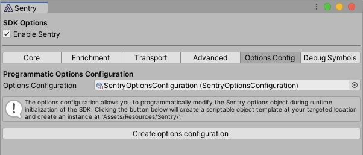

In order to provide native crash support, the Sentry SDK for Unity includes platform-specific (that is, Native) SDKs, such as [Android](/platforms/android/), [Apple](/platforms/apple/guides/ios/), and [Native](/platforms/native/).

By default, we initialize the native SDKs before the Unity engine itself. That means it also runs before the C# layer that relies on [BeforeSceneLoad RuntimeInitializeOnLoadMethodAttribute](https://docs.unity3d.com/ScriptReference/RuntimeInitializeLoadType.BeforeSceneLoad.html) to get initialized. This allows us to capture bugs/crashes of the engine itself, any native plugin, and anything written in C#. The setup for the native SDKs happens during build time, which is why we rely on the options being set in the Sentry editor configuration window and saved to `Assets/Resources/Sentry/SentryOptions.asset`. To provide a way to modify options programmatically, we've added `ScriptableOptionsConfiguration` to the `Options Config` tab in the Sentry editor window.

<Note>

You can click the button _Create options configuration_ to get the C# scriptable object added to your project.

</Note>

Note that changes to the options object done through `ScriptableOptionsConfiguration` do not affect events coming from the native layer. That also means that a `BeforeSend` callback will only modify events coming from C# scripts. The native SDKs only take options defined in the Sentry editor configuration window.

The scriptable object contains a method `Configure` that is called right before the .NET SDK is initialized and provides you with a place to, for example, implement your own filtering of events using the [BeforeSend](/platforms/unity/configuration/filtering/#using-platformidentifier-namebefore-send-) callback.
