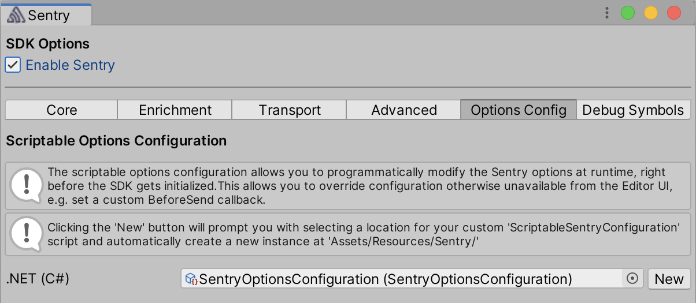

## Programmatic Configuration

In order to provide native crash support, the Sentry SDK for Unity includes [platform-specific (that is, Native)](/platforms/unity/native-support/) SDKs, such as [Android](/platforms/android/), [Apple](/platforms/apple/guides/ios/), and [Native](/platforms/native/). Those SDKs share the options with which they get initialized.

The C# layer self-initializes through the use of the [BeforeSceneLoad RuntimeInitializeOnLoadMethodAttribute](https://docs.unity3d.com/ScriptReference/RuntimeInitializeLoadType.BeforeSceneLoad.html). On Desktop, the C# layer is also responsible for intializing the native SDKs.

On mobile, the native SDKs are configured and set up during build time and initialize themselves before the Unity engine. This allows us to capture bugs/crashes of the engine itself. For that reason we rely on on the options being set in the Sentry editor configuration window and saved to `Assets/Resources/Sentry/SentryOptions.asset`.

To provide a way to modify options programmatically, we've added `ScriptableOptionsConfiguration` to the `Options Config` tab in the Sentry editor window.

<Note>

You can click the button _Create options configuration_ to get the C# scriptable object added to your project.

</Note>

Note that on mobile, changes to the options object done through `ScriptableOptionsConfiguration` do not affect events coming from the native layer. Additionally, a `BeforeSend` callback will only modify events coming from C# scripts.

The scriptable object contains a method `Configure` that is called right before the SDK is initialized and provides you with a place to, for example, implement your own filtering of events using the [BeforeSend](/platforms/unity/configuration/filtering/#using-platformidentifier-namebefore-send-) callback.
