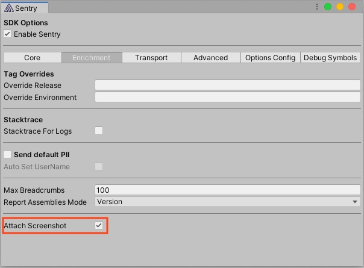

Via the editor integrations in _Tools_ -> _Sentry_:



Or if you're [configuring things programatically](/platforms/unity/configuration/options/):

```csharp {tabTitle:ScriptableOptionsConfiguration}
options.AttachScreenshot = true;
```
