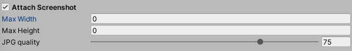

The **Attach Screenshot** options can be found on the `Enrichment` tab in the Editor Configuration Window.

<Note>

Note that capturing a screenshot in the Unity SDK requires running on the main thread.

</Note>

### Max Width and Max Height

The default value of 0 means that screenshots get captured in the game's current [Screen](https://docs.unity3d.com/ScriptReference/Screen.html) size. With max values greater than 0 but less than the screen size, the SDK will try to scale down the captured screenshot while preserving the apect ratio. This allows for a smaller file being sent.
