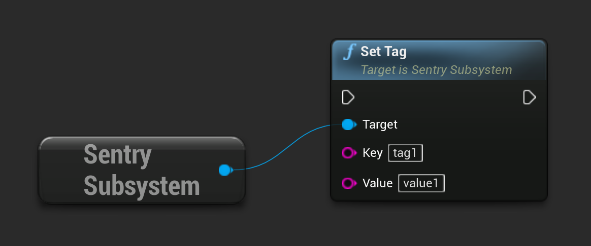

```cpp
USentrySubsystem* SentrySubsystem = ...;

SentrySubsystem->SetTag("tag1", "value1");
```

Same result can be achieved by calling corresponding function in blueprint:



Alternatively, this configuration cab be provided to the crash reporter [during initialization](/platforms/unreal/setup-crashreport/#configure-attributes).
