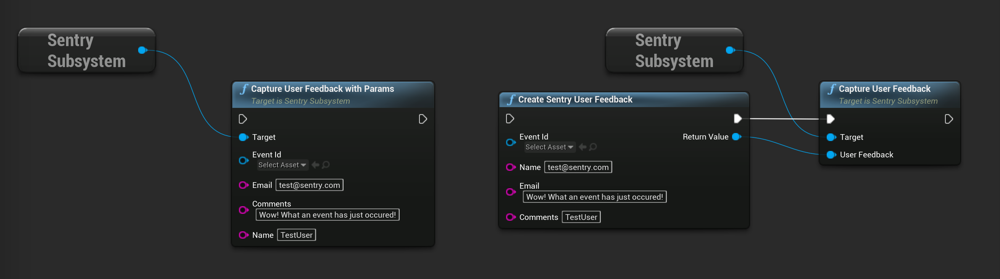

```cpp
USentrySubsystem* SentrySubsystem = ...;

USentryId* EventId = ...;

USentryUserFeedback* UserFeedback = NewObject<USentryUserFeedback>();
User->Initialize(EventId);
User->SetEmail("test@sentry.io");
User->SetName("Name");
User->SetComment("Some comment");

SentrySubsystem->CaptureUserFeedbac(UserFeedback);

// OR

SentrySubsystem->CaptureUserFeedbackWithParams(EventId, "test@sentry.io", "Some comment", "Name");
```

Same result can be achieved by calling corresponding functionі in blueprint:


