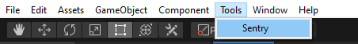

Currently, you can only configure Sentry using the Unity tools window.

The minimum required configuration is to set your [DSN](/product/sentry-basics/dsn-explainer/) in the window. The DSN is available either in your Sentry project settings or, if you're logged in, by copying:

```
___PUBLIC_DSN___
```

To configure the DSN, open `Tools` -> `Sentry`.



And the Sentry configuration window will open:


After you close the window, all settings are saved to `Assets/Resources/Sentry/SentryOptions.json`, which should be maintained in your version control system.
