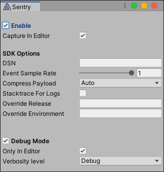

The minimum configuration required is the [DSN](/product/sentry-basics/dsn-explainer/) to your project.
You can find the DSN in your project settings on [sentry.io](https://sentry.io/). If you are logged in you can also select your project and copy its DSN directly from here:

```
___PUBLIC_DSN___
```
Sentry can be configured via the Sentry configuration window or [programatically](/platforms/unity/configuration/options/).
The window can be accessed by going to Unity's top menu: `Tools` > `Sentry`.



Sentry saves your configuration to `Assets/Resources/Sentry/SentryOptions.json` and reads from there at runtime.
