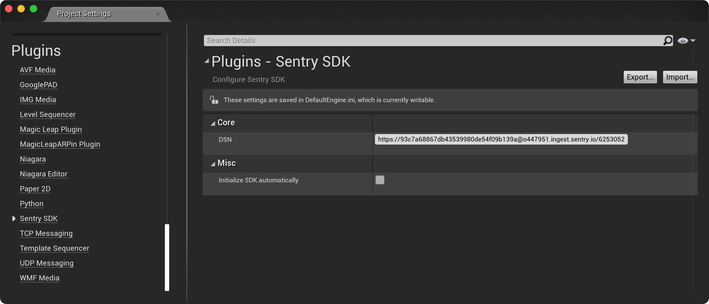

The minimum configuration required is the [DSN](/product/sentry-basics/dsn-explainer/) to your project.

```
___PUBLIC_DSN___
```

<Note>

If you are logged in you can also select your project and copy its DSN directly from here.

</Note>

Sentry can be configured via the Sentry SDK configuration window.
The window can be accessed by going to Editor's menu: `Project Settings` > `Plugins` > `Sentry SDK`.




Alternatively `Initialize SDK automatically` option can be enabled in order to initialize SDK on application startup. In this case explicit SDK initialization won't be required.
