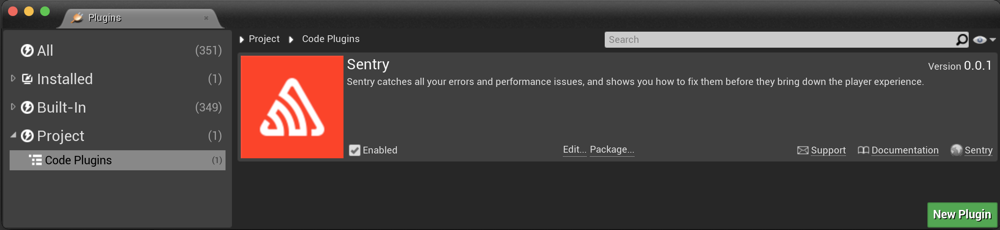

The Unreal Engine SDK currently is compatible with **UE 4.26 or newer** and supports **Windows**, **macOS**, **iOS**, and **Android**.

To build the SDK, download the latest sources from the [Releases page](https://github.com/getsentry/sentry-unreal/releases) and place it into project's `Plugins` directory. On the next project launch UE will prompt to build SentrySDK module.

<Note>

Currently this method is available only for C++ UE projects. Blueprint project can be converted to a C++ one by adding an empty class via Editor.

</Note>

After the successfull build in Editor navigate to `Settings` > `Plugins` > `Code Plugins` menu and check whether Sentry SDK plugin is enabled.



In order to access plugin API from within C++
add `SentrySDK` support to the build script (`MyProject.build.cs`):

```csharp
PublicDependencyModuleNames.AddRange(new string[] { ..., "SentrySDK" });
```
