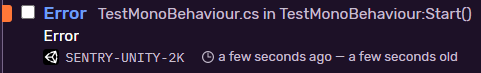
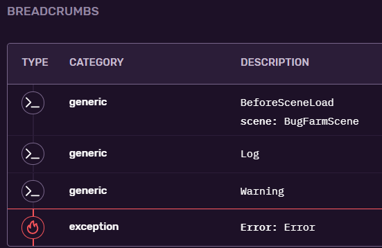

Create `TestMonoBehaviour.cs` with contains `Debug.LogError` (but can be any exception like the C# expression `throw null`):

```csharp
using UnityEngine;

public class TestMonoBehaviour : MonoBehaviour
{
    void Start()
    {
        Debug.Log("Log");
        Debug.LogWarning("Warning");
        Debug.LogError("Error");
    }
}
```

Assign it to any object you have in the scene and press play. Open up your Sentry project in the web UI and check the logs.

You should see a new issue:



Open it up and check breadcrumbs:



The list of captured events are displayed.

### Event debouncer

A debouncing mechanism is in place. This means that if you try to send a many requests in a quick succession (with the same log type), we will take the first one and ignore the others given the time slot. Current settings:

* `LogType.Error` (also exceptions) or `LogType.Exception` or `LogType.Assert` - one second
* `LogType.Log` - one second
* `LogType.Warning` - one second

Create another `DebouncerTestMonoBehaviour.cs`, then assign it to any object in the scene and run it.

```csharp
using UnityEngine;

public class DebouncerTestMonoBehaviour : MonoBehaviour
{
    void Start()
    {
        Debug.Log("Log");             // recorded
        Debug.Log("Log2");            // not recorded (1 second didn't expire from the previous call)
        Debug.LogWarning("Warning");  // recorded
        Debug.LogWarning("Warning2"); // not recorded
        Debug.LogError("Error");      // recorded
    }
}
```
