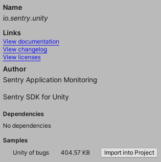

```csharp
using Sentry;
using UnityEngine;

public class TestMonoBehaviour : MonoBehaviour
{
    private GameObject testObject = null;

    void Start()
    {
        Debug.Log("Captured Log");              // Breadcrumb
        Debug.LogWarning("Captured Warning");   // Breadcrumb
        Debug.LogError("Captured Error");       // Captured Error

        // This will throw an unhandled Null Reference Exception
        testObject.GetComponent<Transform>();   // Captured error
    }
}
```

Additionally, the packages includes a sample called "Unity of bugs" that can optionally be imported into your project through the package manager. The samples contain a variety of common bugs, including native errors, so you don't have to write them.


