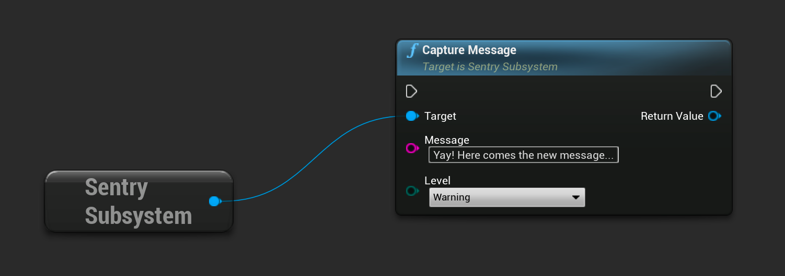

This snippet includes message capturing, so you can test that everything is working as soon as you set it up:

```cpp
#include "SentrySubsystem.h"

void Verify()
{
    // Obtain reference to GameInstance
    UGameInstance* GameInstance = ...;

    // Capture message
    USentrySubsystem* SentrySubsystem = GameInstance->GetSubsystem<USentrySubsystem>();
    SentrySubsystem->CaptureMessage(TEXT("Capture message"));
}
```

The same result can be achieved by calling corresponding function in blueprint:


