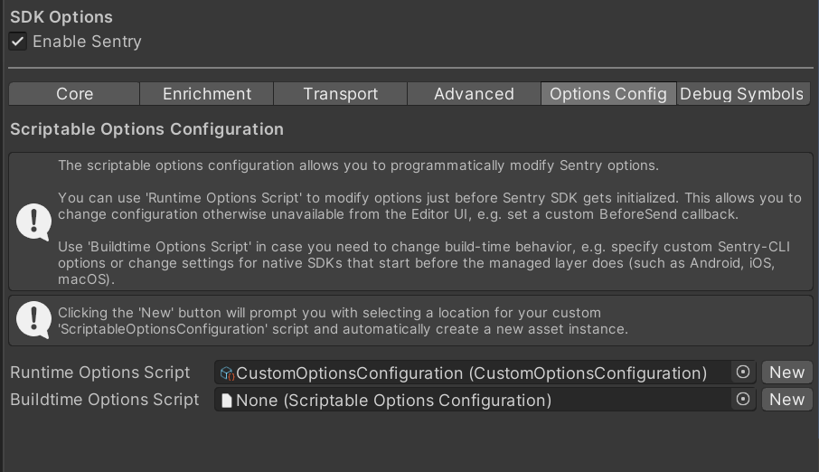

## Programmatic Configuration

In order to provide native crash support, the Sentry SDK for Unity includes [platform-specific (that is, Native)](/platforms/unity/native-support/) SDKs, such as [Android](/platforms/android/), [Apple](/platforms/apple/guides/ios/), and [Native](/platforms/native/). Those SDKs share the options with which they get initialized.

The C# layer self-initializes through the use of the [BeforeSceneLoad RuntimeInitializeOnLoadMethodAttribute](https://docs.unity3d.com/ScriptReference/RuntimeInitializeLoadType.BeforeSceneLoad.html). On desktop, the C# layer is also responsible for intializing the native SDKs.

On mobile, the native SDKs are configured and set up during build time and initialize themselves before the Unity engine. This allows us to capture bugs/crashes of the engine itself. For that reason, we rely on on the options being set in the Sentry editor configuration window and saved to `Assets/Resources/Sentry/SentryOptions.asset`.

To provide a way to modify options programmatically, we've added `ScriptableOptionsConfiguration` to the `Options Config` tab in the Sentry editor window.

<Note>

You can click the button _Create options configuration_ to get the C# scriptable object added to your project.

</Note>

The created scriptable object contains two methods that allow you to configure/override the options: 

* `ConfigureAtBuild()` is executed by the Unity Editor during app build. 
  Changes you make here affect current build and also allow you to alter native platform build-time settings (Android, iOS, macOS).

* `ConfigureAtRuntime()` is executed on each app startup, right before the managed Sentry SDK is initialized (except for Android, iOS and macOS native layers which are already set-up by that time).
  This can be used, for example, to implement your own filtering of events using the [BeforeSend](/platforms/unity/configuration/filtering/#using-platformidentifier-namebefore-send-) callback (note: this callback only runs for events coming from C# scripts).

<Note>

Not all options are used on all platforms, and some may need to be changed at build-time, other at runtime. 
Usually, it's safe for both functions to run the same code, unless you know some options should only be set in one or the other.

</Note>
