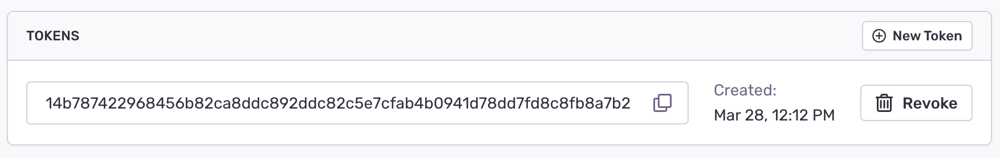

Sentry requires dSYMs (debug information files) to symbolicate your stacktraces. The symbolication process unscrambles the stacktraces to reveal the function, file names, and line numbers of the crash.

Every solution requires a **Sentry Auth Token**. We recommend [using internal integrations](https://sentry.io/settings/developer-settings/) for managing Auth Tokens. [Create a new internal integration](https://sentry.io/settings/developer-settings/new-internal/) with the permission `project:read&write`, if you don't have one already. After saving it, you can copy the Auth Token from the integration page.



To view uploaded dSYMs in your project, select an existing project from the "Projects" page, then go to **Settings > Debug Files**. You can upload dSYMs using:

- [sentry-cli](#sentry-cli)
- [Sentry Fastlane Plugin](#fastlane)
- [Xcode Build Phase](#xcode-build-phase)

<Note>

Starting with Xcode 13, newly generated projects don't automatically create a required `Info.plist` configuration file.
If this is your situation, please read [Info.plist Is Missing in Xcode 13 — Here's How To Get It Back](https://betterprogramming.pub/info-plist-is-missing-in-xcode-13-heres-how-to-get-it-back-1a7abf3e2514).

</Note>

## Sentry-cli

Use the `sentry-cli debug-files upload` command to upload dSYMs to Sentry. The command will recursively scan the provided folders or ZIP archives. Files that have already been uploaded will be skipped automatically.

Sentry can display snippets of your code next to the event stacktraces. This feature is called <PlatformLink to="/data-management/debug-files/source-context/">source context</PlatformLink>. When setting the `--include-sources` option, sentry-cli will scan your debug files to find references to the source code files, resolve them in the local file system, bundle them up, and upload them to Sentry. For this to work, your project settings for `DEBUG_INFORMATION_FORMAT` must be set to `DWARF with dSYM File`, which is the default for release builds but not for debug builds.

```bash
sentry-cli debug-files upload --auth-token YOUR_AUTH_TOKEN \
  --include-sources \
  --org ___ORG_SLUG___ \
  --project ___PROJECT_SLUG___ \
  PATH_TO_DSYMS
```

Visit the [sentry-cli docs](/product/cli/dif/#uploading-files) for more information.

## Sentry Fastlane Plugin {#fastlane}

If you're already using Fastlane, you can use the [Sentry Fastlane plugin](https://github.com/getsentry/sentry-fastlane-plugin)
to upload your dSYMs to Sentry.

Sentry can display snippets of your code next to event stacktraces. This feature is called <PlatformLink to="/data-management/debug-files/source-context/">source context</PlatformLink>. When setting the `include_sources` parameter to `true`, the Fastlane plugin will scan your debug files to find references to the source code files, resolve them in the local file system, bundle them up, and upload them to Sentry.

```ruby
sentry_upload_dif(
  auth_token: 'YOUR_AUTH_TOKEN',
  org_slug: '___ORG_SLUG___',
  project_slug: '___PROJECT_SLUG___',
  include_sources: true, # Optional. For source context.
)
```

<Alert level="" title="On Prem">

By default fastlane will connect to sentry.io. For on-prem you need to provide the _api_host_ parameter to instruct the tool to connect to your server:

```
api_host: 'https://mysentry.invalid/'
```

</Alert>

## Xcode Build Phase

Your project's dSYM can be uploaded during Xcode's build phase as a _Run Script_. To do this, set the _DEBUG_INFORMATION_FORMAT_ to _DWARF with a dSYM file_. By default, an Xcode project will only have _DEBUG_INFORMATION_FORMAT_ set to _DWARF with a dSYM file_ in _release_, so make sure everything is properly set up in your build settings.

Follow these steps to upload the debug symbols:

1.  Download and install [sentry-cli](/product/cli/installation/).
2.  Copy the script below into a new _Run Script_ and set your _AUTH_TOKEN_, _ORG_SLUG_, and _PROJECT_SLUG_.

Sentry can display snippets of your code next to the event stacktraces. This feature is called <PlatformLink to="/data-management/debug-files/source-context/">source context</PlatformLink>. When setting the `--include-sources` option, sentry-cli will scan your debug files to find references to the source code files, resolve them in the local file system, bundle them up, and upload them to Sentry. For this to work, your project settings for `DEBUG_INFORMATION_FORMAT` must be set to `DWARF with dSYM File`, which is the default for release builds but not for debug builds. If you don't want Sentry to upload your sorce code, remove the `--include-sources` argument from the copied script.

<Alert level="" title="Warnings vs. Errors">

Depending on your needs, you may want to emit warnings to the Xcode build log to let the build pass, or emit errors to fail it. For example, in a CI deployment where debug symbols may be harder to recover, and you might not realize symbols couldn't be symbolicated until after release, it might be better to fail the build.

Another option is to use warnings, and then set `GCC_TREAT_WARNINGS_AS_ERRORS` to `YES` in build settings for configurations you use to deploy to production.

</Alert>

```bash {tabTitle:Warn on failures - nonblocking}
if which sentry-cli >/dev/null; then
export SENTRY_ORG=___ORG_SLUG___
export SENTRY_PROJECT=___PROJECT_SLUG___
export SENTRY_AUTH_TOKEN=YOUR_AUTH_TOKEN
ERROR=$(sentry-cli debug-files upload --include-sources "$DWARF_DSYM_FOLDER_PATH" 2>&1 >/dev/null)
if [ ! $? -eq 0 ]; then
echo "warning: sentry-cli - $ERROR"
fi
else
echo "warning: sentry-cli not installed, download from https://github.com/getsentry/sentry-cli/releases"
fi
```

```bash {tabTitle:Error on failures - blocking}
if which sentry-cli >/dev/null; then
export SENTRY_ORG=___ORG_SLUG___
export SENTRY_PROJECT=___PROJECT_SLUG___
export SENTRY_AUTH_TOKEN=YOUR_AUTH_TOKEN
ERROR=$(sentry-cli debug-files upload --include-sources "$DWARF_DSYM_FOLDER_PATH" --force-foreground 2>&1 >/dev/null)
if [ ! $? -eq 0 ]; then
echo "error: sentry-cli - $ERROR"
fi
else
echo "error: sentry-cli not installed, download from https://github.com/getsentry/sentry-cli/releases"
fi
```

3.  You also need to add the following line to the _Input Files_ section in the _Run Script_ from step 2:

[//]: # "Don't use bash here. Clicking the copy button on the code sample with bash"
[//]: # "removes the leading $."

```text
${DWARF_DSYM_FOLDER_PATH}/${DWARF_DSYM_FILE_NAME}/Contents/Resources/DWARF/${TARGET_NAME}
```

<Alert level="" title="Self Hosted">

By default sentry-cli will connect to sentry.io. For on-prem you need to export the _SENTRY_URL_ environment variable to instruct the tool to connect to your server:

```bash
export SENTRY_URL=https://mysentry.invalid/
```

</Alert>
