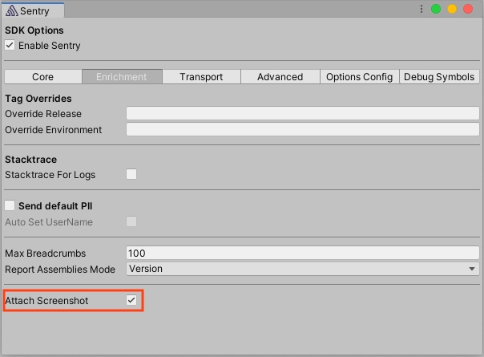

Using the editor integrations in **Tools > Sentry**:



Or, like so, if you're [configuring things programatically](/platforms/unity/configuration/options/):

```csharp {tabTitle:ScriptableOptionsConfiguration}
options.AttachScreenshot = true;
```

## Screenshot capture mechanism

Since the Unity SDK internally consists of multiple SDKs, the mechanism with which a screenshot gets captured depends on where the error originates.

- C# errors from within your game will be captured through Unity's built-in [ScreenCapture](https://docs.unity3d.com/ScriptReference/ScreenCapture.html). This means that screenshots only contain things visible within your game. Overlays on top of your game will not be visible.
- Native errors get captured by their respective SDK. If you're using a native plugin to display an overlay and an error occurs then that SDK will try to capture a screenshot that contains the overlay.

<Note>

Screenshots might contain PII of your app. For example, if your game has a registration form and an error happens while the form is being displayed.

</Note>
