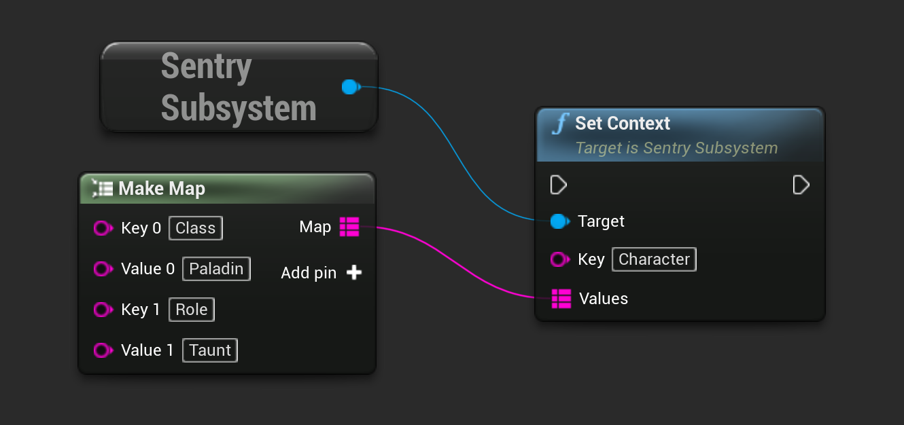

```cpp
USentrySubsystem* SentrySubsystem = ...;

TMap<FString, FString> ContextData;
AdditionalData.Add("Class", "Paladin");
AdditionalData.Add("Role", "Taunt");

SentrySubsystem->SetContext("Character", ContextData);
```

The same result can be achieved by calling corresponding function in blueprint:



Alternatively, this configuration can be provided to the crash reporter [during initialization](/platforms/unreal/configuration/setup-crashreporter/#configure-attributes).
