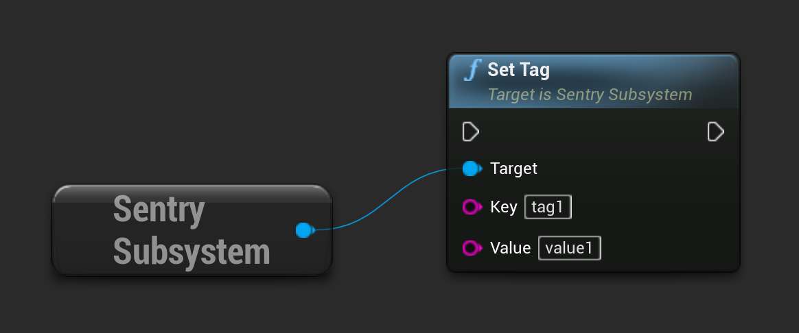
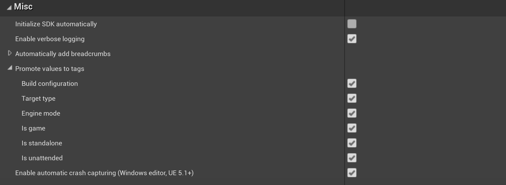

```cpp
USentrySubsystem* SentrySubsystem = ...;

SentrySubsystem->SetTag("tag1", "value1");
```

The same result can be achieved by calling corresponding function in blueprint:



Alternatively, this configuration can be provided to the crash reporter [during initialization](/platforms/unreal/configuration/setup-crashreporter/#configure-attributes).

Commonly used values including `Engine version`, `Configuration`, and `Target Type`, can be promoted to tags via Sentry's configuration window by navigating to the editor's menu **Project Settings > Plugins > Sentry > Misc > Promote values to tags** and selecting the values that should be automatically added to captured events as tags.


